# Software Engineer Interview Master Guide
## For TWO Interviews: NAB Starcamp + KMS Technology

> A theory-first, depth-first guide for backend SWE interviews. Concepts come before code; code illustrates concepts. The goal is **understanding**, not memorization — so you can answer a question you've never seen before by reasoning from first principles.
>
> **NAB Starcamp** (Australia bank) — submitted with `artisan-connect-server` + `roboflow-clone-server` → JavaScript / Node.js / Express / TypeScript / React
> **KMS Technology** (Java fresher SWE) — submitted with `payment-transaction-service` → Java / Spring Boot / hexagonal architecture
>
> Both share core CS fundamentals (DSA, OS, networks, DBs, system design).

---

## How to read this guide

- **Read the prose first, the code second.** Every code block is a worked example of an idea explained in the paragraphs above it. If you can't explain *why* the code looks that way, the paragraph wasn't read carefully enough.
- **Each major section ends with interview questions.** These are the exact phrasings interviewers use. Practice saying the answer out loud — the gap between "I know it" and "I can explain it in 30 seconds" is huge.
- **Diagrams use Mermaid** — render in GitHub, Obsidian, Typora, VS Code preview, or any modern Markdown viewer.

---

## Quick interview-prep map

| Interview | Sections to prioritize |
|---|---|
| **NAB Starcamp** | §3 JS/TS, §4 Node.js, §5 Express, §6 React, §7 DSA, §8-§11 CS, §19.1+§19.2 (artisan + roboflow projects), §21 Behavioral |
| **KMS Technology** | §1 Java, §2 Spring Boot, §7 DSA, §8-§11 CS, §12-§14 Engineering, §15-§19 Production stack, §20.3 (payment project), §21 Behavioral |
| **Shared core** | §7 DSA, §8-§11 CS fundamentals, §12-§14 Engineering, §21 Behavioral |

---

## Master Table of Contents

### Part I — Programming Languages & Frameworks
- [1. Java Essentials](#1-java-essentials)
- [2. Spring Boot Essentials](#2-spring-boot-essentials)
- [3. JavaScript & TypeScript Essentials](#3-javascript--typescript-essentials)
- [4. Node.js](#4-nodejs)
- [5. Express.js](#5-expressjs)
- [6. React.js](#6-reactjs)

### Part II — Algorithms & CS Foundations
- [7. Data Structures & Algorithms (C++)](#7-data-structures--algorithms-c)
- [8. Operating Systems](#8-operating-systems)
- [9. Computer Networks](#9-computer-networks)
- [10. Computer Architecture](#10-computer-architecture)
- [11. Databases & SQL](#11-databases--sql)

### Part III — Engineering & Design
- [12. Software Engineering Principles](#12-software-engineering-principles)
- [13. Design Patterns](#13-design-patterns)
- [14. System Design Essentials](#14-system-design-essentials)

### Part IV — Production Stack
- [15. Docker](#15-docker)
- [16. Redis](#16-redis)
- [17. Kafka](#17-kafka)
- [18. Observability: Prometheus, Grafana, k6](#18-observability-prometheus-grafana-k6)
- [19. Distributed Systems Patterns](#19-distributed-systems-patterns)

### Part V — Interview Prep
- [20. Your Projects: Defending Every Decision](#20-your-projects-defending-every-decision)
- [21. Behavioral & Closing Questions](#21-behavioral--closing-questions)

---
---

# PART I — Programming Languages & Frameworks

# 1. Java Essentials

> Java is the language of choice for KMS Technology's interview. Master the *why* behind each feature, not just the syntax. Most interview questions test whether you understand the underlying model — JVM, memory, type system, concurrency — and the syntax is just where you express that understanding.

## 1.1 What is Java, really?

Java is a **statically-typed**, **object-oriented**, **class-based**, **garbage-collected**, **platform-independent** programming language. Each of those adjectives means something concrete that the interviewer might probe:

**Statically-typed** means types are checked at compile time. If you write `String s = 42;`, the compiler refuses — it knows `42` is an `int`, not a `String`. This catches huge classes of bugs before the code ever runs. Contrast with Python or JavaScript, where types are dynamic and errors surface at runtime. Static typing trades a bit of upfront friction for runtime safety and IDE assistance (autocomplete, refactoring, "find usages" — these are only reliable when the compiler knows the types).

**Object-oriented and class-based** means the unit of organization is the class, and a program is a collection of objects (instances of classes) sending messages (method calls) to each other. Java enforces this strictly: every executable statement lives inside a method, every method lives inside a class. Even the entry point `public static void main(String[] args)` is a class method.

**Garbage-collected** means you don't manually allocate and free memory. The JVM tracks which objects are still reachable and reclaims the rest. This eliminates whole categories of bugs — use-after-free, double-free, leaks (mostly) — at the cost of some runtime overhead and occasional GC pauses.

**Platform-independent** comes from Java's two-step execution model: source compiles to **bytecode** (a portable intermediate representation), and bytecode runs on the **JVM** (a virtual machine implemented for each platform). The slogan: *"Write Once, Run Anywhere."* The reality has some nuance (file paths, threads, GC tuning differ between OSes), but the core promise holds.

### The execution model

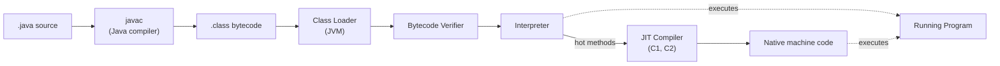

When you compile a `.java` file with `javac`, you get a `.class` file containing **bytecode** — instructions for a hypothetical "Java Virtual Machine." Bytecode is not native machine code; the JVM reads and executes it. This is what gives Java its portability — a `.class` file compiled on Windows runs unchanged on Linux because both platforms have a JVM that understands the same bytecode.

When you run your program, the JVM:
1. **Loads** classes on demand via the **Class Loader** (bootstrap → platform → application class loaders, in that delegation order)
2. **Verifies** the bytecode is safe (no stack underflows, no invalid type conversions)
3. **Interprets** the bytecode instruction by instruction
4. **JIT-compiles** "hot" methods (frequently executed) to native machine code

This is why Java apps need a **warm-up**: the first few thousand calls to a method run interpreted (slow), then HotSpot's JIT compiler decides it's worth optimizing and produces tuned native code. Peak performance comes after warm-up, which is why benchmarks should always exclude the first N seconds of execution.

**Tiered compilation** (the modern default) is a refinement: the JVM uses two JIT compilers, C1 (quick to compile, modest optimization) and C2 (slow to compile, aggressive optimization). Methods progress: interpreted → C1 → C2 as they prove their importance. This balances startup time with peak throughput.

### JDK vs JRE vs JVM — what's the difference?

These three terms confuse beginners and get asked all the time.

- **JVM (Java Virtual Machine)** is the runtime — the program that loads and executes bytecode. It's a *specification* with many *implementations* (HotSpot is the most common, others include OpenJ9, GraalVM, Azul Zing).
- **JRE (Java Runtime Environment)** is the JVM plus the standard libraries (`java.lang`, `java.util`, `java.io`, etc.) that every Java program depends on. It's everything you need to *run* compiled Java code.
- **JDK (Java Development Kit)** is the JRE plus developer tools — `javac` (compiler), `jar` (archiver), `javadoc` (doc generator), `jshell` (REPL), debugger, profilers. It's everything you need to *develop* Java code.

```
JDK ⊃ JRE ⊃ JVM
```

In modern Java (since version 9), the line between JRE and JDK has blurred — you typically install a JDK and let `jlink` create custom minimal runtimes per app. But conceptually the hierarchy still helps you reason about deployment.

## 1.2 The memory model: where Java keeps your data

Understanding Java's memory layout is one of the highest-leverage things you can do for interviews. Every concurrency bug, every `OutOfMemoryError`, every reference vs value confusion ultimately traces back to memory.

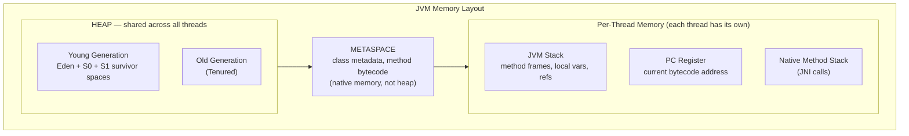

The fundamental split is between the **stack** (per-thread, automatic, fast) and the **heap** (shared, garbage-collected, slower).

### The stack

Each thread has its own stack. Every time a method is called, a **stack frame** is pushed onto that thread's stack containing:
- The method's local variables
- The parameters passed in
- A pointer back to the caller
- Space for the return value

When the method returns, its frame pops off. This is automatic and very fast — push and pop are constant-time, and the memory is reclaimed instantly with no GC involved.

Local variables of primitive types (`int`, `long`, `boolean`, etc.) live directly in their stack frame. For reference types (`String`, `List`, your own classes), the *reference* (a pointer-like value) lives on the stack, but the *object* it points to lives on the heap.

```java
public void example() {
    int x = 42;              // x is in the stack frame, holds the value 42
    String s = "hello";      // s is in the stack frame, holds a reference to a String on the heap
    int[] arr = {1, 2, 3};   // arr is in the stack frame, holds a reference to an array on the heap
}                            // when example() returns, all three frame slots are gone
                             // the int 42 vanishes; the String and array remain on the heap (until GC)
```

If you recurse too deeply, the stack overflows — that's `StackOverflowError`. Each frame uses some bytes, and the stack has a fixed maximum size (default ~512KB to 1MB per thread).

### The heap

The heap is where all objects live. It's shared across threads, which is what makes Java's concurrency model both powerful and tricky. Two threads can both hold references to the same object; if either mutates it, the other sees the change — that's how shared-memory communication works in Java.

Modern Java uses **generational garbage collection**, based on a key empirical observation: *most objects die young*. A method allocates a temporary `StringBuilder`, uses it, and lets it go out of scope — that object lives microseconds. Other objects (your `User`, your cache map) live for the lifetime of the program. The GC takes advantage of this by splitting the heap into:

- **Young Generation**: where new objects are allocated. Subdivided into **Eden** (where allocation happens) and two **Survivor spaces** (S0 and S1, used during collection). Collection here is called **minor GC** and is frequent + fast.
- **Old Generation** (also called Tenured): objects that survive several minor GCs get **promoted** here. Collection is called **major GC** (or **full GC**) and is rarer + slower.

The vast majority of objects never leave Eden. Minor GC scans only the young gen, finds the few survivors, copies them to a survivor space, and reclaims the rest in one swoop. This is fast precisely because most objects are dead by the time GC runs.

### Metaspace

Class metadata — the runtime representation of your classes themselves (their names, fields, method signatures, the bytecode of their methods) — lives in **Metaspace**, which is native (off-heap) memory. Before Java 8 this was called **PermGen** and lived inside the heap; PermGen had a fixed maximum and overflowed in apps that loaded lots of classes (Spring apps, OSGi). Metaspace defaults to unlimited (bounded only by available native memory), which solved the most common cause of `OutOfMemoryError: PermGen space`.

### Why this matters in interviews

- **OutOfMemoryError** comes in flavors. `Java heap space` means the heap is full of live objects (real leak or undersized heap). `Metaspace` means too many classes loaded (classloader leak, common with hot-reloading frameworks). `unable to create new native thread` means you've hit the OS thread limit.
- **References vs values** trips up everyone at least once. Java is *always pass-by-value*. For reference types, the value being passed *is* the reference. So you can mutate what the reference points to (visible to caller) but you can't reassign the caller's variable. (More on this in §1.4.)
- **Escape analysis** is a JIT optimization: if HotSpot proves an object never escapes the method, it can allocate it on the stack instead of the heap, dodging GC entirely. You don't write code for this — but it explains why Java performance is sometimes better than the naive heap-allocation model suggests.

## 1.3 Primitives vs reference types

Java has **8 primitive types** and everything else is a **reference type**.

| Primitive | Size | Range |
|---|---|---|
| `byte` | 8 bits | -128 to 127 |
| `short` | 16 bits | -32,768 to 32,767 |
| `int` | 32 bits | ~-2.1B to ~2.1B |
| `long` | 64 bits | ~-9.2 × 10^18 to ~9.2 × 10^18 |
| `float` | 32 bits | IEEE 754 single precision |
| `double` | 64 bits | IEEE 754 double precision |
| `char` | 16 bits | UTF-16 code unit |
| `boolean` | JVM-defined | `true` / `false` |

Primitives store the value directly. References store a pointer (more or less) to an object on the heap. This has performance implications: a `long[]` of a million elements is 8MB of contiguous memory; a `Long[]` of a million elements is 8MB of pointers *plus* a million heap objects each with their own header overhead (16+ bytes) — roughly 3-4× larger, plus cache-hostile pointer chasing during iteration.

### Autoboxing and the wrapper classes

Each primitive has a corresponding **wrapper class**: `int` ↔ `Integer`, `long` ↔ `Long`, `boolean` ↔ `Boolean`, etc. Wrappers are reference types — they're objects on the heap. Java automatically converts between primitives and wrappers as needed:

```java
List<Integer> list = new ArrayList<>();
list.add(42);          // autoboxing: int 42 becomes Integer object
int x = list.get(0);   // unboxing: Integer becomes int
```

This is convenient but has costs:
- **Heap allocation** for the wrapper (unless cached — see below)
- **Indirection** when accessing the value
- **NullPointerException** if you unbox a null wrapper: `Integer i = null; int x = i;` throws NPE

There's also a subtle caching behavior: `Integer.valueOf(n)` caches instances for `-128 ≤ n ≤ 127` (configurable), so `Integer.valueOf(100) == Integer.valueOf(100)` is `true` but `Integer.valueOf(200) == Integer.valueOf(200)` is `false`. **Always use `.equals()` to compare wrappers.**

### `==` vs `.equals()`

- For primitives: `==` compares values. There's no `.equals()` because primitives aren't objects.
- For reference types: `==` compares *references* (are these the same object?). `.equals()` compares *values* (do these objects represent the same thing?), if the class overrides it properly.

```java
String a = "hello";
String b = "hello";
String c = new String("hello");
a == b;          // true (both reference the same interned literal in the string pool)
a == c;          // false (c is a separate object)
a.equals(c);     // true (same content)
```

This is *the* most common bug in beginner Java code: comparing strings with `==`. It sometimes works (when both happen to be interned) and sometimes doesn't, which is the worst kind of bug.

## 1.4 Pass-by-value: the most-misunderstood feature in Java

Java is **strictly pass-by-value**, always, for both primitives and references. The confusion arises because the "value" of a reference type is the *reference itself*, not the object it points to.

```java
void mutate(StringBuilder sb) {
    sb.append("!");                  // mutates the SHARED object — visible to caller
    sb = new StringBuilder("new");   // reassigns LOCAL parameter — invisible to caller
}

StringBuilder x = new StringBuilder("hello");
mutate(x);
System.out.println(x);  // prints "hello!" — caller sees the mutation but NOT the reassignment
```

What happened? When `mutate(x)` was called, Java copied the *reference value* held in `x` into the parameter `sb`. Both now point to the same `StringBuilder` object. When `sb.append("!")` runs, it mutates that shared object — `x` sees it too because they point to the same thing. When `sb = new StringBuilder("new")` runs, it changes what *the local parameter* points to, but `x` still points to the original.

A useful mental model: Java is "pass-the-pointer-by-value." You can use the pointer to mutate what's pointed to, but you can't change the caller's pointer.

This affects every aspect of API design — methods that "modify" their arguments have to mutate the existing object, not "replace" it. Conventions like `Collections.sort(list)` mutate in place; `list.stream().sorted().toList()` returns a new list.

## 1.5 Object-Oriented Programming: the four pillars in depth

OOP in Java rests on four classical pillars: **encapsulation**, **inheritance**, **polymorphism**, and **abstraction**. Knowing the buzzwords gets you partial credit; understanding *why* each exists gets you the full points.

### Encapsulation

Encapsulation is **bundling state and the operations on that state into a single unit (a class), and hiding internal state from outside access**. The goal is to enforce invariants — rules about what makes the object's state "valid" — by allowing mutation only through methods that check those rules.

```java
public class BankAccount {
    private BigDecimal balance;                // private — only this class can read/write directly
    private final String accountId;            // final — never changes after construction

    public BankAccount(String id, BigDecimal initial) {
        if (initial.signum() < 0) throw new IllegalArgumentException("negative initial");
        this.accountId = id;
        this.balance = initial;
    }

    public BigDecimal getBalance() { return balance; }    // read-only access

    public void withdraw(BigDecimal amount) {
        if (amount.signum() <= 0) throw new IllegalArgumentException("non-positive");
        if (balance.compareTo(amount) < 0) throw new IllegalStateException("insufficient");
        balance = balance.subtract(amount);
    }
}
```

If `balance` were `public`, any code anywhere could set it directly — to a negative number, to null, to garbage. The class couldn't enforce the invariant "balance ≥ 0." By keeping it `private` and forcing access through `withdraw()`, the class controls every mutation point and can validate.

**Java's access modifiers**, from most restrictive to least:

| Modifier | Visible from |
|---|---|
| `private` | Same class only |
| (default, no modifier) | Same package |
| `protected` | Same package + subclasses anywhere |
| `public` | Anywhere |

The principle: **start as restrictive as possible, loosen only when necessary**. Public is a commitment — once code outside your control depends on a public field or method, you can't change it without breaking them.

### Inheritance

Inheritance lets one class extend another, automatically gaining its fields and methods. It models an **"is-a" relationship**: a `Dog` *is an* `Animal`, a `SavingsAccount` *is a* `BankAccount`.

```java
public class Animal {
    protected String name;
    public Animal(String name) { this.name = name; }
    public void eat() { System.out.println(name + " eats"); }
    public void sleep() { System.out.println(name + " sleeps"); }
}

public class Dog extends Animal {
    public Dog(String name) { super(name); }    // call parent constructor
    public void bark() { System.out.println(name + " barks"); }
    @Override
    public void eat() { System.out.println(name + " wolfs food down"); }  // override
}
```

Java supports **single inheritance for classes** — a class can extend exactly one class. This sidesteps the "diamond problem" of multiple inheritance (which class's method wins if two parents define the same method?). For "can-do" capabilities, Java has **interfaces**, which a class can implement many of.

**`super`** refers to the parent class. `super.method()` calls the parent's version of an overridden method. `super(args)` (in a constructor, as the first statement) calls the parent's constructor.

A subtle but tested point: **constructors are not inherited**. If `Animal` has `Animal(String name)` and `Dog extends Animal`, `Dog` doesn't automatically get a `Dog(String name)` constructor. You must define one, and you must call `super(name)` (explicitly or implicitly — if you don't write `super(...)`, the compiler inserts `super()`, which fails if the parent has no no-arg constructor).

**Composition is often better than inheritance.** Inheritance creates tight coupling between parent and child: changes to the parent ripple through every subclass. Composition (one class *holds* another and delegates) gives you the same capability with looser coupling. Modern guidance: prefer composition unless you have a true is-a relationship with stable parent contracts.

### Polymorphism

Polymorphism means **"many forms"** — the same code, written once, behaves differently depending on the actual type of the object at runtime.

```java
Animal a = new Dog("Rex");
a.eat();    // prints "Rex wolfs food down" — Dog's override runs, not Animal's eat()
```

Even though the *static type* of `a` is `Animal`, the *runtime type* is `Dog`, and Java dispatches `a.eat()` to `Dog`'s implementation. This is **dynamic dispatch** (or **late binding**) — the JVM looks up the method in the actual object's class at runtime.

Mental model: each class has a hidden **virtual method table** (vtable) — an array of pointers to the actual implementations. The compiler emits `invokevirtual` bytecode, which at runtime indexes into the receiver's vtable to find the right method.

Why this is powerful: you can write code that operates on `Animal` and works for any subclass, even subclasses written years later by someone else. The Open/Closed Principle (§12) — open for extension, closed for modification — falls out of polymorphism directly.

**Compile-time polymorphism** also exists, in the form of **method overloading** — same method name with different parameter lists:

```java
class MathUtil {
    public int add(int a, int b)        { return a + b; }
    public double add(double a, double b) { return a + b; }
    public int add(int a, int b, int c) { return a + b + c; }
}
```

The compiler picks which `add` to call based on the static types of the arguments. Overloading is a compile-time mechanism (also called **static dispatch**); overriding is a runtime mechanism. Don't confuse them in interviews.

### Abstraction

Abstraction means **exposing only what's necessary and hiding the implementation details**. It comes in two flavors in Java:

**Abstract classes**: classes you can't instantiate, used as base classes for shared structure.

```java
public abstract class PaymentProcessor {
    public final void process(Payment p) {     // final — can't be overridden; defines the algorithm
        validate(p);
        Result r = charge(p);                  // delegated to subclass
        record(r);
    }
    protected void validate(Payment p) { /* default impl */ }
    protected abstract Result charge(Payment p); // subclass MUST implement
    protected void record(Result r)    { /* default impl */ }
}

public class StripeProcessor extends PaymentProcessor {
    @Override
    protected Result charge(Payment p) { /* call Stripe API */ }
}
```

This is the **Template Method pattern** in action: the abstract class defines the skeleton, subclasses fill in specific steps.

**Interfaces**: pure contracts. Java 8+ also allows `default` and `static` methods on interfaces, blurring the line:

```java
public interface Comparable<T> {
    int compareTo(T other);
    
    default boolean lessThan(T other) {        // default — provided implementation
        return compareTo(other) < 0;
    }
}
```

| | Abstract class | Interface |
|---|---|---|
| Multiple inheritance | No (one extends) | Yes (many implements) |
| State (instance fields) | Yes | No (only static final constants) |
| Constructors | Yes | No |
| Method bodies | Concrete or abstract | abstract / default / static / private |
| When to use | "is-a" relationship with shared state | "can-do" capability/contract |

The rule: **interfaces describe capabilities; abstract classes describe partial implementations.** A `List` is a capability — many implementations (ArrayList, LinkedList) provide it. An `AbstractList` is a helper that captures shared boilerplate; concrete subclasses only implement the few methods that differ.

## 1.6 The Object class and the equals/hashCode contract

Every Java class implicitly extends `Object`. This means every object has methods like `toString()`, `equals(Object)`, `hashCode()`, `getClass()`, `wait()`, `notify()`. Three of these — `equals`, `hashCode`, and `toString` — are commonly overridden.

The **equals/hashCode contract** is *the* most-asked Java question. It says:

1. `equals` is **reflexive**: `x.equals(x)` is `true`
2. `equals` is **symmetric**: if `x.equals(y)` then `y.equals(x)`
3. `equals` is **transitive**: if `x.equals(y)` and `y.equals(z)` then `x.equals(z)`
4. `equals` is **consistent**: repeated calls return the same result if neither object changed
5. `x.equals(null)` is always `false`
6. **If `x.equals(y)` is `true`, then `x.hashCode() == y.hashCode()`** ← the critical one

The reverse is *not* required — two objects with the same hash code don't have to be equal (that would be a perfect hash, which is impossible in general). The point is that hash code is a fast first-pass filter; equality is the slower-but-definitive check.

Why does this contract matter? Because `HashMap`, `HashSet`, and friends rely on it. Their `put` algorithm:
1. Compute `hashCode()` of the key, find the right bucket
2. In that bucket, walk the entries and compare with `.equals()`
3. If found, replace; otherwise, add a new entry

If you break the contract — say, two equal objects produce different hash codes — they end up in different buckets, and `.contains()` returns `false` for the duplicate. The map is silently corrupted; the bug shows up later, far from the cause.

```java
public class Point {
    private final int x, y;
    public Point(int x, int y) { this.x = x; this.y = y; }

    @Override
    public boolean equals(Object o) {
        if (this == o) return true;
        if (!(o instanceof Point p)) return false;     // pattern matching, Java 16+
        return x == p.x && y == p.y;
    }

    @Override
    public int hashCode() {
        return Objects.hash(x, y);    // built-in helper combines hashes properly
    }
}
```

**Records** (Java 16+) generate `equals`, `hashCode`, `toString`, accessors, and a canonical constructor for you. Perfect for DTOs and value types:

```java
public record Money(BigDecimal amount, Currency currency) {}
// You get: amount() and currency() accessors, equals/hashCode/toString, constructor
```

## 1.7 Strings: immutable, interned, special

Strings deserve their own section because they're everywhere and have surprising behavior.

**Immutability**: once created, a `String` cannot be modified. Methods that look like mutations (`substring`, `toUpperCase`, `+`) all return *new* String objects. This has profound consequences:

- **Thread safety for free** — no synchronization needed when sharing strings across threads
- **Hash code caching** — `String.hashCode()` is computed once and cached, since the value can never change
- **Security** — strings are used as identifiers (file paths, class names, SQL queries); if they could be mutated by malicious code, security checks could be bypassed
- **String pool** — the JVM maintains a pool of unique string literals; `"hello"` written in two places refers to the same object

```java
String a = "hello";
String b = "hello";
String c = new String("hello");
String d = c.intern();           // returns the pool version

a == b;     // true (both are the pool "hello")
a == c;     // false (c is a separate heap object created by `new`)
a == d;     // true (intern() returns the pool version)
a.equals(c); // true (content match — always works)
```

**Performance pitfall**: string concatenation with `+` in a loop is `O(n²)` because each iteration creates a new string by copying both operands.

```java
// BAD: O(n²)
String result = "";
for (int i = 0; i < 1000; i++) result = result + i;

// GOOD: O(n)
StringBuilder sb = new StringBuilder();
for (int i = 0; i < 1000; i++) sb.append(i);
String result = sb.toString();
```

`StringBuilder` is a mutable string buffer — appending is amortized O(1). It's not thread-safe; for the rare case where you need that, `StringBuffer` is the synchronized version. (In practice, almost no one uses `StringBuffer` — if you're concatenating across threads, you have bigger design problems.)

The Java compiler is smart enough to optimize `a + b + c` (a *single* expression, not a loop) into a `StringBuilder`, so you don't need to manually convert simple cases.

## 1.8 Collections — the everyday workhorses

The Java Collections Framework is one of the most-tested API areas. Understanding the trade-offs between implementations is more important than memorizing every method.

```
Collection ──┬── List   (ArrayList, LinkedList)
             ├── Set    (HashSet, LinkedHashSet, TreeSet)
             └── Queue  (ArrayDeque, PriorityQueue, BlockingQueue)
             
Map (NOT a Collection) ── HashMap, LinkedHashMap, TreeMap, ConcurrentHashMap
```

### The Big-O reference

| Operation | ArrayList | LinkedList | HashMap | TreeMap | ArrayDeque | PriorityQueue |
|---|---|---|---|---|---|---|
| `add` at end | O(1) amortized | O(1) | O(1) avg | O(log n) | O(1) amortized | O(log n) |
| `get(index)` | O(1) | O(n) | — | — | — | — |
| `contains` / `get(key)` | O(n) | O(n) | O(1) avg | O(log n) | O(n) | O(n) |
| `remove(value)` | O(n) | O(n) | O(1) avg | O(log n) | O(n) | O(n) |
| `peek` / `poll` | — | O(1) head | — | — | O(1) | O(1) min |

### Lists: ArrayList vs LinkedList

**ArrayList** is backed by a regular array that grows when full (doubles in size, copying the elements). Random access is O(1) — you have a direct array index. Inserting at the end is O(1) amortized (most adds are free; the rare grow-and-copy is O(n) but happens log n times across n inserts). Inserting in the middle is O(n) because everything after the insertion point shifts down.

**LinkedList** is backed by a doubly-linked list. Each element is a separate heap object with `prev` and `next` pointers. Inserting at the head or tail is O(1) (just update the pointers). Random access is O(n) because you have to walk the list.

In practice, **ArrayList beats LinkedList almost always**, even for use cases where the Big-O suggests otherwise. Reasons:
- Memory layout: ArrayList is contiguous in memory, cache-friendly
- LinkedList: every node is a separate heap object with overhead (16+ byte header, plus prev/next pointers) — 3-4× more memory per element
- Pointer chasing: walking a linked list misses cache constantly

The only case where LinkedList wins is if you already have an iterator at the insertion point and you're inserting many elements there. Even then, `ArrayDeque` usually beats it for queue/stack use cases.

### Sets: HashSet vs LinkedHashSet vs TreeSet

A `Set` is a collection with no duplicates. The three implementations differ in iteration order:

- **HashSet** — backed by a `HashMap`. No defined iteration order (and don't rely on the apparent order, it can change). O(1) operations.
- **LinkedHashSet** — `HashSet` + a doubly-linked list maintaining insertion order. Slightly slower (linked list overhead) but predictable iteration order.
- **TreeSet** — backed by a red-black tree. Iteration is in sorted order. O(log n) operations, but `first()`, `last()`, `floor()`, `ceiling()`, range operations come for free.

### HashMap: the deep dive interviewers love

A `HashMap` is the most-asked data structure question after binary search. Be ready to explain it from memory.

**Structure**: an array of "buckets." Each bucket is a small linked list (or, since Java 8, a red-black tree if it grows past a threshold).

**Put algorithm**:
1. Compute `hash = supplementalHash(key.hashCode())` — a function that XORs the upper bits into the lower bits to defuse weak hash functions
2. `index = (capacity - 1) & hash` — note capacity is always a power of 2, so `&` works like modulo but faster
3. If the bucket is empty, store the entry there
4. If the bucket has entries, walk them comparing with `.equals()` — if found, replace; else add to the bucket

**Resize**: when `size > capacity × loadFactor` (default 0.75), the table doubles and every entry rehashes into the new larger array. This is O(n) but happens rarely (amortized O(1) per insert).

**Treeification (Java 8+)**: if a bucket grows past 8 entries AND the table is at least size 64, it converts from linked list to red-black tree. This guarantees O(log n) worst case even under hash collision attacks (which used to be a DoS vector — a malicious client crafting keys that all hash to the same bucket).

**Nulls**: `HashMap` allows one `null` key and many `null` values. `Hashtable` and `ConcurrentHashMap` do not — `null` throws `NullPointerException`.

**Pre-sizing**: if you know you'll insert N entries, construct `new HashMap<>(N / 0.75 + 1)` to avoid resize churn during build-up. Easy free perf.

**Thread safety**: `HashMap` is *not* thread-safe. Concurrent modification can corrupt internal state — including infinite loops in the resize logic (a classic JDK 7 bug). For concurrent use, switch to `ConcurrentHashMap`.

### ConcurrentHashMap: how does it stay concurrent?

In Java 7, `ConcurrentHashMap` used **lock striping** — divided the map into 16 segments by default, each with its own lock. Writers contended only with writers in the same segment.

In Java 8+, it was redesigned:
- **Empty bucket inserts use CAS** (compare-and-swap) — the put writes the new entry atomically with no lock
- **Non-empty buckets use per-bucket `synchronized`** — collisions and updates lock just one bucket
- Treeification still applies under collision

Result: massively concurrent reads and writes, very low contention as long as different keys hash to different buckets.

### Iteration: fail-fast vs weakly-consistent

If you modify a collection while iterating it, what happens?

- **Fail-fast** (`ArrayList`, `HashMap`): the iterator throws `ConcurrentModificationException`. This is intentional — it's better to fail loudly than to produce silent inconsistencies. The iterator detects modification by tracking a `modCount` field on the collection and comparing it on every operation.
- **Weakly consistent** (`ConcurrentHashMap`, `CopyOnWriteArrayList`): the iterator does *not* throw. It reflects the state at iterator creation time, but may or may not see concurrent modifications.

To remove safely while iterating, use `Iterator.remove()` (or `removeIf(predicate)`, which is cleaner):

```java
list.removeIf(x -> x < 0);  // single-pass, no CME
```

## 1.9 Generics: type safety with a runtime gotcha

Generics let you write type-safe collections and methods:

```java
List<String> names = new ArrayList<>();
names.add("Alice");
String first = names.get(0);    // no cast needed; the compiler knows
```

Without generics (pre-Java 5), you'd have:
```java
List names = new ArrayList();           // raw type
names.add("Alice");
String first = (String) names.get(0);   // unchecked cast; runtime ClassCastException possible
```

**Type erasure**: Java implements generics by *erasing* the type parameter at compile time. `List<String>` and `List<Integer>` both compile to plain `List` in the bytecode. The compiler checks types and inserts casts; the JVM doesn't know about generics at runtime.

Why this design? Backward compatibility — generic code can interoperate with pre-generic code without breaking either. The cost: some operations are illegal because runtime type info isn't available:

```java
T newInstance = new T();          // ERROR — no runtime info on T
T[] array = new T[10];            // ERROR — same reason
if (obj instanceof List<String>) {} // ERROR — same erasure makes List<String> indistinguishable from List<Integer>
```

### Bounded type parameters

```java
public <T extends Comparable<T>> T max(List<T> list) {
    T best = list.get(0);
    for (T t : list) if (t.compareTo(best) > 0) best = t;
    return best;
}
```

`T extends Comparable<T>` says: T must be a type that's comparable to itself. The compiler can then call `.compareTo()` on values of T.

### Wildcards: PECS

`? extends T` is a **covariant** wildcard — "some unknown subtype of T." You can *read* T from it (you'll get T or a subtype), but you can't *write* T to it (you don't know the exact type).

`? super T` is a **contravariant** wildcard — "some unknown supertype of T." You can write T into it, but reads come back as `Object`.

The mnemonic: **PECS — Producer Extends, Consumer Super.**

```java
public static <T> void copy(List<? extends T> source, List<? super T> dest) {
    for (T t : source) dest.add(t);
}
```

`source` produces T's (we read from it), so `? extends T`. `dest` consumes T's (we write to it), so `? super T`.

## 1.10 Exceptions

Java's exception hierarchy:

```
Throwable
├── Error                   (don't catch — JVM-level: OutOfMemoryError, StackOverflowError)
└── Exception
    ├── RuntimeException    (unchecked — NPE, IllegalArgumentException, IndexOutOfBounds)
    └── (other Exception)   (checked — IOException, SQLException, etc.)
```

The key distinction is **checked vs unchecked**:

- **Checked**: the compiler forces you to either `catch` or `throws` them. Java's way of saying "this is a likely failure mode of this API — you must acknowledge it."
- **Unchecked** (extends `RuntimeException`): the compiler doesn't enforce handling. Used for programmer errors and conditions that callers can't reasonably recover from.

Checked exceptions were controversial. The original argument: "force callers to think about error cases." The practical critique: they cause "exception pollution" up the call stack, and a lot of code just wraps them in `RuntimeException` to shut the compiler up. Modern style (and most newer JDK APIs) leans toward unchecked.

### try-with-resources

For anything implementing `AutoCloseable` (file streams, JDBC connections, network sockets), use try-with-resources to guarantee cleanup:

```java
try (var reader = Files.newBufferedReader(path);
     var writer = Files.newBufferedWriter(out)) {
    reader.lines().forEach(writer::println);
}    // both resources closed even if an exception is thrown
```

The compiler generates code equivalent to `try { ... } finally { resource.close(); }`, but handles multiple resources and "suppressed exceptions" correctly.

### Best practices

1. **Catch specific exceptions**, not `Exception` or `Throwable`
2. **Never swallow** — `catch (Exception e) {}` hides bugs forever
3. **Preserve the cause** when wrapping: `throw new ServiceException("could not process", cause)`
4. **Don't use exceptions for control flow** — they're expensive (capturing a stack trace allocates) and obscure intent
5. **Validate inputs at boundaries** (public method entry points) — fail fast with `IllegalArgumentException`

## 1.11 Concurrency: where senior interviews are won or lost

Concurrency is the highest-leverage interview topic in Java. The questions test whether you understand the memory model, not just the syntax.

### Why concurrency is hard

Multiple threads share memory. Without coordination:
- **Race conditions** — outcome depends on which thread runs first
- **Visibility issues** — one thread's writes aren't seen by another
- **Atomicity issues** — what looks like one operation is actually several

```java
class Counter {
    private int count = 0;
    public void increment() { count++; }       // NOT atomic
}
```

`count++` compiles to three bytecode operations: load `count`, increment, store `count`. Two threads can interleave: both load 0, both increment to 1, both store 1 — the increment that should have produced 2 got lost.

### The Java Memory Model (JMM)

The JMM defines **when one thread's writes become visible to another**. Without synchronization, the answer is: "the JVM is free to delay or reorder, so maybe never."

The JMM is built on **happens-before relationships**. If action A happens-before action B, then the effects of A are guaranteed visible to B. Key happens-before edges:

- **Program order**: within a single thread, statements happen in source-code order
- **Volatile writes happen-before subsequent volatile reads** of the same variable
- **Lock release happens-before subsequent lock acquisitions** of the same lock
- **Thread start** happens-before any action in that thread
- **Thread termination** happens-before another thread's successful `join()`

This abstract framework matters because it explains *why* `volatile` and `synchronized` work the way they do.

### volatile: visibility, but not atomicity

```java
private volatile boolean stop = false;

// thread A
while (!stop) doWork();

// thread B
stop = true;    // visible to A immediately
```

`volatile` ensures that reads see the latest write. Without it, the JIT might cache `stop` in a register and never re-read from main memory — thread A loops forever.

But `volatile` does *not* make compound operations atomic:

```java
volatile int counter;
counter++;     // STILL not atomic — still load-modify-store
```

For atomic counters, use `AtomicInteger` / `AtomicLong` / `LongAdder`:

```java
private final AtomicInteger counter = new AtomicInteger();
counter.incrementAndGet();      // atomic, lock-free via CAS
```

### synchronized: atomicity AND visibility

```java
class Counter {
    private int count = 0;
    public synchronized void increment() { count++; }  // safe
    public synchronized int get()        { return count; }
}
```

`synchronized` on a method locks `this`. `synchronized(obj)` locks any object you choose. Inside the lock:
- No other thread holding the same lock can enter
- All changes made before the lock release happen-before the next acquire (so the next thread sees them)

Locks are **reentrant**: a thread that holds a lock can acquire it again without blocking — useful when methods call each other.

The cost: contention. If many threads pile up waiting for the same lock, you serialize them and lose the benefit of multiple cores. The solution is finer-grained locks, lock-free algorithms, or rethinking the design.

### ReentrantLock: when synchronized isn't enough

```java
private final ReentrantLock lock = new ReentrantLock();

if (lock.tryLock(1, TimeUnit.SECONDS)) {
    try { /* critical section */ }
    finally { lock.unlock(); }
}
```

Beyond `synchronized`, `ReentrantLock` offers:
- **tryLock with timeout** — give up if you can't acquire quickly
- **Fairness option** — `new ReentrantLock(true)` gives FIFO ordering (slow but starvation-free)
- **Interruptible acquisition** — `lockInterruptibly()` allows another thread to interrupt the wait
- **Multiple condition variables** — `lock.newCondition()` for finer-grained signaling

### Executors and thread pools

Don't create raw `Thread` objects in production. Use the `ExecutorService` framework:

```java
ExecutorService executor = Executors.newFixedThreadPool(8);
Future<Integer> result = executor.submit(() -> computeExpensive());
Integer value = result.get();     // blocks until the task completes
executor.shutdown();
```

Common pool types:
- **FixedThreadPool(n)** — exactly n threads, unbounded queue. Good for CPU-bound work.
- **CachedThreadPool** — grows and shrinks on demand. Good for short-lived tasks. Dangerous: an explosion of tasks creates an explosion of threads.
- **SingleThreadExecutor** — one worker, ordered execution. Useful for background log writers.
- **ScheduledThreadPool** — for delayed and periodic tasks.

In production, prefer constructing `new ThreadPoolExecutor(...)` directly to control queue type, rejection policy, and thread factory (for naming).

### Virtual threads (Java 21+)

Virtual threads are lightweight threads managed by the JVM, not the OS. You can have millions of them per process (vs. low thousands of platform threads). When a virtual thread does blocking I/O, the JVM **unmounts** it from its carrier OS thread, freeing that thread to run another virtual thread.

```java
try (var executor = Executors.newVirtualThreadPerTaskExecutor()) {
    requests.forEach(r -> executor.submit(() -> handle(r)));
}
```

For I/O-bound services (the typical backend), this makes the simple thread-per-request model viable again — no async/reactive callbacks, no complex Future composition. Just plain blocking code that scales.

Caveat: **don't block inside `synchronized`** — this "pins" the virtual thread to its carrier and ruins the whole point. Replace `synchronized` with `ReentrantLock` for critical sections that include blocking calls.

### Deadlock

A deadlock requires four conditions, all simultaneously:
1. **Mutual exclusion** — resources can't be shared
2. **Hold and wait** — thread holds one resource while waiting for another
3. **No preemption** — resources can't be taken away forcibly
4. **Circular wait** — a cycle exists in the wait-for graph

Break any one to prevent:
- **Global lock ordering**: always acquire locks A, B, C in that order. No cycles possible.
- **tryLock with timeout**: give up rather than wait forever
- **Avoid nested locks** entirely if possible

## 1.12 Streams and functional features

Java 8 introduced lambdas, method references, and the Stream API — making functional-style code first-class.

```java
List<Order> bigOrders = orders.stream()
    .filter(o -> o.total().compareTo(BigDecimal.valueOf(1000)) > 0)
    .sorted(Comparator.comparing(Order::createdAt).reversed())
    .limit(10)
    .toList();
```

### The pipeline model

A stream pipeline has three parts:
1. **Source** — a collection, array, generator, or I/O stream
2. **Zero or more intermediate operations** — `filter`, `map`, `sorted`, `distinct`, etc. These are **lazy**: they don't run until a terminal operation triggers them.
3. **One terminal operation** — `collect`, `toList`, `forEach`, `count`, `reduce`. This triggers execution.

Laziness has big implications:
- **Short-circuiting**: `findFirst()` stops as soon as it has an answer; `limit(10)` stops after 10
- **Single pass**: many intermediate operations can be fused into one pass through the data
- **Streams are single-use** — once a terminal op runs, the stream is consumed

### Collectors

The Collectors class provides ready-made reducers:

```java
// Map of customer → total spent
Map<String, BigDecimal> totalsByCustomer = orders.stream()
    .collect(Collectors.groupingBy(
        Order::customer,
        Collectors.reducing(BigDecimal.ZERO, Order::total, BigDecimal::add)
    ));

// Partition into two groups
Map<Boolean, List<Order>> highVsLow = orders.stream()
    .collect(Collectors.partitioningBy(o -> o.total().signum() > 0));

// String joining
String csv = names.stream().collect(Collectors.joining(", ", "[", "]"));
```

### Optional

`Optional<T>` is a container that may or may not hold a value. It's a way to make "this might be missing" explicit in the type system, instead of returning `null` and hoping callers check.

```java
public Optional<User> findById(long id) { ... }

findById(42)
    .map(User::email)
    .filter(e -> e.endsWith("@nab.com.au"))
    .ifPresent(this::sendNewsletter);

User u = findById(99).orElseThrow(() -> new NotFoundException(99));
```

**Anti-patterns**: don't use Optional for fields, parameters, or in collections. It's designed for return types. And don't call `.get()` blindly — it defeats the purpose by treating Optional as "null in disguise."

## 1.13 Modern Java highlights (8 → 21)

The Java release cadence is now six months. Most teams stick to **LTS** versions: 8, 11, 17, 21.

- **8** — lambdas, streams, Optional, `java.time`, default methods on interfaces, `CompletableFuture`
- **9** — modules (Project Jigsaw), `List.of(...)` factory methods, JShell REPL
- **10** — local variable type inference (`var`)
- **11** (LTS) — `HttpClient`, `String.strip/repeat/lines`, deprecated Java EE modules removed
- **14** — switch expressions (stable)
- **16** — records (stable), pattern matching for `instanceof`
- **17** (LTS) — sealed classes
- **21** (LTS) — virtual threads, pattern matching for `switch`, record patterns, sequenced collections

```java
// Switch expression with pattern matching (Java 21+)
String describe(Object o) {
    return switch (o) {
        case null         -> "null";
        case Integer i    -> "int " + i;
        case String s when s.isEmpty() -> "empty string";
        case String s     -> "string len=" + s.length();
        default           -> "other";
    };
}
```

## 1.14 Top Java interview questions

**Q: Is Java pass-by-value or pass-by-reference?**
Strictly pass-by-value. For reference types, the *value* being passed is the reference itself. So you can mutate what the reference points to (visible to caller), but you can't change what the caller's variable points to.

**Q: Why are Strings immutable?**
Thread safety (no synchronization needed when sharing), security (paths and class names can't be tampered with), hash code caching (computed once, cached forever), and string pool optimization (literals are interned). The immutability is enforced by `final` on the class plus all fields being `private final`.

**Q: How does HashMap work internally?**
Array of buckets, each a small linked list (or red-black tree if it grows past 8 entries since Java 8). Put: hash the key, find the bucket via `(capacity-1) & hash`, walk the bucket comparing with `.equals()`. Resize when size exceeds capacity × load factor (default 0.75). Critical: the `equals`/`hashCode` contract — equal objects must have equal hash codes.

**Q: HashMap vs ConcurrentHashMap vs Hashtable?**
- HashMap: not thread-safe, allows null keys/values, faster in single-thread.
- ConcurrentHashMap: thread-safe via CAS for empty buckets + per-bucket synchronization (Java 8+), no nulls allowed, scales with concurrent access.
- Hashtable: legacy, fully synchronized on every operation (slow), no nulls. Use ConcurrentHashMap instead.

**Q: ArrayList vs LinkedList?**
ArrayList wins almost always: O(1) random access, cache-friendly contiguous memory, lower per-element overhead. LinkedList only wins for O(1) head/tail ops if you already have an iterator there — and even then, `ArrayDeque` usually beats it.

**Q: What does `volatile` guarantee?**
Visibility: a write to a volatile field is immediately visible to other threads' reads. Also prevents instruction reordering across the volatile access. Does *not* make compound operations atomic — `volatile int n; n++;` is still not atomic.

**Q: What's the Java Memory Model?**
A set of rules defining when one thread's writes become visible to another. Built on happens-before relationships. Without synchronization (volatile, synchronized, locks, etc.), there are no visibility guarantees across threads.

**Q: Checked vs unchecked exceptions?**
Checked extend `Exception` (compiler enforces handling or declaration). Unchecked extend `RuntimeException` (no compiler enforcement). Modern style favors unchecked for application errors — checked exceptions create boilerplate and don't actually improve error handling in practice.

**Q: How does Java garbage collection work?**
Generational hypothesis: most objects die young. Heap split into Young (Eden + 2 Survivors) and Old. Minor GC frequent + fast in Young. Major GC rare + slower in Old. Objects that survive several minor GCs get promoted to Old. G1 is the default since Java 9; ZGC is for very low latency on huge heaps.

**Q: What's the equals/hashCode contract?**
If two objects are equal, they MUST have the same hash code. Equality must be reflexive, symmetric, transitive, consistent. Violations break HashMap, HashSet, and friends — equal objects end up in different buckets, lookups return stale or missing data.

**Q: Why should you prefer composition over inheritance?**
Inheritance creates tight coupling — changes to the parent ripple through subclasses, breaks fragile-base-class problems, can violate Liskov substitution. Composition is more flexible: hold a reference to what you need, delegate. Inheritance only when you truly have an is-a relationship with stable parent contracts.

**Q: What's a virtual thread? When use one?**
A JVM-managed lightweight thread, not OS-mapped. The JVM unmounts virtual threads from their carrier OS thread on blocking I/O, allowing millions per process. Use for I/O-bound services where the thread-per-request model is simpler than async/reactive. Don't block inside `synchronized` — it pins the carrier and defeats the purpose.

**Q: How do you debug a memory leak in Java?**
Run with `-XX:+HeapDumpOnOutOfMemoryError` to capture a heap dump on OOM. Open in Eclipse MAT (Memory Analyzer Tool). Look at "leak suspects" report or the dominator tree. Common culprits: static maps growing forever, listener registrations not cleaned up, ThreadLocals in pooled threads, classloader leaks (hot reloading frameworks), inner classes holding outer-instance refs.

---


# 2. Spring Boot Essentials

> Spring is the most-used Java framework on the planet. Spring Boot makes Spring approachable — convention over configuration, auto-configuration, embedded servers. Master the *concepts* (IoC, DI, AOP, beans, transactions) and the framework feels small. Memorize annotations without understanding and you'll get stuck on every novel question.

## 2.1 What problem does Spring solve?

Before Spring, building enterprise Java apps meant **a lot of plumbing**. You'd manually instantiate dependencies (`new EmailService(new SmtpClient(config))`), manually wire them together, write boilerplate transaction code, manage your own thread pools, and configure XML for every framework you used. The application code drowned in scaffolding.

Spring's core insight: **the framework should manage the plumbing, your code should focus on business logic**. Concretely:

- **Dependency Injection** so you don't construct your own collaborators
- **Aspect-Oriented Programming** so cross-cutting concerns (transactions, security, logging) don't pollute your code
- **Templates** (`JdbcTemplate`, `RestTemplate`) that handle the boilerplate of common tasks
- **Portable abstractions** over JMS, JDBC, JPA, REST, etc., so the framework code stays the same when you swap providers

Spring Framework gives you all this. **Spring Boot** adds a layer on top that eliminates most configuration entirely — "you get a sensible default unless you say otherwise." Starter dependencies pull in everything you need for a common stack (web, JPA, security) in one Maven/Gradle line, with an embedded servlet container so your app is a single executable JAR.

The mental model: **Spring Framework is the engine; Spring Boot is the car around it**. You can drive a Spring Framework app, but you build a lot of the car yourself. Spring Boot ships a working car with defaults you can override.

### Version landscape (May 2026)

- **Spring Boot 3.x** (Java 17 minimum) is mainstream. Major change vs 2.x: renamed `javax.*` to `jakarta.*` because Java EE became Jakarta EE.
- **Spring Boot 4.0** (Nov 2025, built on Spring Framework 7, Java 25 first-class) is the cutting edge. AOT compilation, virtual threads, observability stack overhaul.

For interviews: know that 2.x → 3.x was the big breaking change, and Java 17 is the floor.

## 2.2 Inversion of Control and Dependency Injection: the foundational concepts

These two phrases get used interchangeably but mean slightly different things.

**Inversion of Control (IoC)** is the broader principle: instead of *your code* deciding when to create and configure its collaborators, *the framework* does. The flow of control is "inverted" — application code is called by the framework, not the other way around.

**Dependency Injection (DI)** is the specific technique by which IoC is achieved for object dependencies: instead of a class creating its dependencies itself, those dependencies are **injected** from outside.

```java
// Without DI — class controls its own dependencies
public class OrderService {
    private final EmailService email = new EmailService();        // tight coupling
    private final OrderRepository repo = new JpaOrderRepository(); // hard to test
}

// With DI — dependencies provided from outside
public class OrderService {
    private final EmailService email;
    private final OrderRepository repo;
    
    public OrderService(EmailService email, OrderRepository repo) {
        this.email = email;
        this.repo = repo;
    }
}
```

Now `OrderService` doesn't care *which* email implementation is used — it just calls the `EmailService` interface. The DI container (Spring) decides what to inject.

### Why this matters

1. **Testability** — in a unit test, inject mocks. Without DI, you'd have to subclass or use reflection to swap out the hard-coded dependencies.
2. **Loose coupling** — `OrderService` depends on the *interface* `EmailService`, not a concrete implementation. Swap `SmtpEmailService` for `SesEmailService` without changing `OrderService`.
3. **Single Responsibility** — the class focuses on its job (order processing), not on wiring (which email service to use, how to construct it).
4. **Configuration centralized** — wiring lives in one place (config classes / @Bean methods), not scattered across the codebase.

### Three injection styles

```java
// 1. Constructor injection — STRONGLY RECOMMENDED
@Service
public class OrderService {
    private final EmailService email;
    public OrderService(EmailService email) { this.email = email; }
}

// 2. Setter injection — for optional dependencies
@Service
public class OrderService {
    private EmailService email;
    @Autowired
    public void setEmail(EmailService email) { this.email = email; }
}

// 3. Field injection — DISCOURAGED
@Service
public class OrderService {
    @Autowired private EmailService email;
}
```

**Why constructor injection wins** (interview answer):

- **Immutability** — fields can be `final`, locked in at construction
- **Mandatory dependencies are explicit** — the object can't exist in a partially-constructed state
- **Trivially testable without Spring** — `new OrderService(mockEmail)` works fine
- **No reflection magic** — works with records, works with plain Java
- **Fails fast at startup** — Spring sees the constructor signature, reports missing dependencies immediately
- **Detects circular dependencies at startup** — field injection silently allows them; constructor injection refuses (correctly — circular deps are usually a design smell)

Field injection is the most concise but has every weakness flipped: hides what's required, makes test setup awkward, allows circular deps to hide.

## 2.3 Beans: what they are and how they live

A **bean** is an object whose lifecycle is managed by the Spring container. You don't `new` beans — the container creates, configures, and destroys them.

Three things make a class a bean:

1. **Component scanning** finds classes annotated with `@Component` (or specializations: `@Service`, `@Repository`, `@Controller`, `@RestController`)
2. **`@Bean` methods** inside `@Configuration` classes register beans explicitly
3. **Spring Boot auto-configuration** registers beans for you based on classpath and properties (more in §2.4)

```java
// Approach 1: stereotype annotation, picked up by component scan
@Service
public class OrderService { ... }

// Approach 2: explicit @Bean for types you don't own (third-party classes)
@Configuration
public class AppConfig {
    @Bean
    public RestClient apiClient(@Value("${api.base-url}") String url) {
        return RestClient.builder().baseUrl(url).build();
    }
}
```

The stereotype annotations are conceptually equivalent (all extend `@Component`), but signal intent:
- `@Service` — business logic
- `@Repository` — data access (also: translates DB exceptions to Spring's `DataAccessException` hierarchy)
- `@Controller` / `@RestController` — web entry points

### The bean lifecycle

When the container starts:

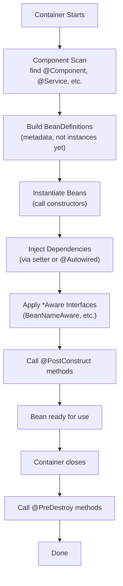

A typical use of lifecycle hooks:

```java
@Service
public class FileWatcher {
    private ScheduledExecutorService exec;

    @PostConstruct
    void init() { exec = Executors.newSingleThreadScheduledExecutor(); }

    @PreDestroy
    void shutdown() { exec.shutdown(); }
}
```

### Bean scopes

By default, beans are **singletons** — one instance per container, shared across all callers. This is what you usually want for stateless services. Other scopes:

| Scope | Description |
|---|---|
| `singleton` (default) | One per container |
| `prototype` | New instance every time the bean is requested |
| `request` | One per HTTP request (web only) |
| `session` | One per HTTP session |
| `application` | One per servlet context |
| `websocket` | One per WebSocket session |

**Singleton injecting prototype** is a gotcha: if `SingletonA` has a prototype bean injected by field, the prototype is instantiated *once* and reused — defeating the prototype scope. To get a fresh instance per call, inject `ObjectProvider<T>` (or use `@Lookup`) and call `.getObject()`.

### Resolving ambiguity: multiple beans of the same type

What if there are two implementations of `PaymentGateway`?

```java
@Service @Primary class StripeGateway implements PaymentGateway { }
@Service class PaypalGateway implements PaymentGateway { }
```

- `@Primary` — declares the default winner when there's a tie
- `@Qualifier("paypal")` — specify which one in the consumer
- Inject `List<PaymentGateway>` to get all implementations
- Inject `Map<String, PaymentGateway>` to get all keyed by bean name

```java
public OrderService(@Qualifier("paypal") PaymentGateway gateway) { ... }

public OrderService(List<PaymentGateway> allGateways) { ... }      // strategy registry pattern
```

## 2.4 Auto-configuration: the heart of Spring Boot

Auto-configuration is what makes Spring Boot feel magical. You add `spring-boot-starter-data-jpa` to your dependencies, define `spring.datasource.url`, and suddenly you have a fully-wired JPA setup — `DataSource`, `EntityManagerFactory`, `TransactionManager`, `JpaRepository` support, all configured automatically.

How? **`@EnableAutoConfiguration`** (included in `@SpringBootApplication`) consults a list of auto-configuration classes shipped in starter JARs at `META-INF/spring/org.springframework.boot.autoconfigure.AutoConfiguration.imports`. Each auto-config class uses **conditional annotations** to decide whether to register its beans:

```java
@AutoConfiguration
@ConditionalOnClass(DataSource.class)             // is DataSource on the classpath?
@ConditionalOnMissingBean(DataSource.class)       // did the user define one already?
@EnableConfigurationProperties(DataSourceProperties.class)
public class DataSourceAutoConfiguration {
    @Bean
    public DataSource dataSource(DataSourceProperties props) { ... }
}
```

The rule: **the user's beans always win**. Auto-configuration is "the default *if* you don't say otherwise." Define your own `DataSource` and Spring Boot's auto-config silently steps aside.

### Common conditional annotations

- `@ConditionalOnClass` — a class is on the classpath
- `@ConditionalOnMissingClass` — a class is NOT on the classpath
- `@ConditionalOnBean` — a bean of a type already exists
- `@ConditionalOnMissingBean` — a bean of a type does NOT exist
- `@ConditionalOnProperty` — a property is set (optional `havingValue` and `matchIfMissing`)
- `@ConditionalOnWebApplication` / `@ConditionalOnNotWebApplication`
- `@Profile` — a profile is active

### Common starters

| Starter | Pulls in |
|---|---|
| `spring-boot-starter-web` | Spring MVC, embedded Tomcat, Jackson |
| `spring-boot-starter-data-jpa` | Spring Data JPA + Hibernate |
| `spring-boot-starter-data-redis` | Spring Data Redis + Lettuce |
| `spring-boot-starter-security` | Spring Security |
| `spring-boot-starter-actuator` | Production endpoints, metrics |
| `spring-boot-starter-test` | JUnit 5, Mockito, AssertJ, MockMvc |
| `spring-boot-starter-validation` | Hibernate Validator |
| `spring-boot-starter-aop` | AspectJ |

### Debugging auto-configuration

Set `debug=true` or run with `--debug` to print the **conditions evaluation report** — every auto-config class and whether each condition matched. Or hit `/actuator/conditions` at runtime.

## 2.5 Configuration: properties, profiles, and externalization

Spring Boot supports configuration from many sources, with a well-defined priority order. Higher beats lower:

1. Command-line arguments (`--server.port=9090`)
2. JVM system properties (`-Dserver.port=9090`)
3. **OS environment variables** (`SERVER_PORT=9090`) ← typical for prod containers
4. `application-{profile}.yml`
5. `application.yml`

**Relaxed binding** means the framework maps among naming conventions: `server.port`, `SERVER_PORT`, `server-port`, `serverPort` all bind to the same property. This lets you use YAML conventions in source and Linux env-var conventions in production without remapping.

### `@Value` vs `@ConfigurationProperties`

```java
// @Value — quick but stringly-typed and per-property
@Service
public class RetryService {
    @Value("${app.retry.max-attempts}")
    private int maxAttempts;
}

// @ConfigurationProperties — type-safe, validated, grouped logically (PREFER THIS)
@ConfigurationProperties(prefix = "app.retry")
@Validated
public record RetryProperties(@Min(1) int maxAttempts, @Min(0) long backoffMs) {}
```

To enable scanning of `@ConfigurationProperties` classes:
```java
@SpringBootApplication
@ConfigurationPropertiesScan
public class Application { }
```

With the `spring-boot-configuration-processor` annotation processor on the build path, IDEs autocomplete properties in `application.yml`. Nice productivity boost.

### Profiles

Profiles activate or deactivate beans based on environment.

```java
@Profile("dev")
@Service
public class FakePaymentGateway implements PaymentGateway { /* in-memory mock */ }

@Profile({"prod", "staging"})
@Configuration
public class CloudConfig { ... }
```

Activate:
- `--spring.profiles.active=prod`
- `SPRING_PROFILES_ACTIVE=prod` env var
- `spring.profiles.active=prod` in YAML (only as a fallback)

Profile-specific files: `application-dev.yml`, `application-prod.yml`, etc., are loaded automatically when their profile is active, overlaying on top of `application.yml`.

## 2.6 Spring MVC: how HTTP requests become Java method calls

Spring MVC is the web framework inside Spring Framework. Even though "MVC" suggests templating, for backend APIs you'll mostly use it for JSON-in / JSON-out via `@RestController`.

### The DispatcherServlet pipeline

When an HTTP request arrives, Spring's `DispatcherServlet` runs it through a pipeline:

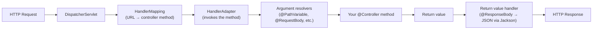

You write the controller method. Spring handles everything around it.

### A REST controller in detail

```java
@RestController
@RequestMapping("/api/v1/orders")
public class OrderController {

    private final OrderService service;

    public OrderController(OrderService service) {
        this.service = service;
    }

    @GetMapping
    public Page<OrderDto> list(@PageableDefault(size = 20) Pageable pageable) {
        return service.list(pageable);
    }

    @GetMapping("/{id}")
    public OrderDto get(@PathVariable long id) {
        return service.findById(id)
            .orElseThrow(() -> new NotFoundException(id));
    }

    @PostMapping
    @ResponseStatus(HttpStatus.CREATED)
    public OrderDto create(@Valid @RequestBody CreateOrderRequest request) {
        return service.create(request);
    }
}
```

What's happening:

- `@RestController` = `@Controller` + `@ResponseBody`. Method return values are serialized to JSON via Jackson (the default).
- `@RequestMapping("/api/v1/orders")` sets the base path. Method-level mappings (`@GetMapping`, `@PostMapping`, etc.) are appended.
- `@PathVariable` extracts URI template variables. `@RequestBody` deserializes the body. `@RequestParam` reads query strings or form fields. `@RequestHeader` reads headers.
- `@Valid` triggers Bean Validation on the body.
- `@ResponseStatus(CREATED)` overrides the default 200 OK with 201 Created.

For more control (custom headers, redirect URLs, status by case), return `ResponseEntity<>`:

```java
@PostMapping
public ResponseEntity<OrderDto> create(@Valid @RequestBody CreateOrderRequest r) {
    OrderDto created = service.create(r);
    URI location = URI.create("/api/v1/orders/" + created.id());
    return ResponseEntity.created(location).body(created);
}
```

### DTOs at the boundary — never expose entities

A common beginner mistake: returning JPA entities directly from controllers. This couples your API contract to your database schema, can leak sensitive fields (passwords, internal flags), and triggers Hibernate lazy-loading exceptions during JSON serialization (because the persistence context closed when the transaction ended).

Use **records as DTOs** at the API boundary:

```java
public record OrderDto(long id, String customer, BigDecimal total, Instant createdAt) {}
public record CreateOrderRequest(@NotBlank String customer, @NotEmpty List<LineItem> items) {}
```

Map between entity and DTO in the service layer.

## 2.7 Validation and exception handling

Bean Validation (Jakarta, formerly JSR-380) is the standard. Annotate fields with constraints, mark parameters with `@Valid`, and the framework checks before your method runs.

```java
public record CreateUserRequest(
    @NotBlank @Size(max=100) String name,
    @Email String email,
    @Min(18) int age,
    @Valid Address address                    // cascade — validate the nested object too
) {}

@PostMapping
public UserDto create(@Valid @RequestBody CreateUserRequest req) { ... }
```

Validation failures throw `MethodArgumentNotValidException` (for `@RequestBody`) or `ConstraintViolationException` (for `@RequestParam`/`@PathVariable` when the class is `@Validated`). Spring Boot 3 returns a default RFC 7807 Problem Details response, but you'll usually want a custom format.

### Global exception handling

```java
@RestControllerAdvice
public class GlobalExceptionHandler {

    @ExceptionHandler(NotFoundException.class)
    @ResponseStatus(HttpStatus.NOT_FOUND)
    public ApiError onNotFound(NotFoundException ex) {
        return new ApiError("NOT_FOUND", ex.getMessage());
    }

    @ExceptionHandler(MethodArgumentNotValidException.class)
    @ResponseStatus(HttpStatus.BAD_REQUEST)
    public ApiError onValidation(MethodArgumentNotValidException ex) {
        var fields = ex.getBindingResult().getFieldErrors().stream()
            .map(e -> Map.entry(e.getField(), e.getDefaultMessage()))
            .toList();
        return new ApiError("VALIDATION_FAILED", "Invalid request", fields);
    }

    @ExceptionHandler(Exception.class)
    @ResponseStatus(HttpStatus.INTERNAL_SERVER_ERROR)
    public ApiError onUnknown(Exception ex) {
        log.error("Unhandled error", ex);
        return new ApiError("INTERNAL", "Something went wrong");   // don't leak internals
    }
}
```

`@RestControllerAdvice` is a global `@ExceptionHandler` registry. Specific exception types get specific status codes. Always log unexpected exceptions; never echo internal details back to clients.

## 2.8 Spring Data JPA: declarative persistence

Spring Data JPA layers on top of JPA (the standard ORM API, implemented by Hibernate). Instead of writing CRUD boilerplate, you declare a repository interface and Spring generates the implementation:

```java
public interface OrderRepository extends JpaRepository<OrderEntity, Long> {

    // Derived query — method name parsed into a query
    List<OrderEntity> findByCustomer(String customer);
    Optional<OrderEntity> findFirstByStatusOrderByCreatedAtDesc(OrderStatus s);
    Page<OrderEntity> findByCustomer(String customer, Pageable pageable);

    @Query("SELECT o FROM OrderEntity o WHERE o.total > :min AND o.status = :s")
    List<OrderEntity> findBigOrdersByStatus(@Param("min") BigDecimal min, @Param("s") OrderStatus s);

    @Modifying
    @Query("UPDATE OrderEntity o SET o.status = :s WHERE o.id = :id")
    int updateStatus(@Param("id") long id, @Param("s") OrderStatus s);
}
```

`JpaRepository<T, ID>` extends `PagingAndSortingRepository<T, ID>` extends `CrudRepository<T, ID>` — gives you `save`, `findById`, `findAll`, `deleteById`, plus paging and sorting.

### Entity mapping basics

```java
@Entity
@Table(name = "orders")
public class OrderEntity {
    @Id
    @GeneratedValue(strategy = GenerationType.IDENTITY)
    private Long id;

    @Column(nullable = false, length = 100)
    private String customer;

    @Column(precision = 10, scale = 2, nullable = false)
    private BigDecimal total;

    @Enumerated(EnumType.STRING)              // STORE THE NAME, NEVER ORDINAL
    @Column(nullable = false)
    private OrderStatus status;

    @CreationTimestamp
    private Instant createdAt;

    @ManyToOne(fetch = FetchType.LAZY)        // ALWAYS LAZY — eager is a performance trap
    @JoinColumn(name = "customer_id")
    private CustomerEntity customerRef;

    @OneToMany(mappedBy = "order", cascade = CascadeType.ALL, orphanRemoval = true)
    private List<OrderLine> lines = new ArrayList<>();

    @Version                                  // optimistic locking
    private long version;

    protected OrderEntity() {}                // JPA requires a no-arg constructor
}
```

Critical gotchas:
- **`EnumType.STRING`** always. The default `ORDINAL` (integer index) silently corrupts if you reorder enum constants.
- **`fetch = LAZY`** on relations. The default `EAGER` triggers extra SELECTs on every fetch, leading to N+1 problems and slow listing endpoints.
- **`@Version`** for optimistic locking. Cheap insurance against lost updates.

### The N+1 problem

```java
List<OrderEntity> orders = repo.findAll();    // 1 query
for (var o : orders) o.getLines().size();      // N queries — one per order
```

If `lines` is lazy (recommended), accessing it triggers a separate `SELECT * FROM order_lines WHERE order_id = ?` for each parent. With 100 orders, you do 101 queries. This pattern is *the* most common performance bug in Spring Data apps.

**Fixes:**

```java
// JPQL JOIN FETCH — pull the related data in one query
@Query("SELECT o FROM OrderEntity o LEFT JOIN FETCH o.lines")
List<OrderEntity> findAllWithLines();

// Or EntityGraph — declarative
@EntityGraph(attributePaths = {"lines"})
@Override
List<OrderEntity> findAll();

// Or @BatchSize on the relation (Hibernate-specific) — batches the secondary loads
@OneToMany(mappedBy = "order")
@BatchSize(size = 50)
private List<OrderLine> lines;
```

Detect N+1 in tests by enabling Hibernate statistics or using `p6spy` to log every SQL statement.

### Schema migrations

Never use `spring.jpa.hibernate.ddl-auto=create` or `update` in production. Hibernate's schema management is fine for prototyping, terrible for real apps (no version control, no rollback). Use **Flyway** or **Liquibase**:

```
src/main/resources/db/migration/
    V1__init_schema.sql
    V2__add_orders_status_index.sql
    V3__add_idempotency_keys_table.sql
```

Set `spring.jpa.hibernate.ddl-auto=validate` so Hibernate confirms the schema matches but doesn't modify it.

## 2.9 Transactions: `@Transactional` deep dive

Database transactions are *the* highest-stakes feature in any backend that handles money. Get them wrong and you double-charge, lose updates, or corrupt invariants. Spring's `@Transactional` makes the *common* case easy and the *subtle* cases survivable — if you understand what's happening.

```java
@Service
public class OrderService {

    @Transactional
    public OrderDto place(CreateOrderRequest request) {
        OrderEntity o = new OrderEntity(request);
        repo.save(o);
        billing.charge(o.getTotal());
        return toDto(o);
        // On return: commit. On unchecked exception: rollback.
    }
}
```

### How `@Transactional` works under the hood

Spring uses **AOP proxies**. When `OrderService` is a bean, Spring wraps it in a proxy. Callers actually receive the proxy, not the real `OrderService`. When you call `orderService.place(...)`, the call hits the proxy first; the proxy:

1. Opens a transaction (acquires a DB connection, sets autoCommit=false)
2. Invokes the real method
3. On normal return: commits, returns the connection to the pool
4. On unchecked exception: rolls back, returns the connection

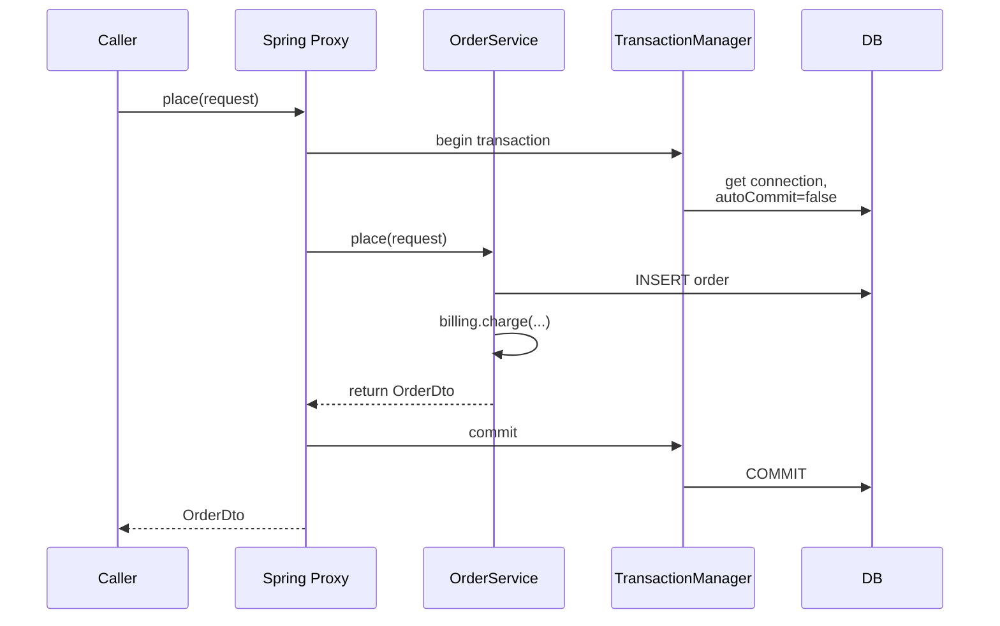

### The self-invocation trap

```java
@Service
public class OrderService {
    
    public void outer() {
        inner();                              // calls `this.inner()` — bypasses the proxy!
    }
    
    @Transactional
    public void inner() { ... }               // NO TRANSACTION because called through `this`
}
```

`outer()` calls `inner()` directly on `this`, not through the proxy. So no transaction is opened.

**Fixes**:
- Inject self: `@Autowired @Lazy OrderService self;` then call `self.inner()`. Ugly but works.
- Split into two beans: extract `inner` to a separate service.
- Use `@TransactionalEventListener` for event-driven flows.

This is one of the most-asked Spring interview questions. The answer to remember: **`@Transactional` only works through the proxy; self-invocations bypass it.**

### Rollback rules

By default:
- **Rolls back** on unchecked exceptions (`RuntimeException`, `Error`)
- **Commits** on checked exceptions

This default is surprising. A `SQLException` (checked) wraps DB failures — but Spring's defaults won't roll back on it. Override:

```java
@Transactional(rollbackFor = Exception.class)
```

Or, equivalently, throw `RuntimeException` from your own code instead of checked.

### Propagation

What if a `@Transactional` method calls another `@Transactional` method? Propagation rules:

| Propagation | Behavior |
|---|---|
| `REQUIRED` (default) | Join existing tx, or start a new one |
| `REQUIRES_NEW` | Suspend outer, start a new tx, resume outer afterward |
| `SUPPORTS` | Join existing if there is one, else run non-transactionally |
| `MANDATORY` | Must have a tx in progress — throw if not |
| `NEVER` | Must NOT have a tx — throw if there is one |
| `NESTED` | Savepoint within outer tx; rollback savepoint rolls back to it |

**`REQUIRES_NEW` use case**: audit logging or event publishing that must succeed even if the outer transaction rolls back.

### Isolation levels

```java
@Transactional(isolation = Isolation.REPEATABLE_READ, timeout = 5)
```

Isolation levels (see §11.5 for theory):
- `READ_UNCOMMITTED` — dirty reads possible
- `READ_COMMITTED` — Postgres default
- `REPEATABLE_READ` — MySQL InnoDB default
- `SERIALIZABLE` — strongest

Higher isolation = fewer anomalies, lower throughput. Pick based on the actual race conditions in your domain.

### readOnly = true

```java
@Transactional(readOnly = true)
public List<OrderDto> recentOrders() { ... }
```

Hints that no writes will happen. Optimizations:
- Hibernate skips dirty checking (cheaper)
- Connection can be routed to a read replica
- Sets `Connection.setReadOnly(true)` (some DBs optimize)

### Where to put `@Transactional`

**On service-layer methods** (use-case granularity). Reasons:

- Service layer is the natural unit of business action
- Controllers shouldn't be transactional — mixing HTTP and persistence concerns
- Don't annotate `@Async` methods — the new thread doesn't share the caller's transaction context

## 2.10 Spring Security: authentication and authorization

Spring Security is a separate but tightly-integrated framework. It works as a chain of servlet filters that runs *before* your controllers — every request passes through, and the security filters decide whether to allow it.

### Modern configuration (Spring Security 6+)

```java
@Configuration
@EnableWebSecurity
@EnableMethodSecurity
public class SecurityConfig {

    @Bean
    public SecurityFilterChain api(HttpSecurity http) throws Exception {
        return http
            .csrf(csrf -> csrf.disable())                               // stateless API
            .sessionManagement(s -> s.sessionCreationPolicy(STATELESS))
            .authorizeHttpRequests(auth -> auth
                .requestMatchers("/actuator/health", "/public/**").permitAll()
                .requestMatchers("/api/admin/**").hasRole("ADMIN")
                .anyRequest().authenticated())
            .oauth2ResourceServer(oauth -> oauth.jwt(Customizer.withDefaults()))
            .build();
    }

    @Bean
    public PasswordEncoder passwordEncoder() {
        return new BCryptPasswordEncoder(12);    // strength = work factor (cost)
    }
}
```

### Authentication vs Authorization

- **Authentication (authn)**: who are you? Verify credentials.
- **Authorization (authz)**: what can you do? Check roles/permissions.

Usually checked in that order — first authenticate, then authorize.

### JWT for stateless APIs

JSON Web Tokens are the standard for stateless API auth. The flow:

1. Client logs in with username/password
2. Server validates, generates a JWT (signed token containing user identity claims)
3. Client sends `Authorization: Bearer <token>` on every subsequent request
4. Server validates signature, extracts claims — no session lookup needed

```yaml
spring:
  security:
    oauth2:
      resourceserver:
        jwt:
          jwk-set-uri: https://auth.example.com/.well-known/jwks.json
```

JWT structure: three base64url-encoded sections separated by dots — header, payload, signature. The signature is computed over header+payload using a secret (HMAC) or private key (RSA/ECDSA), so tampering invalidates it.

```java
// HS256 JWT generation with JJWT 0.12
String token = Jwts.builder()
    .subject(userId)
    .claim("role", "USER")
    .issuedAt(now)
    .expiration(Date.from(now.toInstant().plusSeconds(3600)))
    .signWith(Keys.hmacShaKeyFor(secret.getBytes()))
    .compact();
```

### Password hashing

**Never store plaintext passwords.** Use `BCryptPasswordEncoder` (good default) or `Argon2PasswordEncoder` (modern choice, memory-hard).

```java
String hashed = encoder.encode(rawPassword);     // one-way hash
boolean ok = encoder.matches(rawPassword, hashed);  // compare
```

BCrypt is intentionally slow (configurable cost factor — higher = slower = more secure). The slowness is a feature: it limits brute-force attacks.

### Method-level security

```java
@PreAuthorize("hasRole('ADMIN')")
public void deleteUser(long id) { ... }

@PreAuthorize("hasRole('USER') and #userId == authentication.principal.id")
public List<Order> myOrders(long userId) { ... }
```

`@PreAuthorize` evaluates a SpEL expression *before* the method runs. Can reference method arguments and the authenticated principal.

## 2.11 AOP: cross-cutting concerns without pollution

Aspect-Oriented Programming addresses concerns that span many classes — logging, metrics, transactions, security, retry. Without AOP, you'd repeat `log.info("entering...")` at the start of every method. With AOP, you write the cross-cutting code *once* and declare *where* it applies.

Concepts:
- **Aspect** — a module of cross-cutting behavior
- **Join point** — a point in execution where the aspect can apply (in Spring AOP: any method call)
- **Pointcut** — an expression that selects join points
- **Advice** — the code to execute at a join point (`@Before`, `@After`, `@Around`)

```java
@Aspect
@Component
public class TimingAspect {
    private static final Logger log = LoggerFactory.getLogger(TimingAspect.class);

    @Around("execution(* com.acme.app.service..*(..))")
    public Object time(ProceedingJoinPoint pjp) throws Throwable {
        long start = System.nanoTime();
        try {
            return pjp.proceed();
        } finally {
            log.info("{} took {} ms",
                pjp.getSignature().toShortString(),
                (System.nanoTime() - start) / 1_000_000);
        }
    }
}
```

The pointcut `execution(* com.acme.app.service..*(..))` matches any method in any class under `service` package and its subpackages.

**Spring's `@Transactional`, `@Async`, `@Cacheable`, `@PreAuthorize` all use AOP under the hood**. Understanding AOP demystifies them all.

### Custom annotation + aspect

```java
@Target(METHOD)
@Retention(RUNTIME)
public @interface AuditLog {
    String action();
}

@Aspect @Component
public class AuditAspect {
    @AfterReturning("@annotation(audit)")
    public void log(JoinPoint jp, AuditLog audit) {
        auditRepo.save(new AuditRecord(audit.action(), currentUser(), Instant.now()));
    }
}

// Usage:
@AuditLog(action = "DELETE_USER")
public void deleteUser(long id) { ... }
```

### The proxy caveat

Spring AOP works via runtime proxies (JDK dynamic proxy if the bean implements an interface, otherwise CGLIB subclass). This means:
- **Self-invocations bypass the proxy** (same trap as `@Transactional`)
- **Private methods can't be intercepted**
- **`final` classes/methods break CGLIB proxying**

For true compile-time weaving (working everywhere), use AspectJ. Spring AOP is "good enough" for the common cases.

## 2.12 Caching

```java
@SpringBootApplication
@EnableCaching
public class Application { }

@Service
public class UserService {
    @Cacheable(value = "users", key = "#id")
    public UserDto get(long id) { ... }      // first call → DB; subsequent → cache

    @CacheEvict(value = "users", key = "#user.id")
    public void update(User user) { ... }    // invalidate

    @CachePut(value = "users", key = "#result.id")
    public UserDto save(UserDto user) { ... } // always execute; cache result

    @Cacheable(value = "users", key = "#id", sync = true)
    public UserDto getSync(long id) { ... }  // single-flight on miss
}
```

### Cache providers

The default `@EnableCaching` uses an in-memory `ConcurrentMapCacheManager` — fine for tests, terrible for production (no eviction, unbounded growth, per-instance).

Real options:
- **Caffeine** — best in-process cache for Java. Excellent hit ratios, modest memory overhead, simple.
- **Redis** — distributed, shared across instances, TTL native. Slower per-op (network), but the right answer when you have multiple instances and need consistency.
- **Hazelcast** — distributed in-memory data grid. More features than Redis, more complexity.

```yaml
spring:
  cache:
    type: redis
    redis:
      time-to-live: 5m
```

### The single-flight problem

When `@Cacheable(sync = true)`, only one thread runs the actual computation on a cache miss; others wait for it. Without `sync`, a hot key going stale causes a thundering herd — every concurrent miss hits the underlying source.

## 2.13 Testing Spring Boot apps

Spring Boot's test framework lets you load just the slice of the application you need. Faster tests, less framework noise.

| Annotation | Loads | Use for |
|---|---|---|
| `@SpringBootTest` | Full application context | E2E, integration |
| `@WebMvcTest(MyController.class)` | Web layer only (controllers, filters, advice) | Controller tests |
| `@DataJpaTest` | JPA + embedded DB | Repository tests |
| `@JsonTest` | Jackson | Serialization tests |

### Slice test example

```java
@WebMvcTest(OrderController.class)
class OrderControllerTest {
    @Autowired MockMvc mvc;
    @MockBean OrderService service;

    @Test
    void getOrder() throws Exception {
        when(service.findById(1L))
            .thenReturn(Optional.of(new OrderDto(1L, "Alice", BigDecimal.TEN, Instant.now())));

        mvc.perform(get("/api/v1/orders/1"))
           .andExpect(status().isOk())
           .andExpect(jsonPath("$.customer").value("Alice"));
    }
}
```

`@WebMvcTest` skips loading services, repositories, and other non-web beans. Fast. Mock the service layer with `@MockBean`.

### Integration with Testcontainers

For real DB / Kafka / Redis tests, **Testcontainers** spins up actual Docker containers per test run:

```java
@SpringBootTest
@Testcontainers
class OrderIntegrationTest {
    @Container
    static PostgreSQLContainer<?> postgres = new PostgreSQLContainer<>("postgres:15");

    @DynamicPropertySource
    static void props(DynamicPropertyRegistry r) {
        r.add("spring.datasource.url", postgres::getJdbcUrl);
        r.add("spring.datasource.username", postgres::getUsername);
        r.add("spring.datasource.password", postgres::getPassword);
    }

    @Autowired OrderRepository repo;

    @Test
    void roundTrip() {
        var saved = repo.save(new OrderEntity(...));
        assertThat(repo.findById(saved.getId())).isPresent();
    }
}
```

Slower than slice tests but catches real persistence issues. Use sparingly for high-value integration paths.

## 2.14 Actuator: production-readiness endpoints

`spring-boot-starter-actuator` exposes endpoints for operational visibility:

| Endpoint | What |
|---|---|
| `/actuator/health` | Liveness/readiness — for load balancer health checks |
| `/actuator/info` | App metadata |
| `/actuator/metrics` | Micrometer metrics |
| `/actuator/prometheus` | Metrics in Prometheus format |
| `/actuator/env` | Environment + properties (sensitive — secure!) |
| `/actuator/loggers` | View/change log levels at runtime |
| `/actuator/threaddump` | Thread dump |
| `/actuator/heapdump` | Trigger heap dump |

```yaml
management:
  endpoints:
    web:
      exposure:
        include: health,info,metrics,prometheus
  endpoint:
    health:
      show-details: when-authorized       # don't leak DB details to anonymous
```

Health groups for Kubernetes:
```yaml
management:
  endpoint:
    health:
      group:
        liveness:  { include: livenessState }
        readiness: { include: readinessState, db, redis }
```

## 2.15 Top Spring Boot interview questions

**Q: What is auto-configuration and how does it work?**
Spring Boot consults a list of auto-configuration classes (in `META-INF/spring/...AutoConfiguration.imports`) shipped by starter JARs. Each uses conditional annotations (`@ConditionalOnClass`, `@ConditionalOnMissingBean`, etc.) to decide whether to register beans. User beans always win — auto-config is the default if you don't override.

**Q: Why prefer constructor injection?**
Immutability (`final` fields), mandatory dependencies are explicit, trivially testable without Spring, fails fast at startup, detects circular deps. Field injection hides what's required and silently allows design problems.

**Q: `@Component` vs `@Service` vs `@Repository`?**
All are detected by component scanning. `@Service` and `@Repository` are semantic specializations. `@Repository` additionally translates persistence exceptions into Spring's `DataAccessException` hierarchy.

**Q: How does `@Transactional` work? Self-invocation trap?**
Spring wraps the bean in an AOP proxy. The proxy begins a transaction, calls the method, commits or rolls back. Self-invocation (calling `this.method()` from another method in the same class) bypasses the proxy — no transaction starts. Fix: inject self, or split into two beans.

**Q: Default rollback behavior?**
Rolls back on unchecked exceptions (`RuntimeException`, `Error`). Commits on checked. Override with `rollbackFor=Exception.class` if you want checked-on-rollback.

**Q: How does Spring resolve which bean to inject when multiple match?**
Looks for `@Primary`, then `@Qualifier`. Or you can inject `List<T>` of all impls, or `Map<String, T>` keyed by bean name. Throws `NoUniqueBeanDefinitionException` if it can't decide.

**Q: Difference between `@RequestParam` and `@PathVariable`?**
`@PathVariable` reads from URI templates (`/users/{id}` → 42 from `/users/42`). `@RequestParam` reads from query strings or form fields (`?id=42`).

**Q: How do you handle exceptions globally?**
`@RestControllerAdvice` class with `@ExceptionHandler` methods. Each handler maps a specific exception type to a specific HTTP status with a consistent error body format.

**Q: HikariCP — why is it the default?**
Performance. Lock-free `ConcurrentBag`, optimized hot loops, minimal overhead. Default in Spring Boot since 2.0.

**Q: Spring profile activation order?**
Command-line `--spring.profiles.active` > `SPRING_PROFILES_ACTIVE` env var > `spring.profiles.active` in YAML.

**Q: How do you test a controller without starting the full app?**
`@WebMvcTest(MyController.class)` — loads only the web layer (controllers, filters, advice). Mock service dependencies with `@MockBean`. Call endpoints with `MockMvc`.

**Q: How does `@Cacheable` know what to cache?**
By default, the key is composed from the method's parameters. Override with SpEL: `key = "#id"` or `key = "#user.id + ':' + #user.tenant"`.

**Q: RestTemplate vs RestClient vs WebClient?**
- RestTemplate: legacy synchronous, in maintenance mode
- RestClient: modern synchronous (Spring 6.1+), fluent API, works with virtual threads
- WebClient: reactive non-blocking, for WebFlux apps

**Q: How does Spring Security protect a REST endpoint?**
Defines a `SecurityFilterChain` with `authorizeHttpRequests` rules. CSRF is disabled for stateless APIs. JWT resource server validates `Authorization: Bearer ...` tokens. Method-level `@PreAuthorize` for finer-grained checks.

**Q: How does `@Async` work?**
Spring proxy hands off the method invocation to a `TaskExecutor` (configured separately). Returns immediately, optionally with a `Future`/`CompletableFuture` for the result. Subject to the same self-invocation trap as `@Transactional`.

---


# 3. JavaScript & TypeScript Essentials

> NAB will probe JavaScript fundamentals because your CV uses Node + Express + TypeScript. Focus on what makes JS *different* from Java — dynamic typing, prototypes, closures, the event loop, and the famously confusing `this` keyword. Understanding the underlying model lets you answer any question, not just the ones you've memorized.

## 3.1 What kind of language is JavaScript?

JavaScript is a **dynamically-typed**, **single-threaded**, **event-driven**, **prototype-based** language with **first-class functions** and **automatic garbage collection**. Each of those adjectives describes something with deep implications:

**Dynamically-typed** means variables don't have fixed types — only values do. `let x = 5; x = "hello"; x = [1,2,3];` is all legal. The flexibility is fast for prototyping but means many bugs only surface at runtime. TypeScript was invented to bolt back the static typing layer that JavaScript lacks.

**Single-threaded** means one thing runs at a time. No threads, no thread synchronization issues — but also no parallelism within a single JavaScript context. Concurrency comes from **the event loop**: while one piece of work waits for I/O, the runtime processes other pending callbacks. This model is great for I/O-heavy servers (Node was designed for this), poor for CPU-bound work.

**Event-driven** means I/O doesn't block — it registers a callback. When a file read finishes, a timer fires, or an HTTP request completes, the runtime schedules its callback to run. Your code is mostly reactions to events.

**Prototype-based** is the unusual one. Java/C++ use **class-based** inheritance: classes define structure, instances follow that template. JavaScript uses **prototype-based** inheritance: objects inherit directly from other objects. Even with the modern `class` syntax (ES2015), under the hood it's still prototypes. We'll explore this in §3.6.

**First-class functions** means functions are values — assignable to variables, passable as arguments, returnable from functions. Combined with closures, this is what makes JavaScript a true functional language.

### Where JavaScript runs

JavaScript was born in the browser (1995) but now runs in many environments:
- **Browsers** (V8 in Chrome, SpiderMonkey in Firefox, JavaScriptCore in Safari)
- **Node.js** (server-side, using V8)
- **Deno, Bun** (newer Node alternatives)
- **Edge runtimes** (Cloudflare Workers, Vercel Edge)
- **Embedded** (IoT devices)

The **language standard** is ECMAScript (ES), versioned by year (ES2015, ES2016, ...). Every modern JS engine implements ES2020 or later. "JavaScript" colloquially means "ES + whatever DOM/Node APIs are also available."

## 3.2 Variables: `var`, `let`, `const`

```js
var  a = 1;     // function-scoped, hoisted, can re-declare — DON'T USE in modern code
let  b = 2;     // block-scoped, hoisted but in TDZ until declaration
const c = 3;    // block-scoped, can't reassign (object/array contents still mutable!)
```

### Scoping: function vs block

`var` is **function-scoped**: a `var` declared anywhere in a function is visible throughout the entire function, even before its declaration line:

```js
function f() {
    console.log(x);   // undefined (NOT a ReferenceError!)
    var x = 5;
    console.log(x);   // 5
}
```

The `var x` declaration is **hoisted** to the top of the function. `x` exists from the first line; its value is `undefined` until the assignment runs.

`let` and `const` are **block-scoped**: visible only inside the `{...}` block they're declared in. They're also hoisted (declarations are processed before code runs), but accessing them before the declaration line throws a `ReferenceError` — this is the **Temporal Dead Zone (TDZ)**:

```js
function f() {
    console.log(x);   // ReferenceError — x is in TDZ
    let x = 5;
}
```

The TDZ catches a class of bugs: using a variable before you meant to. Block scoping also fixes the classic `var` closure trap:

```js
// With var — all callbacks see i = 3 because there's one `i` per function
for (var i = 0; i < 3; i++) setTimeout(() => console.log(i), 0);
// Prints: 3, 3, 3

// With let — each iteration has its own `i`
for (let i = 0; i < 3; i++) setTimeout(() => console.log(i), 0);
// Prints: 0, 1, 2
```

**Modern guidance**: always use `const`. Promote to `let` only when you genuinely need to reassign. Never use `var`.

### `const` doesn't mean "immutable contents"

`const` makes the *binding* immutable — you can't reassign the variable. The *object* it points to is still mutable:

```js
const arr = [1, 2];
arr.push(3);          // OK — mutating contents
arr = [];             // TypeError — can't reassign

const obj = {x: 1};
obj.x = 2;            // OK
Object.freeze(obj);   // make contents read-only too (shallow)
```

For deep immutability, use `Object.freeze()` recursively or libraries like `immer`.

## 3.3 Types and type coercion

JavaScript has **7 primitive types** and **1 reference type** (object).

Primitives: `undefined`, `null`, `boolean`, `number`, `string`, `symbol`, `bigint`.
Reference type: `object` (includes arrays, functions, dates, regexes — everything).

### Numbers: just IEEE 754 doubles

There's no integer type. Every `number` in JavaScript is a 64-bit IEEE 754 double. This has surprising consequences:

```js
0.1 + 0.2 === 0.3;        // false! 0.1 + 0.2 = 0.30000000000000004
2 ** 53 === 2 ** 53 + 1;  // true! Doubles lose precision above 2^53
```

For larger integers or precise decimal arithmetic, use `BigInt`:

```js
2n ** 100n;               // 1267650600228229401496703205376n — exact
```

Never use `number` for money. Use a decimal library or store amounts as integer cents.

### `undefined` vs `null`

- `undefined` — a variable is declared but not assigned, a missing function argument, a missing object property, or the return value of a function with no `return`.
- `null` — an *intentional* "no value", set by you to signal absence.

The convention: let `undefined` happen naturally; assign `null` explicitly to indicate intent.

```js
function find(id) {
    if (notFound) return null;    // intentional
    return result;
}

let x;                            // x is undefined naturally
```

### Type coercion: the source of `==` vs `===`

`==` performs **type coercion** — converts operands to a common type before comparing. The rules are complicated and infamous:

```js
"5" == 5         // true  (string coerced to number)
0 == false       // true  (boolean coerced to number)
null == undefined // true (special case)
[] == false      // true  (array → "" → 0 → matches false→0)
[] == ![]        // true  (because []→0, ![]→false→0)
```

`===` (strict equality) does **no coercion**. Same value AND same type:

```js
"5" === 5        // false
null === undefined // false
```

**Modern guidance**: always use `===` and `!==`. The only `==` exception some teams allow: `x == null` (catches both `null` and `undefined` in one check).

### Truthy and falsy

In a boolean context (e.g. `if (x)`), each value is either **truthy** (treated as `true`) or **falsy** (treated as `false`).

**Falsy values** (exhaustive): `false`, `0`, `-0`, `0n`, `""`, `null`, `undefined`, `NaN`.

**Everything else is truthy**, including:
- `"0"` (non-empty string)
- `"false"` (non-empty string)
- `[]` (empty array — but `[] == false` is true under `==`! one of JS's worst footguns)
- `{}` (empty object)

```js
if ("0") { /* runs! */ }
if ([]) { /* runs! */ }
```

The new **nullish coalescing operator** `??` differs from `||` by treating only `null`/`undefined` as "missing":

```js
const port = config.port ?? 3000;  // uses 3000 only if port is null/undefined, NOT if it's 0
const port = config.port || 3000;  // uses 3000 if port is 0, "", false — usually wrong!
```

### `typeof` quirks

```js
typeof undefined  // "undefined"
typeof null       // "object"  — historical bug, will never be fixed
typeof []         // "object"  — arrays are objects
typeof function(){} // "function"
typeof NaN        // "number"
```

To check for an array: `Array.isArray(x)`. To check for null: `x === null`. To check for object specifically: `typeof x === 'object' && x !== null && !Array.isArray(x)`.

## 3.4 Functions are values: first-class functions

Functions in JavaScript are objects — values you can assign, pass, and return.

```js
// All four create equivalent function values
function add(a, b) { return a + b; }
const add = function(a, b) { return a + b; };
const add = function named(a, b) { return a + b; };
const add = (a, b) => a + b;
```

Higher-order functions take other functions as arguments or return them:

```js
const apply = (fn, x) => fn(x);
apply(n => n * 2, 5);                 // 10

const adder = n => x => x + n;        // returns a function
const add5 = adder(5);
add5(10);                              // 15
```

### Arrow functions vs regular functions

Arrow functions have two key differences from regular functions:

1. **They don't bind their own `this`** — they inherit from the enclosing scope (see §3.7)
2. **They can't be used as constructors** — `new (() => {})()` throws

Use arrow functions when you want to inherit `this` (callback inside a method, `.then` chains). Use regular functions for methods on objects (so they have their own `this`).

## 3.5 Closures: the most powerful concept in JS

A **closure** is a function that "remembers" the variables from the scope in which it was defined, even after that scope has finished executing.

```js
function makeCounter() {
    let count = 0;
    return function() {
        count++;
        return count;
    };
}

const counter = makeCounter();
counter();    // 1
counter();    // 2
counter();    // 3
```

`makeCounter` returns and exits. Normally, its local `count` variable would be eligible for garbage collection. But because the returned function references `count`, the engine keeps that variable alive — it's part of the closure. Each call to the closure mutates the same `count`.

### Closures everywhere

Closures aren't a "feature you use sometimes" — they're how essentially every JS pattern works:

```js
// Event handlers — closure over the surrounding state
function setup(button) {
    let clicks = 0;
    button.addEventListener('click', () => {
        clicks++;
        console.log('clicked', clicks, 'times');
    });
}

// Module pattern — closure to hide state
const counter = (() => {
    let count = 0;
    return {
        increment: () => ++count,
        get: () => count,
    };
})();

// Memoization — closure to keep cache
function memoize(fn) {
    const cache = new Map();
    return (arg) => {
        if (!cache.has(arg)) cache.set(arg, fn(arg));
        return cache.get(arg);
    };
}

const slowSquare = (n) => { /* ... */ return n * n; };
const fastSquare = memoize(slowSquare);
```

### The classic closure interview question

```js
for (var i = 0; i < 3; i++) {
    setTimeout(() => console.log(i), 0);
}
// Prints 3, 3, 3 — why?
```

Because `var` is function-scoped, there's one `i` shared by all three callbacks. By the time the callbacks run (after the loop completes), `i` is 3.

Fix with `let` (each iteration gets its own `i`):

```js
for (let i = 0; i < 3; i++) {
    setTimeout(() => console.log(i), 0);
}
// Prints 0, 1, 2
```

Or with an IIFE creating its own scope (old-school):

```js
for (var i = 0; i < 3; i++) {
    (function(j) {
        setTimeout(() => console.log(j), 0);
    })(i);
}
```

## 3.6 Prototypes and classes

JavaScript's inheritance is **prototype-based**, not class-based. Every object has an internal link to another object — its **prototype**. When you access a property, JavaScript walks the prototype chain looking for it.

```js
const animal = { eats: true };
const rabbit = { jumps: true };

Object.setPrototypeOf(rabbit, animal);   // rabbit's prototype is now animal

rabbit.jumps;     // true   (own property)
rabbit.eats;      // true   (inherited via prototype)
```

The chain ends at `Object.prototype` (whose prototype is `null`).

### Functions as constructors and `prototype`

Before `class` was added, you used **constructor functions** with a `prototype` object:

```js
function Animal(name) {
    this.name = name;
}
Animal.prototype.eat = function() {
    console.log(this.name + ' eats');
};

const rex = new Animal('Rex');
rex.eat();         // 'Rex eats'
```

`new Animal('Rex')` does roughly:
1. Create a new empty object whose prototype is `Animal.prototype`
2. Call `Animal.call(newObject, 'Rex')` — runs the function with `this` = newObject
3. Return the new object (unless the constructor explicitly returned something else)

### The `class` syntax — syntactic sugar over prototypes

ES2015 added `class`:

```js
class Animal {
    constructor(name) {
        this.name = name;
    }
    eat() {
        console.log(this.name + ' eats');
    }
}

class Dog extends Animal {
    bark() {
        console.log(this.name + ' barks');
    }
    eat() {
        super.eat();
        console.log('...hungrily');
    }
}
```

Under the hood, this is still prototypes — `class` is sugar. `Dog.prototype` is an object whose prototype is `Animal.prototype`. The hierarchy chain works because of prototypal lookup.

Key implications:
- Methods are stored on the prototype, not the instance — one shared method per class, not one per object. Memory-efficient.
- Adding a method to a class's prototype later affects all existing instances.
- The chain is dynamic — you can change it at runtime (though you almost never should).

## 3.7 `this`: the famously confusing keyword

In Java, `this` always refers to the current instance. In JavaScript, `this` is **determined by how the function is called**, not where it was defined. Four "binding rules":

### Rule 1: Default binding

A plain function call binds `this` to the global object (`window` in browsers, `global` in Node) — or to `undefined` in strict mode.

```js
function f() { return this; }
f();    // global object (or undefined in strict mode)
```

### Rule 2: Implicit binding (method call)

When a function is called as a property of an object, `this` is that object.

```js
const obj = {
    name: 'Alice',
    greet() { return 'Hi, ' + this.name; }
};
obj.greet();    // 'Hi, Alice'
```

The implicit binding is fragile — *which* object owns the call matters:

```js
const greet = obj.greet;
greet();        // 'Hi, undefined' — bare function call, no implicit object
```

Or when you pass a method as a callback:

```js
button.addEventListener('click', obj.greet);
// When the button fires, `greet` is called bare — `this` is the button (or undefined)
```

This is why people get bitten by `this` in callbacks. Fix: arrow functions (Rule 4), or `.bind()` (next rule).

### Rule 3: Explicit binding (call, apply, bind)

```js
function greet() { return 'Hi, ' + this.name; }
const alice = { name: 'Alice' };

greet.call(alice);          // 'Hi, Alice' — call directly with `this`
greet.apply(alice);         // same; apply takes args as an array
const boundGreet = greet.bind(alice);  // returns a new function with `this` permanently bound
boundGreet();               // 'Hi, Alice'
```

### Rule 4: Arrow functions

Arrow functions **don't have their own `this`**. They inherit from the surrounding lexical scope at the time they're defined:

```js
const obj = {
    name: 'Alice',
    greet: function() {
        const inner = () => this.name;   // arrow inherits `this` from greet's call site
        return inner();
    }
};
obj.greet();    // 'Alice'

const obj2 = {
    name: 'Bob',
    greet: () => this.name,   // arrow at top-level — `this` is global, not obj2
};
obj2.greet();    // undefined (in modules / strict)
```

**Rules of thumb**:
- **Methods on objects**: regular function (`greet() { ... }`)
- **Callbacks inside methods**: arrow function (so `this` is inherited)
- **Constructors**: regular function or `class`
- **Top-level helpers** (no `this` needed): either, but arrow is shorter

## 3.8 Asynchronous JavaScript: callbacks, promises, async/await

JavaScript is single-threaded but excels at I/O because of its async model.

### Callbacks: the original async pattern

```js
fs.readFile('a.txt', (err, dataA) => {
    if (err) return handleError(err);
    fs.readFile('b.txt', (err, dataB) => {
        if (err) return handleError(err);
        fs.readFile('c.txt', (err, dataC) => {
            // "callback hell" — deeply nested, error handling repeated
        });
    });
});
```

Callbacks work but compose poorly — sequential async ops nest deeply, and error handling has to be repeated at every level.

### Promises: a value that will exist

A **Promise** is an object representing the eventual completion (or failure) of an async operation. Promises are *chainable* — `.then` returns a new promise.

```js
fetch('/api/user/1')
    .then(response => response.json())
    .then(user => fetch(`/api/orders?userId=${user.id}`))
    .then(response => response.json())
    .then(orders => console.log(orders))
    .catch(err => console.error('failed:', err));
```

Promise states:
- **Pending** — initial state
- **Fulfilled** — resolved with a value
- **Rejected** — failed with a reason

Once settled (fulfilled or rejected), a promise's state never changes. Callbacks attached via `.then()` / `.catch()` run on the next microtask tick.

```js
const p = new Promise((resolve, reject) => {
    setTimeout(() => resolve(42), 100);
});
p.then(value => console.log(value));    // 42 (after 100ms)
```

### async/await: promises in disguise

`async/await` is syntactic sugar over promises. An `async` function returns a promise; `await` suspends the function until a promise settles, then resumes with its value.

```js
async function loadUserOrders(userId) {
    try {
        const userRes = await fetch(`/api/user/${userId}`);
        const user = await userRes.json();
        const ordersRes = await fetch(`/api/orders?userId=${user.id}`);
        return await ordersRes.json();
    } catch (err) {
        console.error('failed:', err);
        throw err;    // rethrow if caller should handle
    }
}
```

Reads like synchronous code; runs asynchronously. **This is the modern default**. Callbacks and raw promises are still common in libraries but writing application code with `async/await` is cleaner.

### Promise combinators

```js
// Wait for ALL to resolve (or first to reject)
const [users, orders, products] = await Promise.all([
    fetch('/api/users').then(r => r.json()),
    fetch('/api/orders').then(r => r.json()),
    fetch('/api/products').then(r => r.json()),
]);

// Wait for ALL to settle (resolve or reject), get array of {status, value/reason}
const results = await Promise.allSettled([p1, p2, p3]);

// Take the first to settle (resolve OR reject)
const first = await Promise.race([fetchFromCache(), fetchFromDb()]);

// Take the first to RESOLVE (skip rejections); reject only if all reject
const fastest = await Promise.any([p1, p2, p3]);
```

`Promise.all` is the workhorse — concurrent fetches that complete together. If you `await` them sequentially you lose the parallelism:

```js
// Slow: 300ms total (sequential)
const a = await fetchA();
const b = await fetchB();
const c = await fetchC();

// Fast: ~100ms (parallel, then await all)
const [a, b, c] = await Promise.all([fetchA(), fetchB(), fetchC()]);
```

### Common async pitfalls

**Forgetting to `await`**:
```js
async function bad() {
    const result = saveToDb(data);    // returns a Promise, not the result!
    return result;                     // returns the Promise, caller might forget to await
}
```

**Sequential awaits where parallel would do**: see above.

**Errors lost in async functions** if you don't `await` or attach `.catch`:
```js
async function fireAndForget() {
    saveAsync();    // if this rejects, "unhandled promise rejection" — silent in older Node
}
```

## 3.9 The event loop — *the* Node interview topic

Node and browsers both implement an **event loop**: a perpetually-running loop that pulls work off queues and runs it on the main JavaScript thread.

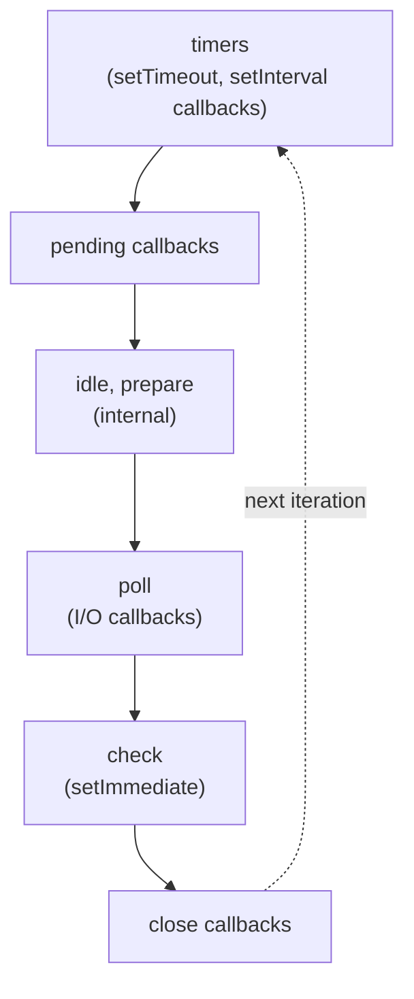

Each phase has its own callback queue. The loop visits phases in order. Crucially: **between each phase**, the loop drains:
1. The **microtask queue** (Promise callbacks, `queueMicrotask`)
2. The **`process.nextTick` queue** (Node-specific, even higher priority)

This means a chain of Promise resolutions can run many microtasks before the next phase starts.

### Macro-tasks vs micro-tasks

```js
console.log('1');
setTimeout(() => console.log('2'), 0);             // macro-task (timers phase)
Promise.resolve().then(() => console.log('3'));    // micro-task — runs first
process.nextTick(() => console.log('4'));          // even higher priority than micro-tasks
console.log('5');

// Output: 1, 5, 4, 3, 2
```

Why? The synchronous code (1, 5) runs first. Then between operations, the microtask queue drains: nextTick (4) before Promise.then (3). Only then does the loop enter the timers phase and run the setTimeout callback (2).

### Don't block the event loop

Because everything is on one thread, a slow synchronous operation blocks ALL other work:

```js
app.get('/slow', (req, res) => {
    const result = computeForTenSeconds();    // blocks the event loop!
    res.json(result);
});
// During those 10 seconds, NO OTHER REQUEST can be processed
```

Solutions:
- Offload CPU work to worker threads (`worker_threads` in Node)
- Use streaming or batching to break up the work
- Refactor to async I/O if the slowness is I/O-bound

## 3.10 ES modules and CommonJS

JavaScript has two module systems coexisting:

**CommonJS (CJS)** — Node's original module system. Synchronous loading, `require()` / `module.exports`:

```js
// math.js
function add(a, b) { return a + b; }
module.exports = { add };

// main.js
const { add } = require('./math');
```

**ES Modules (ESM)** — the modern standard, used in browsers and increasingly in Node. Asynchronous loading, `import` / `export`:

```js
// math.js
export function add(a, b) { return a + b; }
export default class Calculator { ... }

// main.js
import Calculator, { add } from './math.js';
```

In Node, files with `.mjs` extension or in packages with `"type": "module"` are ESM. The two systems have important differences:
- ESM is async; CJS is sync
- ESM exports are *live bindings* (you see updates); CJS exports are values (snapshots at import time)
- ESM is statically analyzable (tree-shaking); CJS dynamic
- You can't `require()` an ESM file directly (workaround: dynamic `import()`)

Modern code: use ESM unless you specifically need CJS for compatibility.

## 3.11 TypeScript essentials

TypeScript adds **static typing** to JavaScript, catching whole classes of bugs at compile time. The compiler erases all types to produce plain JS.

```ts
function greet(name: string, age: number): string {
    return `Hello ${name}, age ${age}`;
}

interface User {
    id: number;
    name: string;
    email?: string;       // optional
}

const u: User = { id: 1, name: 'Alice' };
```

### Structural typing

TypeScript uses **structural typing** (a.k.a. "duck typing"): types are compatible if they have the same shape, regardless of how they were declared:

```ts
interface Named { name: string; }
class Person { name: string; age: number; }

const p: Named = new Person();   // OK — Person has a `name`
```

Compare with Java's **nominal typing** where types are compatible only by explicit declaration (`implements Named`).

### Union types and discriminated unions

```ts
type Status = 'pending' | 'success' | 'failed';

function process(s: Status) {
    if (s === 'pending') {/* ... */}
    // TypeScript knows s is 'success' | 'failed' here
}

// Discriminated unions — TS narrows by a discriminant property
type Shape =
    | { kind: 'circle'; radius: number }
    | { kind: 'square'; side: number };

function area(s: Shape): number {
    if (s.kind === 'circle') return Math.PI * s.radius ** 2;
    return s.side ** 2;     // TS knows s is the square variant here
}
```

### `any` vs `unknown`

`any` disables type checking — avoid in production code. `unknown` is type-safe — you must narrow before using:

```ts
function parse(json: string): unknown {
    return JSON.parse(json);
}

const data = parse('{"x": 1}');
data.x;                                       // ERROR — data is unknown
if (typeof data === 'object' && data && 'x' in data) {
    data.x;                                   // OK now
}
```

### Generics

```ts
function first<T>(arr: T[]): T | undefined {
    return arr[0];
}

const n = first([1, 2, 3]);          // n: number
const s = first(['a', 'b']);          // s: string

interface ApiResponse<T> {
    data: T;
    status: number;
}

const users: ApiResponse<User[]> = await fetch(...).then(r => r.json());
```

### Utility types

TypeScript ships with useful generic utilities:

```ts
type User = { id: number; name: string; email: string; };

type ReadOnlyUser = Readonly<User>;        // all fields readonly
type PartialUser = Partial<User>;          // all fields optional
type UserUpdate = Pick<User, 'name' | 'email'>;     // only these fields
type UserNoId = Omit<User, 'id'>;          // exclude this field
type UserId = User['id'];                  // number — index lookup
```

### `strict` mode

In `tsconfig.json`:
```json
{
    "compilerOptions": {
        "strict": true
    }
}
```

Enables `strictNullChecks`, `noImplicitAny`, `strictFunctionTypes`, etc. **Always enable** — catches huge classes of bugs.

## 3.12 Top JavaScript / TypeScript interview questions

**Q: `==` vs `===`?**
`==` does type coercion before comparing; `===` does not. The coercion rules are complex and surprising (`[] == false` is `true`). Always use `===` unless you have a specific reason.

**Q: `var` vs `let` vs `const`?**
`var` is function-scoped, hoisted, can be redeclared — don't use in modern code. `let` and `const` are block-scoped, in TDZ until declaration. `const` makes the binding immutable (but not the contents of objects).

**Q: What's a closure?**
A function that retains access to variables from the scope where it was defined, even after that scope has finished. Used for state encapsulation, currying, memoization, event handlers — closures are everywhere in JS.

**Q: How does `this` work in JavaScript?**
Four rules: default (global or undefined), implicit (method call — receiver), explicit (call/apply/bind), and arrow functions (inherits from enclosing lexical scope). Arrow functions don't bind their own `this`.

**Q: Prototypes vs classes?**
JS uses prototype-based inheritance — objects inherit directly from other objects via a prototype chain. The `class` keyword (ES2015) is syntactic sugar over this; methods still live on `ClassName.prototype`, instances delegate through the chain.

**Q: Callback hell — how to avoid?**
Promises and async/await. Promises chain via `.then()`, async/await reads sequentially while being non-blocking.

**Q: Difference between Promise.all, Promise.allSettled, Promise.race, Promise.any?**
- `all`: resolves when all resolve, or rejects on first rejection
- `allSettled`: waits for all to finish, returns array of {status, value/reason} — never rejects
- `race`: resolves/rejects with whichever settles first
- `any`: resolves with the first to fulfill, rejects only if all reject

**Q: How does the Node.js event loop work?**
Phases: timers → pending callbacks → idle/prepare → poll (I/O) → check (setImmediate) → close. Between each phase, the runtime drains microtasks (Promise.then) and `process.nextTick` callbacks. `nextTick` > microtasks > macrotasks in priority.

**Q: What's a microtask?**
A task queued for execution between the synchronous code finishing and the next macro-task. Promise `.then` callbacks, `queueMicrotask`. Higher priority than `setTimeout` and other macro-tasks.

**Q: Hoisting — what is it?**
The JS engine reads all declarations before executing code. `var` declarations are hoisted and initialized to `undefined`. `let`/`const` are hoisted but in the Temporal Dead Zone — accessing them before the declaration line throws ReferenceError. `function` declarations are hoisted entirely (including the body).

**Q: TypeScript: `any` vs `unknown`?**
`any` disables type checking — escape hatch, avoid. `unknown` requires narrowing (type guards) before use — type-safe.

**Q: TypeScript: type vs interface?**
Largely equivalent for object shapes. `interface` is extensible (can be re-opened across files) and reads more declaratively. `type` is more flexible: can express unions, intersections, mapped types, conditional types. Most codebases use both: interface for object shapes, type for everything else.

**Q: How do TypeScript types disappear at runtime?**
TS compiles to JS by erasing all type annotations. Types help you write correct code; they don't exist at runtime. So `instanceof MyInterface` won't compile — interfaces don't exist after compilation. For runtime type checks, use type guards (`typeof`, `instanceof` on classes, custom predicates).

---

# 4. Node.js

> Where JavaScript runs on a server. Single-threaded event loop, libuv, npm. Used in both your NAB project repos. Master the event loop, async patterns, modules, and common pitfalls.

## 4.1 What Node.js is

Node.js is a JavaScript runtime built on V8 (Chrome's JS engine). It adds:
- **libuv** — async I/O event loop (epoll/kqueue/IOCP under the hood)
- **Built-in modules** — `fs`, `http`, `crypto`, `stream`, `path`, `os`, `events`, `child_process`, etc.
- **npm / package.json** — dependency management
- **CommonJS** + **ES Modules** — module systems

Why Node became popular for backends:
- Same language client and server (universal team skills)
- Non-blocking I/O — handle thousands of concurrent connections per process
- Massive ecosystem (npm: ~3M packages)
- Fast startup, low memory per request — great for microservices, real-time, edge

## 4.2 The event loop — *the* Node interview topic

Node is **single-threaded for JavaScript** but uses background threads (libuv's thread pool, plus the OS) for I/O. The event loop coordinates everything.

### The phases (simplified)

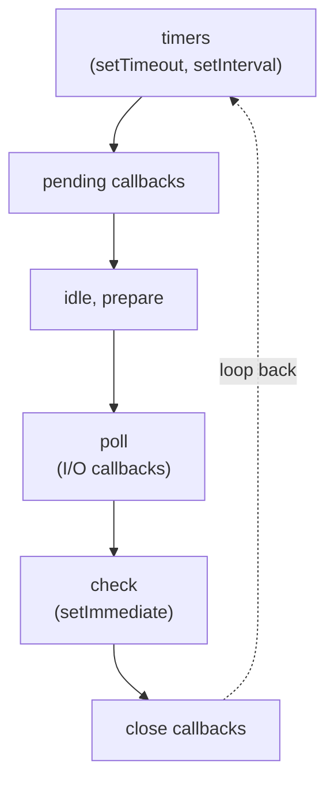

Between every phase, the event loop drains:
1. **All microtasks** (Promise callbacks, `queueMicrotask`)
2. **All `process.nextTick`** callbacks (even higher priority than microtasks)

### Macro-tasks vs micro-tasks

```js
console.log("1");
setTimeout(() => console.log("2"), 0);          // macro-task (timers phase)
Promise.resolve().then(() => console.log("3"));  // micro-task — runs sooner!
process.nextTick(() => console.log("4"));        // even sooner
console.log("5");

// Output: 1, 5, 4, 3, 2
```

Order of priority within a tick: synchronous code → `nextTick` queue → microtask queue → next event loop phase.

### What blocks the event loop?

Anything CPU-intensive on the main thread:
- Parsing huge JSON
- Complex regex on a long string
- Sync filesystem ops (`fs.readFileSync`)
- `crypto.pbkdf2Sync`, `bcrypt.hashSync` on long inputs

When the event loop is blocked, **no other request gets served**. This is the #1 production failure mode for Node.

**Mitigation:**
- Use async APIs (`fs.promises.readFile`, not `fs.readFileSync`)
- For CPU work: Worker Threads (`worker_threads`) or child processes
- For very heavy CPU: a different runtime (Java, Go, Rust) — Node is for I/O-bound

### `setImmediate` vs `setTimeout(0)` vs `process.nextTick`

```js
setImmediate(() => console.log("immediate"));
setTimeout(() => console.log("timeout"), 0);
process.nextTick(() => console.log("nextTick"));

// Order is mostly: nextTick → timeout/immediate (race), but inside an I/O callback,
// setImmediate always wins over setTimeout(0).
```

`process.nextTick` runs before any I/O — *don't recurse on it* or you'll starve the event loop.

## 4.3 Modules

### CommonJS (legacy but ubiquitous)

```js
// math.js
function add(a, b) { return a + b; }
module.exports = { add };

// or
exports.add = add;

// app.js
const { add } = require('./math');
```

### ES Modules (modern, what your TS projects compile to)

```js
// math.js
export function add(a, b) { return a + b; }
export default function square(x) { return x * x; }

// app.js
import square, { add } from './math.js';
```

In `package.json`:
```json
{ "type": "module" }                    // .js files are ESM
{ "type": "commonjs" }                  // .js files are CommonJS (default)
```

Or use file extensions: `.mjs` (always ESM), `.cjs` (always CommonJS).

### `require` vs `import` — interop

- ESM can `import` from CommonJS (default export = `module.exports`)
- CommonJS can `require()` ESM only via dynamic `import()` (returns a Promise)

This trips up many real codebases. TypeScript projects often compile to CommonJS for compatibility.

## 4.4 npm essentials

```bash
npm init -y                          # create package.json
npm install express                  # add to dependencies
npm install -D typescript jest        # add to devDependencies
npm install -g typescript            # global (rarely needed; prefer npx)
npm install                          # install everything per package.json + lockfile

npm run dev                          # run "dev" script from package.json
npm test                             # run "test" script
npm run                              # list all scripts

npx tsc                              # run a binary from a package without installing globally
npm outdated                         # what's old?
npm audit                            # known vulns
npm ci                               # clean install from lockfile (CI use)
```

### `package.json` anatomy

```json
{
  "name": "artisan-connect-server",
  "version": "1.0.0",
  "type": "module",
  "main": "dist/index.js",
  "scripts": {
    "dev": "ts-node-dev src/index.ts",
    "build": "tsc",
    "start": "node dist/index.js",
    "test": "jest",
    "lint": "eslint . --fix"
  },
  "dependencies": {
    "express": "^4.18.0",
    "@prisma/client": "^5.0.0"
  },
  "devDependencies": {
    "typescript": "^5.0.0",
    "@types/express": "^4.17.0"
  }
}
```

### Semver in dependencies

- `"4.18.0"` — exact
- `"^4.18.0"` — same major (≥4.18.0, <5.0.0) — npm default
- `"~4.18.0"` — same minor (≥4.18.0, <4.19.0)
- `">=4.0.0 <5.0.0"` — explicit range

`package-lock.json` pins exact resolved versions for reproducible installs. **Always commit it**.

### `dependencies` vs `devDependencies` vs `peerDependencies`

- `dependencies` — needed at runtime
- `devDependencies` — needed only for development (TypeScript compiler, linters, test framework, type definitions)
- `peerDependencies` — your package expects the consumer to provide it (libraries only, not apps)

## 4.5 Built-in modules you'll use

### `fs` (file system)

```js
import { promises as fs } from 'node:fs';

const data = await fs.readFile('config.json', 'utf8');
const obj  = JSON.parse(data);

await fs.writeFile('out.json', JSON.stringify(obj, null, 2));
await fs.mkdir('output', { recursive: true });
const exists = await fs.access('foo.txt').then(() => true).catch(() => false);
```

Always prefer `fs.promises` over the callback API. Never use `fs.readFileSync` in request paths — it blocks the event loop.

### `http` and `https`

```js
import http from 'node:http';

const server = http.createServer((req, res) => {
    res.writeHead(200, { 'Content-Type': 'application/json' });
    res.end(JSON.stringify({ ok: true }));
});
server.listen(3000);
```

In practice, you use Express (or Fastify, Koa, etc.) on top of `http`.

### `path`

```js
import path from 'node:path';

path.join(__dirname, 'data', 'users.json');         // OS-correct separator
path.resolve('foo', 'bar');                          // absolute path
path.extname('file.txt');                            // '.txt'
path.basename('/a/b/c.txt');                         // 'c.txt'
```

### `crypto`

```js
import crypto from 'node:crypto';

crypto.randomUUID();                                  // generate UUID v4
crypto.randomBytes(32).toString('hex');              // secure random
crypto.createHash('sha256').update('input').digest('hex');

// HMAC for signing
const sig = crypto.createHmac('sha256', secret).update(payload).digest('hex');

// Password hashing — use bcrypt or argon2 from npm, not crypto directly
// (crypto.scrypt is OK; pbkdf2 is dated)
```

### `events` — EventEmitter

```js
import { EventEmitter } from 'node:events';

const ee = new EventEmitter();
ee.on('order', order => console.log('got', order));
ee.once('ready', () => console.log('ready'));         // fires once, then removes
ee.emit('order', { id: 42 });
```

Used internally by `http.Server`, `stream`, etc. Don't forget to remove listeners on long-lived emitters or you'll leak memory.

### `stream`

Streams handle large data without loading it all into memory.

```js
import { createReadStream, createWriteStream } from 'node:fs';
import { pipeline } from 'node:stream/promises';
import { createGzip } from 'node:zlib';

await pipeline(
    createReadStream('big.log'),
    createGzip(),
    createWriteStream('big.log.gz')
);
```

Express response objects are streams. `req.body` middleware (e.g., `express.json()`) reads from a stream. For uploads, multer streams files to disk or memory.

### `child_process`

```js
import { exec, spawn } from 'node:child_process';

const proc = spawn('ffmpeg', ['-i', 'in.mp4', 'out.gif']);
proc.stdout.on('data', d => console.log(d.toString()));
proc.on('exit', code => console.log('exited', code));
```

For CPU work that can run in another process — but `worker_threads` is usually preferable since it shares memory.

### `worker_threads`

```js
// main.js
import { Worker } from 'node:worker_threads';
const w = new Worker('./hash.js', { workerData: { input: 'big input' } });
w.on('message', result => console.log(result));

// hash.js
import { parentPort, workerData } from 'node:worker_threads';
import crypto from 'node:crypto';
const hash = crypto.createHash('sha256').update(workerData.input).digest('hex');
parentPort.postMessage(hash);
```

Use for: CPU-intensive work that would block the event loop (compression, image processing, complex algorithms).

## 4.6 Error handling

### Sync code

```js
try {
    JSON.parse(input);
} catch (e) {
    if (e instanceof SyntaxError) { ... }
    else throw e;
}
```

### Async code

```js
async function handler(req, res) {
    try {
        const data = await loadData(req.params.id);
        res.json(data);
    } catch (e) {
        next(e);                                      // delegate to Express error middleware
    }
}
```

### Process-level

```js
process.on('uncaughtException', err => {
    console.error('FATAL', err);
    process.exit(1);                                  // crash and let supervisor restart
});

process.on('unhandledRejection', err => {
    console.error('UNHANDLED REJECTION', err);
    process.exit(1);
});
```

**Best practice for production**: log the error and exit (`process.exit(1)`). The process is now in an undefined state — restart cleanly via supervisor (Docker, systemd, K8s).

### Operational vs programmer errors

- **Operational** — expected (DB connection lost, validation failure). Handle gracefully, return error to user.
- **Programmer** — bugs (null deref, wrong API usage). Crash the process — these aren't recoverable in place.

## 4.7 Performance & production hygiene

### Cluster module — use multiple cores

Node is single-threaded; to use all CPU cores on one box, fork workers:

```js
import cluster from 'node:cluster';
import os from 'node:os';

if (cluster.isPrimary) {
    for (let i = 0; i < os.cpus().length; i++) cluster.fork();
} else {
    // worker — runs the actual server
    import('./server.js');
}
```

Or use **PM2** (process manager that handles clustering, restarts, log rotation).

In practice: in container deployments (Docker / K8s), prefer **one process per container** and let the orchestrator scale via more containers — simpler, more isolated.

### Graceful shutdown

```js
const server = app.listen(3000);
process.on('SIGTERM', () => {
    console.log('SIGTERM received, shutting down');
    server.close(() => {                              // stop accepting new connections
        // close DB, redis, kafka clients
        prisma.$disconnect().then(() => process.exit(0));
    });
});
```

Critical for K8s: when a pod is killed, K8s sends SIGTERM, then SIGKILL after `terminationGracePeriodSeconds` (default 30s). Drain in-flight requests in that window.

### Memory leaks — common culprits

- Unbounded growing arrays/maps (caches without eviction)
- EventEmitter listeners not removed
- Closures capturing large objects unnecessarily
- Global state across requests
- Forgotten timers / intervals

Diagnose with:
- `--inspect` flag + Chrome DevTools heap snapshot
- `clinic` package
- `process.memoryUsage()` over time

### Logging

`console.log` is fine for development; structured logging in production:

```js
import pino from 'pino';
const log = pino({ level: 'info' });
log.info({ requestId, userId }, 'order created');
log.error({ err }, 'failed to charge');
```

**Pino** is the fastest Node logger; **Winston** is more featureful. Both output JSON for ingestion by ELK / Datadog / etc.

## 4.8 Node interview questions

**Q: Why is Node single-threaded? How does it handle thousands of concurrent connections?**
JavaScript runs single-threaded; I/O is delegated to libuv's thread pool and the OS (via epoll/kqueue/IOCP). When I/O completes, callbacks queue back to the main loop. So one thread juggles thousands of pending I/O operations efficiently.

**Q: Walk me through the event loop.**
*(see §4.2)* Phases: timers → pending callbacks → poll (I/O callbacks) → check (`setImmediate`) → close. Between every phase, drain microtasks (Promises) and `process.nextTick` callbacks.

**Q: What's the difference between `setImmediate` and `setTimeout(0)`?**
`setImmediate` runs in the "check" phase. `setTimeout(0)` schedules in the "timers" phase with minimum delay (~1ms). Inside an I/O callback, `setImmediate` always fires before the next `setTimeout(0)`.

**Q: What blocks the event loop? How do you detect and fix?**
CPU-intensive sync work, sync filesystem ops, sync crypto. Detect with event-loop lag tools (`perf_hooks`, `clinic`). Fix: use async APIs, offload to Worker Threads, or split work into smaller chunks via `setImmediate`/`setTimeout`.

**Q: `process.nextTick` vs Promises (microtasks)?**
Both run before the next event-loop phase. `process.nextTick` fires before microtasks. Don't recurse on either — you'll starve I/O.

**Q: CommonJS vs ESM?**
CommonJS: `require`/`module.exports`, synchronous, dynamic, the legacy default. ESM: `import`/`export`, async, static, modern standard. Both supported in Node — set `"type": "module"` for ESM.

**Q: How do you handle errors in async code?**
`async`/`await` + `try`/`catch`. For uncaught errors: `process.on('unhandledRejection')` and `process.on('uncaughtException')` — log and exit; let a supervisor restart.

**Q: How do you avoid blocking with CPU-intensive work?**
**Worker Threads** for shared-memory parallelism, or `child_process` for full process isolation. For very heavy CPU, Node may not be the right runtime.

**Q: How do you scale a Node app?**
- **Vertical**: cluster module or PM2 to use all cores
- **Horizontal**: more processes / containers behind a load balancer
- **Container deploys**: one process per container, scale containers via K8s

**Q: How do you handle graceful shutdown?**
Listen for SIGTERM, stop accepting connections (`server.close()`), drain in-flight requests, close DB/Redis/Kafka clients, then `process.exit(0)`.

**Q: Memory leaks in Node — common causes?**
Growing caches without eviction, listeners not removed, closures capturing large objects, global state across requests, forgotten timers. Diagnose with heap snapshots in Chrome DevTools (`--inspect` flag).

**Q: When use streams?**
Large I/O (files, network) where loading everything into memory is impractical. Express bodies, file uploads, log processing, compression pipelines. `pipeline()` from `stream/promises` is the modern API — handles errors and backpressure.

**Q: What's `package-lock.json` for? Why commit it?**
Pins exact versions of all dependencies (and transitive deps). Without it, `npm install` resolves `^4.18.0` differently between machines/dates → "works on my machine" bugs. **Always commit.**

**Q: `dependencies` vs `devDependencies`?**
`dependencies` are needed at runtime (Express, Prisma client). `devDependencies` are needed only for development (TypeScript compiler, Jest, ESLint, type definitions). Production installs (`npm ci --omit=dev`) skip dev dependencies.

**Q: How does Node use multiple CPU cores?**
JavaScript runs on one thread per process. To use multiple cores: cluster (multiple worker processes), `worker_threads` (multiple JS threads in one process, shared memory), or run multiple containers.

---

# 5. Express.js

> The most popular Node.js web framework. Both your NAB projects use it. Master middleware, routing, error handling, and the request lifecycle.

## 5.1 What Express is

Express is a minimal, unopinionated HTTP framework for Node. It provides:
- **Routing** — match URL paths to handlers
- **Middleware** — pluggable functions in the request/response pipeline
- **Convenience methods** on `req` and `res` — `req.params`, `res.json()`, `res.status()`, etc.

That's pretty much it. It's intentionally lightweight — most features come from middleware (body parsing, sessions, validation, etc.).

```js
import express from 'express';

const app = express();
app.use(express.json());                        // parse JSON request bodies

app.get('/health', (req, res) => res.json({ ok: true }));

app.listen(3000);
```

## 5.2 Routing

```js
app.get('/users',           (req, res) => { ... });        // list
app.get('/users/:id',       (req, res) => { ... });        // single
app.post('/users',          (req, res) => { ... });        // create
app.put('/users/:id',       (req, res) => { ... });        // replace
app.patch('/users/:id',     (req, res) => { ... });        // partial update
app.delete('/users/:id',    (req, res) => { ... });        // delete

// Multiple methods on same path
app.route('/users/:id')
    .get(getUser)
    .put(updateUser)
    .delete(deleteUser);
```

### Path params

```js
app.get('/users/:userId/orders/:orderId', (req, res) => {
    const { userId, orderId } = req.params;            // strings
    res.json({ userId, orderId });
});
```

### Query strings

```js
app.get('/search', (req, res) => {
    const q = req.query.q;                              // ?q=keyword
    const page = parseInt(req.query.page ?? '0', 10);
});
```

### Routers — modular routing

```js
// users.routes.ts
import { Router } from 'express';

const router = Router();
router.get('/',     listUsers);
router.get('/:id',  getUser);
router.post('/',    createUser);
export default router;

// app.ts
import usersRouter from './routes/users.routes.js';
app.use('/api/v1/users', usersRouter);                 // mount at prefix
```

Your projects use this pattern heavily — one router per module/feature.

## 5.3 Middleware — the heart of Express

A middleware is `(req, res, next) => void`. It can:
- Inspect/mutate `req` and `res`
- End the response (don't call `next()`)
- Pass control to the next middleware (`next()`)
- Pass an error (`next(err)`)

```js
// Logging middleware
app.use((req, res, next) => {
    console.log(`${req.method} ${req.url}`);
    next();
});

// Built-in middleware
app.use(express.json({ limit: '10mb' }));               // JSON body parser
app.use(express.urlencoded({ extended: true }));        // form parser
app.use(express.static('public'));                      // serve files

// Third-party
import cors from 'cors';
import helmet from 'helmet';
import morgan from 'morgan';
import cookieParser from 'cookie-parser';
import rateLimit from 'express-rate-limit';

app.use(cors({ origin: 'https://app.example.com', credentials: true }));
app.use(helmet());                                      // security headers
app.use(morgan('combined'));                            // HTTP logging
app.use(cookieParser());

app.use('/api/', rateLimit({ windowMs: 15*60*1000, max: 100 }));
```

### Middleware ordering matters!

```js
app.use(express.json());                                // BEFORE handlers
app.use('/api', authMiddleware);                        // BEFORE protected routes
app.use('/api/users', usersRouter);                     // routes
app.use(notFoundHandler);                               // AFTER all routes
app.use(errorHandler);                                  // ERROR handler — must be LAST
```

If you mount JSON parser *after* a route, that route won't see `req.body`. Order is essential.

### Route-specific middleware

```js
const requireAuth = (req, res, next) => {
    if (!req.user) return res.status(401).json({ error: 'unauthorized' });
    next();
};

const requireRole = role => (req, res, next) => {
    if (req.user?.role !== role) return res.status(403).json({ error: 'forbidden' });
    next();
};

app.delete('/api/users/:id',
    requireAuth,
    requireRole('ADMIN'),
    deleteUserHandler);
```

## 5.4 Authentication & JWT (your project's pattern)

```js
import jwt from 'jsonwebtoken';

// Sign — at login
const accessToken = jwt.sign(
    { sub: user.id, role: user.role },
    process.env.JWT_ACCESS_SECRET,
    { expiresIn: '15m' }
);
const refreshToken = jwt.sign({ sub: user.id }, process.env.JWT_REFRESH_SECRET, { expiresIn: '7d' });

// Set as httpOnly cookie (artisan-connect's pattern)
res.cookie('refresh', refreshToken, {
    httpOnly: true,
    secure: process.env.NODE_ENV === 'production',
    sameSite: 'strict',
    maxAge: 7 * 24 * 3600 * 1000,
});

// Verify — middleware
const authenticate = (req, res, next) => {
    const token = req.headers.authorization?.replace(/^Bearer /, '');
    if (!token) return res.status(401).json({ error: 'no token' });
    try {
        const payload = jwt.verify(token, process.env.JWT_ACCESS_SECRET);
        req.user = payload;
        next();
    } catch (e) {
        return res.status(401).json({ error: 'invalid token' });
    }
};

app.use('/api', authenticate);
```

### Refresh token flow

1. Login → returns access (short-lived) + refresh (long-lived, httpOnly cookie)
2. Client uses access for normal requests
3. On 401, client hits `/auth/refresh` with refresh cookie → gets new access
4. On logout, server invalidates refresh (DB or revocation list)

Why both: short access token limits blast radius if leaked; refresh in httpOnly cookie immune to XSS exfiltration.

### Password hashing

```js
import bcrypt from 'bcrypt';

const hashed = await bcrypt.hash(password, 12);          // cost factor 12
const ok = await bcrypt.compare(password, hashed);
```

bcrypt is industry standard for password hashing. Argon2 is even better (modern). **Never** store plaintext passwords or hash with plain SHA/MD5.

## 5.5 Error handling

Express recognizes error-handling middleware by **4 args**: `(err, req, res, next)`.

```js
// Async route — errors must be passed to next()
app.get('/users/:id', async (req, res, next) => {
    try {
        const user = await userService.findById(req.params.id);
        if (!user) throw new NotFoundError('user not found');
        res.json(user);
    } catch (e) {
        next(e);
    }
});

// Or use a wrapper to forward async errors automatically
const asyncHandler = fn => (req, res, next) => Promise.resolve(fn(req, res, next)).catch(next);

app.get('/users/:id', asyncHandler(async (req, res) => {
    const user = await userService.findById(req.params.id);
    if (!user) throw new NotFoundError('user not found');
    res.json(user);
}));

// Express 5+ supports async handlers natively — no wrapper needed

// Centralized error handler — register LAST
app.use((err, req, res, next) => {
    console.error(err);
    if (err instanceof NotFoundError)   return res.status(404).json({ error: err.message });
    if (err instanceof ValidationError) return res.status(400).json({ error: err.message, details: err.details });
    if (err instanceof UnauthorizedError) return res.status(401).json({ error: err.message });
    res.status(500).json({ error: 'internal server error' });
});
```

### Custom error classes

```js
class AppError extends Error {
    constructor(message, statusCode) {
        super(message);
        this.statusCode = statusCode;
        this.isOperational = true;
    }
}
class NotFoundError extends AppError { constructor(msg) { super(msg, 404); } }
class ValidationError extends AppError {
    constructor(msg, details) { super(msg, 400); this.details = details; }
}
```

## 5.6 Request validation

### Manual validation — basic

```js
app.post('/users', (req, res) => {
    const { name, email } = req.body;
    if (!name || !email) return res.status(400).json({ error: 'missing fields' });
    if (!email.includes('@')) return res.status(400).json({ error: 'bad email' });
    ...
});
```

### Zod — modern type-safe validation

```js
import { z } from 'zod';

const CreateUserSchema = z.object({
    name:  z.string().min(1).max(100),
    email: z.string().email(),
    age:   z.number().int().min(13),
});
type CreateUserDto = z.infer<typeof CreateUserSchema>;        // TS type from schema!

const validate = schema => (req, res, next) => {
    const result = schema.safeParse(req.body);
    if (!result.success) return res.status(400).json({ error: result.error.flatten() });
    req.body = result.data;
    next();
};

app.post('/users', validate(CreateUserSchema), createUser);
```

Zod is now the standard in TypeScript Node projects — schema is also the type.

### `class-validator` (used in artisan-connect-server)

```typescript
import { IsEmail, IsString, MinLength } from 'class-validator';

class CreateUserDto {
    @IsString() @MinLength(1) name: string;
    @IsEmail() email: string;
}
```

## 5.7 ORMs — Prisma vs Sequelize (both your repos!)

### Prisma (artisan-connect-server)

Schema-first, type-safe, auto-generated client.

```prisma
// schema.prisma
model User {
    id        Int      @id @default(autoincrement())
    email     String   @unique
    name      String
    posts     Post[]
    createdAt DateTime @default(now())
}

model Post {
    id      Int    @id @default(autoincrement())
    title   String
    content String
    author  User   @relation(fields: [authorId], references: [id])
    authorId Int
}
```

```typescript
import { PrismaClient } from '@prisma/client';
const prisma = new PrismaClient();

// Fully type-safe
const user = await prisma.user.findUnique({
    where: { email: 'alice@example.com' },
    include: { posts: true },                          // eager load relation
});

const newUser = await prisma.user.create({
    data: { email: 'bob@x.com', name: 'Bob', posts: { create: [{ title: 'Hi', content: '...' }] } }
});

// Pagination
const page = await prisma.user.findMany({
    skip: pageNum * pageSize,
    take: pageSize,
    orderBy: { createdAt: 'desc' },
});

// Transactions
await prisma.$transaction(async tx => {
    const u = await tx.user.create({ data: { ... } });
    await tx.profile.create({ data: { userId: u.id } });
});
```

Pros: best-in-class type safety, intuitive API, generated migrations, schema is the source of truth.
Cons: less SQL-like; complex queries can be awkward; raw SQL escape hatch needed for advanced cases.

### Sequelize (roboflow-clone-server)

Model-first, more imperative, classic Node ORM.

```typescript
import { DataTypes, Model } from 'sequelize';

class User extends Model {
    public id!: number;
    public email!: string;
}

User.init({
    id: { type: DataTypes.INTEGER, primaryKey: true, autoIncrement: true },
    email: { type: DataTypes.STRING, unique: true, allowNull: false },
}, { sequelize, modelName: 'user' });

User.hasMany(Post, { foreignKey: 'userId' });
Post.belongsTo(User);

// Queries
const user = await User.findOne({ where: { email: 'alice@example.com' }, include: Post });
const created = await User.create({ email: 'bob@x.com', name: 'Bob' });

// Pagination
const { rows, count } = await User.findAndCountAll({ limit: 20, offset: page * 20 });

// Transactions
await sequelize.transaction(async t => {
    await User.create({ ... }, { transaction: t });
    await Profile.create({ ... }, { transaction: t });
});
```

Pros: mature, flexible, good control over SQL.
Cons: type safety not as tight as Prisma; more boilerplate; associations can be tricky.

### N+1 in both

Same problem as JPA — eager-load relations:
- Prisma: `include: { posts: true }`
- Sequelize: `include: [Post]`

Watch for it in code reviews.

## 5.8 Real-time with Socket.io (artisan-connect-server)

```typescript
import { Server } from 'socket.io';

const io = new Server(httpServer, { cors: { origin: '*' } });

// Auth middleware on socket connection
io.use((socket, next) => {
    const token = socket.handshake.auth.token;
    try {
        const payload = jwt.verify(token, secret);
        socket.data.userId = payload.sub;
        next();
    } catch (e) { next(new Error('unauthorized')); }
});

io.on('connection', socket => {
    console.log('connected', socket.data.userId);
    socket.join(`user:${socket.data.userId}`);                       // user-private room
    
    socket.on('message:send', async ({ to, text }) => {
        const message = await saveMessage(socket.data.userId, to, text);
        io.to(`user:${to}`).emit('message:new', message);            // emit to recipient's room
    });
    
    socket.on('disconnect', () => console.log('left'));
});
```

### Rooms

Logical groupings of sockets — perfect for "user X's notifications" or "chat room ABC". `socket.join(room)`, `io.to(room).emit(...)`.

### Scaling Socket.io across instances

By default, an event emitted on instance A doesn't reach a socket connected to instance B. Use the **Redis adapter**:

```js
import { createAdapter } from '@socket.io/redis-adapter';
io.adapter(createAdapter(pubClient, subClient));
```

Now all instances share the pub/sub bus, and emits go everywhere.

## 5.9 Project structure (your modules pattern)

The artisan-connect-server uses this clean pattern (3-layer per module):

```
src/
├── modules/
│   ├── users/
│   │   ├── interface/
│   │   │   ├── routes/
│   │   │   │   └── users.routes.ts
│   │   │   └── controllers/
│   │   │       └── users.controller.ts
│   │   ├── services/
│   │   │   └── users.service.ts
│   │   ├── repositories/
│   │   │   └── users.repository.ts
│   │   └── models/
│   │       └── users.dto.ts
│   ├── orders/...
│   └── posts/...
├── shared/
│   ├── middleware/
│   ├── errors/
│   └── utils/
├── prisma/
└── index.ts                                    # app entry, mount routers
```

Data flows: **Controller → Service → Repository → Prisma → DB**. Nothing skips a layer.

This is a clean equivalent of Spring's layered architecture. NAB will appreciate that you can articulate the boundaries:
- **Controllers** — HTTP-only: parse req, call service, format res. No business logic.
- **Services** — Business logic. Use cases. Orchestrate repositories. No HTTP awareness.
- **Repositories** — Data access. Only know about DB / Prisma. No business rules.
- **DTOs** — Type-safe shapes for input/output.

## 5.10 Testing Express

```js
// Jest + supertest
import request from 'supertest';
import { app } from '../src/app';

describe('GET /api/users', () => {
    it('requires auth', async () => {
        const res = await request(app).get('/api/users');
        expect(res.status).toBe(401);
    });

    it('returns user list for admin', async () => {
        const token = signAdminToken();
        const res = await request(app)
            .get('/api/users')
            .set('Authorization', `Bearer ${token}`);
        expect(res.status).toBe(200);
        expect(res.body.users).toBeInstanceOf(Array);
    });
});
```

For repository / DB tests, use Testcontainers (`@testcontainers/postgresql`) — same pattern as your Java project.

## 5.11 Production hygiene

### Security middleware (`helmet`, `cors`, rate limiting)

```js
app.use(helmet());                                       // X-Frame-Options, X-Content-Type-Options, etc.
app.use(cors({ origin: corsOrigin, credentials: true }));
app.use(rateLimit({ windowMs: 60_000, max: 100 }));
app.use(express.json({ limit: '10mb' }));                // prevent giant body DoS
```

### Compression

```js
import compression from 'compression';
app.use(compression());
```

### Don't trust user input

```js
// SQL injection — Prisma/Sequelize parameterize automatically; never string-concat
// XSS — escape on output (template engines do this) or use Content-Security-Policy
// NoSQL injection — validate types before queries

app.get('/search', (req, res) => {
    const q = req.query.q;
    if (typeof q !== 'string') return res.status(400).json({ error: 'q must be string' });
    // ...
});
```

### Environment variables

```js
import 'dotenv/config';                                   // load .env into process.env

const PORT = parseInt(process.env.PORT ?? '3000', 10);
const JWT_SECRET = process.env.JWT_SECRET;
if (!JWT_SECRET) throw new Error('JWT_SECRET is required');

// Or use a typed config validator
import { z } from 'zod';
const env = z.object({
    PORT: z.coerce.number().default(3000),
    DATABASE_URL: z.string(),
    JWT_SECRET: z.string().min(32),
}).parse(process.env);
```

## 5.12 Express interview questions

**Q: What is middleware?**
A function `(req, res, next) => void` in the request pipeline. Can inspect/mutate `req` and `res`, end the response, or call `next()` to pass control. Order matters — built-in parsers must come before routes that use `req.body`.

**Q: How does Express recognize an error-handling middleware?**
By its **four arguments**: `(err, req, res, next)`. Express skips it during normal flow; calls it only when `next(err)` is invoked.

**Q: How do you handle async errors in Express?**
Wrap async handlers in a `Promise.resolve(...).catch(next)` helper, OR use Express 5+ which awaits async handlers natively. Then a centralized error middleware translates errors to HTTP responses.

**Q: How does routing work?**
Express maintains an ordered list of route handlers. On request, it walks the list, matching method and path. First match wins. Routers (`Router()`) are mountable sub-apps with their own route tables.

**Q: Difference between `app.use()` and `app.get()`?**
`app.use()` registers middleware (matches any method; path is a prefix). `app.get()` registers a route handler (specific method, exact match by default with `:param`).

**Q: How do you implement JWT auth?**
*(see §5.4)* Sign on login, send via `Authorization: Bearer ...` header (or httpOnly cookie). Verify in middleware on protected routes. Use short-lived access + long-lived refresh for safety.

**Q: How do you protect against XSS, CSRF, SQL injection?**
- XSS: `helmet` + escape on output + Content-Security-Policy
- CSRF: SameSite cookies (Lax/Strict), CSRF tokens for cookie-based sessions
- SQL injection: parameterized queries (Prisma/Sequelize do this) — never string-concat user input

**Q: Prisma vs Sequelize?**
Prisma: schema-first, best type safety, auto-generated client, intuitive API. Sequelize: model-first, more flexible SQL, mature, less type-safe by default. Both handle migrations, relations, transactions.

**Q: What is N+1 in Prisma/Sequelize? How to avoid?**
Querying a list and then a related entity per item → N+1 queries. Avoid by `include` (Prisma) or `include: [Model]` (Sequelize) to eager-load.

**Q: How do you scale Socket.io across multiple Node instances?**
Use the Redis adapter — pub/sub broadcasts events to all instances, so emits reach sockets regardless of which instance they're connected to.

**Q: Walk me through the request lifecycle.**
1. Client sends HTTP → 2. Node `http.Server` parses → 3. Express receives `(req, res)` → 4. Walks middleware chain (parsers, auth, etc.) → 5. Matches route → 6. Handler runs → 7. Response sent. Errors short-circuit to error middleware.

**Q: What's the difference between `res.send()`, `res.json()`, `res.end()`?**
- `res.send(data)` — auto-detects type (string, object, buffer)
- `res.json(obj)` — sets Content-Type to JSON, serializes
- `res.end()` — ends the response without a body (or with a chunk in streaming)

**Q: How do you organize a large Express codebase?**
Modular structure: one folder per feature, with controller/service/repository/DTOs (your projects' pattern). Mount each module's router at a URL prefix in `app.ts`. Keep cross-cutting concerns (auth middleware, error handler, validation) in `shared/`.

**Q: Why your projects use TypeScript with Express?**
Type safety on `req.body`, `req.params`, `req.query` (with proper types). Catch bugs before runtime. Self-documenting interfaces between modules. With Prisma, the entire stack is type-safe end-to-end.

---


# 6. React.js

> React is a library for building UIs from composable components. It's the most-used frontend library globally. Even though your CV is backend-focused, NAB may probe whether you understand the client side — backend devs increasingly need to navigate both. Focus on the *model* (component, state, render, effect, virtual DOM), not the API minutiae.

## 6.1 What is React, and why was it built?

React was open-sourced by Facebook in 2013. It was a response to the pain of managing UI state in big web apps. Before React, you mostly manipulated the DOM directly (jQuery-style) — read state from the DOM, change state in the DOM, hope you remembered to update all the dependent pieces. As apps grew, this approach scaled badly: state lived everywhere, updates were imperative, bugs piled up.

React's core insight: **the UI is a function of state**. You describe what the screen should look like for a given state, and React figures out how to update the DOM to make it so. The flow is:

1. State changes
2. React re-runs your component functions
3. React computes the difference between the new and old UI descriptions
4. React applies the minimal set of DOM updates

This is **declarative** rendering. You don't manipulate the DOM; you describe what you want, and React handles the mutation.

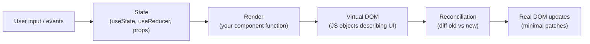

### Why a "virtual DOM"?

The Real DOM is slow to mutate. Every change can trigger layout, paint, and other expensive browser work. The Virtual DOM is a lightweight JavaScript object tree that mirrors the real DOM. React diffs the old VDOM against the new VDOM (cheap — just JS object comparison), then applies the minimal set of real DOM changes to make them match.

So the perf model is: re-running your component function on every state change is OK, because the actual DOM updates are minimal. Don't sweat re-renders; sweat *real* DOM mutations.

### JSX

JSX is a syntax extension that lets you write HTML-like markup inside JavaScript:

```jsx
function Greet({name}) {
    return <h1>Hello, {name}</h1>;
}
```

A compiler (Babel, esbuild, SWC) transforms this into:

```js
function Greet({name}) {
    return React.createElement('h1', null, 'Hello, ', name);
}
```

JSX is not HTML. Differences:
- `className` instead of `class` (because `class` is a JS keyword)
- `htmlFor` instead of `for`
- CamelCase event names: `onClick`, `onChange`
- `style` takes an object: `style={{color: 'red'}}` — two braces (one for JSX, one for object literal)
- Closing tags required: ``, not ``
- Expressions inline with `{}`: `<p>The count is {count}</p>`

## 6.2 Components: the unit of composition

A React component is a function (or class, but classes are legacy in 2025) that takes **props** as input and returns JSX describing what to render.

```jsx
function UserCard({user}) {
    return (
        <div className="card">
            <h2>{user.name}</h2>
            <p>{user.email}</p>
        </div>
    );
}

function App() {
    const alice = {name: 'Alice', email: 'a@x.com'};
    return <UserCard user={alice} />;
}
```

### Props: inputs, treated as immutable

Props are the inputs to a component, passed from parent to child. **Treat them as immutable inside the receiving component.** Mutating props leads to bugs because React doesn't track the mutation.

```jsx
// BAD — mutating props
function BadComp({user}) {
    user.name = user.name.toUpperCase();  // mutation of caller's data
    return <h2>{user.name}</h2>;
}

// GOOD — derive a new value
function GoodComp({user}) {
    const displayName = user.name.toUpperCase();
    return <h2>{displayName}</h2>;
}
```

### `children` prop

The special `children` prop is whatever's nested between the opening and closing tags:

```jsx
function Card({children}) {
    return <div className="card">{children}</div>;
}

<Card>
    <h2>Hello</h2>
    <p>World</p>
</Card>
```

Enables composition — wrap arbitrary content with shared styling/behavior.

## 6.3 State and the rendering cycle

A component can have internal **state** that changes over time. When state changes, React re-renders the component.

```jsx
import {useState} from 'react';

function Counter() {
    const [count, setCount] = useState(0);
    
    return (
        <div>
            <p>You clicked {count} times</p>
            <button onClick={() => setCount(count + 1)}>+1</button>
        </div>
    );
}
```

`useState` returns a pair: the current value and a setter. Calling the setter:
1. Schedules a re-render of the component
2. On re-render, `useState` returns the new value

### What "re-render" actually means

The component function runs again from the top. Local variables are recomputed. Hooks are called again — they return the new state values. The returned JSX is diffed against the previous, and React updates the DOM as needed.

```jsx
function Counter() {
    const [count, setCount] = useState(0);
    console.log('rendering, count is', count);   // runs on every render
    
    return <button onClick={() => setCount(count + 1)}>{count}</button>;
}
```

Click the button → setter called → re-render → console.log runs again with the new count.

### State is local to each component instance

```jsx
<>
    <Counter />    {/* Instance A, has its own count */}
    <Counter />    {/* Instance B, has its own count */}
</>
```

Each `Counter` has independent state. Setting one's count doesn't affect the other.

### Updating state based on previous state

Use the functional form of the setter to avoid stale state:

```jsx
// BAD — three clicks might add only 1 because of stale closures
function bump() {
    setCount(count + 1);
    setCount(count + 1);
    setCount(count + 1);
}

// GOOD — guaranteed to apply three increments
function bump() {
    setCount(c => c + 1);
    setCount(c => c + 1);
    setCount(c => c + 1);
}
```

### State updates are asynchronous

```jsx
function bump() {
    setCount(count + 1);
    console.log(count);    // logs the OLD count, not the new one!
}
```

React batches state updates and re-renders. The new value isn't available until the next render.

## 6.4 Hooks: the core API

Hooks (React 16.8+, 2019) are functions that let you "hook into" React features from function components. The five most-used:

### `useState`

(Covered above.) Local component state.

### `useEffect`: side effects

`useEffect` lets you run side effects (fetching, subscriptions, manual DOM, logging) after render.

```jsx
function UserProfile({userId}) {
    const [user, setUser] = useState(null);
    
    useEffect(() => {
        let cancelled = false;
        fetch(`/api/users/${userId}`)
            .then(r => r.json())
            .then(data => { if (!cancelled) setUser(data); });
        return () => { cancelled = true; };    // cleanup on unmount or re-run
    }, [userId]);    // dependency array
    
    if (!user) return <p>Loading...</p>;
    return <h2>{user.name}</h2>;
}
```

Key concepts:
- **Effect runs after render** (commit phase) — never blocks the UI
- **Dependency array** decides when the effect re-runs. Empty `[]` → once on mount. `[userId]` → whenever `userId` changes. Omitted → after *every* render.
- **Cleanup function** runs before the next effect or on unmount — for canceling subscriptions, timers, fetch requests, etc.

**The exhaustive-deps lint rule** (`react-hooks/exhaustive-deps`) catches missing dependencies. Take it seriously — missing deps cause "stale closure" bugs where effects reference outdated values.

### `useContext`: pass data through the tree without prop-drilling

```jsx
const ThemeContext = React.createContext('light');

function App() {
    return (
        <ThemeContext.Provider value="dark">
            <Page />
        </ThemeContext.Provider>
    );
}

function Page() {
    return <Toolbar />;
}

function Toolbar() {
    const theme = useContext(ThemeContext);   // skips intermediate components
    return <button className={`btn-${theme}`}>Click</button>;
}
```

Context is for *global-ish* state that many components need. Don't use it for every piece of state — it can cause unnecessary re-renders of all consumers when the value changes.

### `useReducer`: state with a reducer function

For complex state logic, `useReducer` is cleaner than multiple `useState`s:

```jsx
function reducer(state, action) {
    switch (action.type) {
        case 'INCREMENT': return {count: state.count + 1};
        case 'DECREMENT': return {count: state.count - 1};
        case 'RESET':     return {count: 0};
        default:          return state;
    }
}

function Counter() {
    const [state, dispatch] = useReducer(reducer, {count: 0});
    return (
        <>
            <p>{state.count}</p>
            <button onClick={() => dispatch({type: 'INCREMENT'})}>+</button>
            <button onClick={() => dispatch({type: 'RESET'})}>0</button>
        </>
    );
}
```

This is the same pattern as Redux at the component level. Useful when state transitions are non-trivial.

### `useMemo` and `useCallback`: memoization

`useMemo` caches the *result* of a computation. `useCallback` caches a *function* reference.

```jsx
function Component({items}) {
    // Re-compute only when items changes
    const sortedItems = useMemo(
        () => [...items].sort((a, b) => a.value - b.value),
        [items]
    );
    
    // Stable function reference across renders, re-created when itemId changes
    const handleClick = useCallback(
        (id) => console.log('clicked', id),
        []
    );
    
    return <List items={sortedItems} onClick={handleClick} />;
}
```

**Use sparingly.** Memoization isn't free — React tracks the cache. Only memoize when:
1. The computation is genuinely expensive
2. You're passing the value to a memoized child component (`React.memo`) and need referential equality to skip the child's render

Premature memoization is one of the most common React anti-patterns.

## 6.5 Component composition and patterns

### Lifting state up

When two sibling components need to share state, move the state to their common parent and pass it down as props:

```jsx
function App() {
    const [filter, setFilter] = useState('');
    return (
        <>
            <SearchBox value={filter} onChange={setFilter} />
            <Results filter={filter} />
        </>
    );
}
```

### Controlled vs uncontrolled components

A **controlled** input is one whose value is in React state:

```jsx
const [name, setName] = useState('');
<input value={name} onChange={e => setName(e.target.value)} />
```

An **uncontrolled** input keeps its value in the DOM; you read it via a ref when needed:

```jsx
const inputRef = useRef(null);
<input ref={inputRef} defaultValue="initial" />
// Read with inputRef.current.value
```

Controlled is the standard — keeps your data flow predictable. Uncontrolled is for performance-sensitive forms or integrating with non-React libraries.

### Conditional rendering

```jsx
function App({user}) {
    if (!user) return <LoginPrompt />;     // early return
    return (
        <>
            {user.isPremium && <PremiumBadge />}      // && for "render if truthy"
            {user.email ? <Email /> : <NoEmail />}    // ternary for else
        </>
    );
}
```

Watch out for `0`: `{items.length && <List items={items} />}` renders `0` when length is 0. Use `>` 0 or convert to boolean.

### Lists and keys

When rendering an array, give each element a stable, unique `key`:

```jsx
{users.map(user => <UserCard key={user.id} user={user} />)}
```

Why keys: React uses them to identify which elements changed, moved, or were removed. Without keys (or with `index` keys when the list reorders), React may reuse the wrong DOM nodes — leading to subtle bugs where input state, animations, or focus get scrambled.

**Don't use array index as key** unless the list is static.

## 6.6 Data fetching

Two common approaches:

### `useEffect` for simple cases

```jsx
function UserPage({id}) {
    const [user, setUser] = useState(null);
    const [error, setError] = useState(null);
    
    useEffect(() => {
        let cancelled = false;
        fetch(`/api/users/${id}`)
            .then(r => r.ok ? r.json() : Promise.reject(r))
            .then(data => { if (!cancelled) setUser(data); })
            .catch(err => { if (!cancelled) setError(err); });
        return () => { cancelled = true; };
    }, [id]);
    
    if (error) return <ErrorMsg error={error} />;
    if (!user) return <Loading />;
    return <UserView user={user} />;
}
```

This is correct but verbose, and you'll write the same pattern many times.

### Dedicated libraries (TanStack Query, SWR)

Production apps usually use a library like **TanStack Query** (formerly React Query) or **SWR**:

```jsx
import {useQuery} from '@tanstack/react-query';

function UserPage({id}) {
    const {data: user, isLoading, error} = useQuery({
        queryKey: ['user', id],
        queryFn: () => fetch(`/api/users/${id}`).then(r => r.json()),
    });
    
    if (isLoading) return <Loading />;
    if (error) return <ErrorMsg error={error} />;
    return <UserView user={user} />;
}
```

Built-in: caching, automatic refetching, request deduplication, mutation handling, optimistic updates. The trade-off in built-in complexity is huge for any non-trivial app.

## 6.7 Routing

For multi-page apps, **React Router** is the de facto router:

```jsx
import {BrowserRouter, Routes, Route, Link, useParams} from 'react-router-dom';

function App() {
    return (
        <BrowserRouter>
            <nav>
                <Link to="/">Home</Link>
                <Link to="/users">Users</Link>
            </nav>
            <Routes>
                <Route path="/" element={<Home />} />
                <Route path="/users" element={<UserList />} />
                <Route path="/users/:id" element={<UserDetail />} />
            </Routes>
        </BrowserRouter>
    );
}

function UserDetail() {
    const {id} = useParams();
    return <p>User ID: {id}</p>;
}
```

## 6.8 Performance optimization

Most React apps don't need optimization — the framework is fast enough out of the box. When you do need it:

### `React.memo` — skip re-render if props are unchanged

```jsx
const ExpensiveChild = React.memo(function ExpensiveChild({data}) {
    // ...
});
```

`React.memo` does a shallow comparison of props. If they match, the component skips rendering. Combine with `useCallback`/`useMemo` to keep stable references when needed.

### Code splitting with `React.lazy`

```jsx
const Settings = React.lazy(() => import('./Settings'));

function App() {
    return (
        <Suspense fallback={<Loading />}>
            <Settings />
        </Suspense>
    );
}
```

The `Settings` component (and everything it imports) becomes a separate JS bundle, loaded on demand. Massive perf win for big apps.

### Profiler

React DevTools includes a Profiler tab — records re-renders and timings. Use it to find which components are rendering more than expected.

## 6.9 React 18 highlights

- **Automatic batching** — multiple state updates inside async callbacks are batched into one re-render
- **`useTransition`** — mark updates as low-priority so urgent updates (typing) aren't blocked
- **`useDeferredValue`** — defer rendering of expensive computations
- **Concurrent rendering** — React can interrupt and resume renders
- **Server Components** (experimental) — components that run only on the server

## 6.10 Common gotchas

**Stale closures**: an effect or callback captures old state.

```jsx
useEffect(() => {
    const interval = setInterval(() => {
        setCount(count + 1);   // BUG: count is captured at mount, always 0
    }, 1000);
    return () => clearInterval(interval);
}, []);     // empty deps — but the closure uses `count`!

// FIX: use functional setter
setInterval(() => setCount(c => c + 1), 1000);
```

**Infinite render loops**: setting state in a function called during render.

```jsx
function BadComponent({user}) {
    setCount(count + 1);    // setState during render — infinite loop!
    return <div />;
}

// FIX: do it in an effect
useEffect(() => { setCount(c => c + 1); }, [user]);
```

**Mutating state directly**:
```jsx
const [items, setItems] = useState([]);

// BAD — mutates the existing array; React doesn't detect the change
items.push(newItem);
setItems(items);

// GOOD — new array
setItems([...items, newItem]);
```

## 6.11 Top React interview questions

**Q: What is JSX, and what does it compile to?**
JSX is a syntax extension that looks like HTML inside JavaScript. A compiler (Babel, esbuild) transforms it to `React.createElement(...)` calls. It's not HTML — `className` instead of `class`, camelCase events, expressions in `{}`.

**Q: What's the virtual DOM?**
A lightweight JavaScript representation of the UI. React diffs the old VDOM against the new VDOM on each render and applies the minimal real DOM updates. This lets you write "re-render everything" code without paying the cost of actually re-rendering.

**Q: Functional components vs class components?**
Functional components are functions that return JSX; class components extend `React.Component`. Since Hooks (2019), functional components can do everything class components do, with less boilerplate. Functional + Hooks is the modern default; classes are legacy.

**Q: What are Hooks?**
Functions that let function components use React features (state, lifecycle, context, refs). Examples: `useState`, `useEffect`, `useContext`, `useReducer`, `useMemo`, `useCallback`, `useRef`. They have rules — only call at the top of the component, never inside loops or conditions.

**Q: Why do Hooks have to be called in the same order every render?**
React tracks hook calls by their *call order* during a render. If you call `useState` conditionally, the second call to `useState` could be skipped sometimes — React would lose track of which hook owns which state. Hence "always call at the top, never conditionally."

**Q: `useState` — how does the state update work?**
Calling the setter schedules a re-render. The new value is available on the next render, not immediately after the setter call. Use the functional form (`setCount(c => c + 1)`) when the new value depends on the previous.

**Q: `useEffect` — when does it run?**
After every render by default. The dependency array changes that: `[]` runs once on mount; `[a, b]` runs when `a` or `b` changes. Cleanup function runs before the next effect (or on unmount).

**Q: How do you fetch data in React?**
Either: `useEffect` with `fetch` and state for data/loading/error, or use a library (TanStack Query, SWR) that handles caching, deduplication, refetching. Libraries are standard in production apps.

**Q: Why do you need keys in lists?**
React uses keys to identify which list items changed, moved, were added, or removed. Without stable keys, React may reuse the wrong DOM nodes — causing scrambled input state, lost focus, or wrong animations. Use a stable unique ID; don't use array index if the list can reorder.

**Q: Controlled vs uncontrolled components?**
Controlled: input value lives in React state, updated via `onChange`. Uncontrolled: value lives in the DOM, read via a `ref` when needed. Controlled is the default; uncontrolled for perf-sensitive forms.

**Q: When use `useMemo` / `useCallback`?**
For expensive computations and stable function references passed to memoized children. Most components don't need them — premature memoization adds complexity without measurable benefit. Profile first.

**Q: What's lifting state up?**
Moving state from sibling components to their common parent, then passing it down as props. The standard pattern for sharing state between siblings.

**Q: React Context — when use it?**
For global-ish data many components need: theme, current user, locale, feature flags. Avoid for frequently-changing state that's only used in part of the tree — every consumer re-renders when the context value changes.

**Q: What's "lifting state up" vs Redux/Zustand/global stores?**
"Lifting" works for state shared by 2-3 nearby components. Global stores (Redux, Zustand, Jotai) work better for state used across many distant components. Start simple; reach for a store only when prop-drilling or context becomes painful.

**Q: How does React decide whether to re-render?**
A component re-renders when its state changes (`useState` setter) or when its parent re-renders (which can be skipped with `React.memo` + unchanged props). Re-running the function is cheap; only DOM updates are expensive.

---

---

# PART II — Algorithms & CS Foundations

# 7. Data Structures & Algorithms (C++)

> Both interviews will include algorithmic questions. KMS especially tests classic DSA — arrays, strings, trees, graphs, dynamic programming. Focus on understanding *why* a data structure exists (what problem it solves, what tradeoffs it makes), not just memorizing operations. C++ is used here because that's the standard interview language; the concepts transfer to Java/JavaScript directly.

## 7.1 Big-O notation: how we talk about cost

When we say an algorithm is "O(n log n)," we're describing how its **running time grows as the input size grows**. The constant factors and lower-order terms don't matter for this analysis — what matters is the dominant term as n gets large.

Big-O is an **upper bound**. "This algorithm is O(n²)" means "in the worst case, it doesn't take more than some constant times n² operations." There's also:
- **Big-Ω (omega)** — lower bound: "at least this fast"
- **Big-Θ (theta)** — tight bound: "exactly this growth rate"

In interviews, "Big-O" usually means "tight worst-case bound" — people are loose about the distinction.

| Complexity | Name | Example |
|---|---|---|
| O(1) | constant | hash table lookup, stack push |
| O(log n) | logarithmic | binary search, balanced tree ops |
| O(n) | linear | array scan, linked list traversal |
| O(n log n) | linearithmic | merge sort, heap sort, quicksort average |
| O(n²) | quadratic | bubble sort, naive substring search |
| O(2^n) | exponential | brute-force subsets |
| O(n!) | factorial | brute-force permutations |

**Space complexity** is the same idea applied to memory. An algorithm can be fast in time but expensive in space (memoization), or slow in time but cheap in space (in-place sort).

### Why this matters

The difference between O(n) and O(n²) doesn't show up at n=10 — both run instantly. At n=10,000 it's noticeable (10K vs 100M ops). At n=1M it's the difference between half a second and several hours. Real production data is usually big, so the *order* of growth dominates everything else.

## 7.2 Arrays and strings: the foundation

An **array** is a contiguous block of memory storing elements of the same type. The defining property is **O(1) random access** by index: `arr[i]` computes a memory address (`base + i * sizeof(element)`) and reads it directly.

The tradeoff: **inserting or deleting in the middle is O(n)** because everything after the insertion point has to shift. **Resizing is O(n)** because the whole block has to be copied to a larger location.

Strings in most languages are essentially arrays of characters with extra methods. In C++, `std::string` is mutable; in Java and JavaScript, strings are immutable — every "modification" creates a new string.

### Common array patterns

**Two pointers**: walk the array with two indices, often moving toward each other or at different speeds. Useful for problems like "find a pair summing to k," reversing, palindromes, removing duplicates.

```cpp
// Reverse a string in place
void reverse(string& s) {
    int l = 0, r = s.size() - 1;
    while (l < r) swap(s[l++], s[r--]);
}

// Two-sum in a sorted array
pair<int,int> twoSum(vector<int>& a, int target) {
    int l = 0, r = a.size() - 1;
    while (l < r) {
        int sum = a[l] + a[r];
        if (sum == target) return {l, r};
        if (sum < target) l++;
        else r--;
    }
    return {-1, -1};
}
```

**Sliding window**: maintain a "window" `[l, r]` over the array, expanding `r` and shrinking `l` as needed. Solves problems like "longest substring with at most k distinct chars," "max sum of k consecutive elements."

```cpp
// Longest substring without repeating chars
int longestUnique(const string& s) {
    unordered_map<char, int> last;
    int best = 0, l = 0;
    for (int r = 0; r < s.size(); r++) {
        if (last.count(s[r]) && last[s[r]] >= l) l = last[s[r]] + 1;
        last[s[r]] = r;
        best = max(best, r - l + 1);
    }
    return best;
}
```

**Prefix sums**: precompute `prefix[i] = a[0] + a[1] + ... + a[i-1]`. Then sum of any range `[l, r]` is `prefix[r+1] - prefix[l]` in O(1). Trades O(n) preprocessing for O(1) range queries.

```cpp
vector<int> prefix(n + 1, 0);
for (int i = 0; i < n; i++) prefix[i+1] = prefix[i] + a[i];
int rangeSum = prefix[r+1] - prefix[l];
```

### Binary search

Binary search finds an element in a **sorted** array in O(log n) by repeatedly halving the search range. The trick to writing it correctly: pick a consistent invariant ("answer is in `[l, r]` inclusive" or "in `[l, r)` half-open"), update bounds correctly, terminate when bounds collapse.

```cpp
int bsearch(const vector<int>& a, int target) {
    int l = 0, r = a.size() - 1;
    while (l <= r) {
        int m = l + (r - l) / 2;     // avoid overflow vs (l+r)/2
        if (a[m] == target) return m;
        if (a[m] < target) l = m + 1;
        else r = m - 1;
    }
    return -1;
}
```

Binary search generalizes beyond "find an exact match." It works whenever you have a **monotonic predicate** — a function `pred(i)` that's `false` for `i < k` and `true` for `i ≥ k`. You can binary-search for that `k`. This shows up in "find the smallest x such that..." problems all the time.

## 7.3 Linked lists: pointers instead of indices

A **linked list** is a chain of nodes where each node holds a value and a pointer to the next node. Singly-linked has one pointer per node; doubly-linked has both `next` and `prev`.

The defining tradeoff: **O(1) insert/delete given a pointer to the location**, but **O(n) random access** (you have to walk from the head). The opposite of an array.

```cpp
struct Node {
    int val;
    Node* next;
    Node(int v) : val(v), next(nullptr) {}
};
```

In practice, linked lists are used less than they're tested. Arrays usually win in real code because of cache locality (array elements sit next to each other in memory; linked list nodes scatter across the heap). But linked lists appear constantly in interviews because they exercise pointer manipulation.

### Common operations

```cpp
// Reverse a singly-linked list
Node* reverse(Node* head) {
    Node* prev = nullptr;
    while (head) {
        Node* next = head->next;
        head->next = prev;
        prev = head;
        head = next;
    }
    return prev;
}

// Detect cycle (Floyd's tortoise-and-hare)
bool hasCycle(Node* head) {
    Node *slow = head, *fast = head;
    while (fast && fast->next) {
        slow = slow->next;
        fast = fast->next->next;
        if (slow == fast) return true;
    }
    return false;
}

// Find middle (same technique: when fast reaches end, slow is at middle)
Node* middle(Node* head) {
    Node *slow = head, *fast = head;
    while (fast && fast->next) {
        slow = slow->next;
        fast = fast->next->next;
    }
    return slow;
}
```

**Dummy head trick**: when manipulating the head pointer is awkward (e.g., removing all nodes with value k), prepend a dummy node so every "real" node has a predecessor:

```cpp
Node* removeAll(Node* head, int k) {
    Node dummy(0);
    dummy.next = head;
    Node* p = &dummy;
    while (p->next) {
        if (p->next->val == k) p->next = p->next->next;
        else p = p->next;
    }
    return dummy.next;
}
```

## 7.4 Stacks and queues: order matters

A **stack** is LIFO (last-in, first-out) — like a stack of plates. A **queue** is FIFO (first-in, first-out) — like a line at a coffee shop. Both restrict where you can add and remove from a collection, in exchange for O(1) operations.

**Stack uses**: function call stacks (the runtime maintains one for you), expression evaluation, undo operations, DFS, "next greater element" problems, balanced parentheses.

```cpp
// Balanced parentheses
bool isBalanced(const string& s) {
    stack<char> stk;
    for (char c : s) {
        if (c == '(' || c == '[' || c == '{') stk.push(c);
        else {
            if (stk.empty()) return false;
            char open = stk.top(); stk.pop();
            if (!((open=='(' && c==')') || (open=='[' && c==']') || (open=='{' && c=='}')))
                return false;
        }
    }
    return stk.empty();
}

// Monotonic stack: "next greater element"
vector<int> nextGreater(vector<int>& a) {
    int n = a.size();
    vector<int> res(n, -1);
    stack<int> stk;  // indices, values decreasing
    for (int i = 0; i < n; i++) {
        while (!stk.empty() && a[stk.top()] < a[i]) {
            res[stk.top()] = a[i];
            stk.pop();
        }
        stk.push(i);
    }
    return res;
}
```

**Queue uses**: BFS, level-order traversal, task scheduling, sliding window maximum (using a deque).

In C++, prefer `std::deque` for general use; `std::queue` is a thin wrapper. `std::stack` similarly wraps `deque` by default.

## 7.5 Hash tables: O(1) lookup at a price

A **hash table** maps keys to values using a hash function. The hash maps the key to a bucket index; the value is stored at that bucket. Lookups, inserts, and deletes are **O(1) on average** — assuming a good hash function and few collisions.

The deep theory was covered in §1.8 (HashMap internals). Key takeaways for DSA:

- **Hash table = set/map with O(1) average ops**, O(n) worst case (if many keys hash to the same bucket)
- **Use as a frequency counter**, presence test, or for memoization
- **C++ `unordered_map` / `unordered_set`** — open hash table (separate chaining)
- **C++ `map` / `set`** — actually a balanced BST (red-black tree), O(log n) ops, ordered

```cpp
// Two-sum — the classic hash-table interview question
vector<int> twoSum(vector<int>& a, int target) {
    unordered_map<int, int> seen;
    for (int i = 0; i < a.size(); i++) {
        int need = target - a[i];
        if (seen.count(need)) return {seen[need], i};
        seen[a[i]] = i;
    }
    return {};
}

// Group anagrams
vector<vector<string>> groupAnagrams(vector<string>& strs) {
    unordered_map<string, vector<string>> groups;
    for (auto& s : strs) {
        string key = s;
        sort(key.begin(), key.end());
        groups[key].push_back(s);
    }
    vector<vector<string>> res;
    for (auto& [_, v] : groups) res.push_back(v);
    return res;
}
```

## 7.6 Trees: branching structures

A **tree** is a hierarchical structure with a root node, where each node has zero or more children but exactly one parent (except the root). **Binary trees** restrict each node to at most two children (left, right).

A **binary search tree (BST)** adds an ordering invariant: for every node, all values in its left subtree are smaller, and all in its right subtree are larger. This enables O(log n) search, insert, and delete — *if* the tree stays balanced.

```cpp
struct TreeNode {
    int val;
    TreeNode *left, *right;
    TreeNode(int v) : val(v), left(nullptr), right(nullptr) {}
};
```

### Tree traversals

Three depth-first orderings, distinguished by when you visit the root:

```cpp
void preorder(TreeNode* n)  { if (!n) return; visit(n); preorder(n->left); preorder(n->right); }
void inorder(TreeNode* n)   { if (!n) return; inorder(n->left); visit(n); inorder(n->right); }
void postorder(TreeNode* n) { if (!n) return; postorder(n->left); postorder(n->right); visit(n); }
```

- **Pre-order**: root → left → right. Used for copying trees, expressing parents before children.
- **In-order** on a BST: visits nodes in sorted order. Used for serializing BSTs, validating BST property.
- **Post-order**: left → right → root. Used for evaluating expression trees, computing tree size/height bottom-up, deleting trees (free children before parent).

**Level-order** is BFS — visit by depth using a queue:

```cpp
vector<vector<int>> levels(TreeNode* root) {
    vector<vector<int>> res;
    if (!root) return res;
    queue<TreeNode*> q;
    q.push(root);
    while (!q.empty()) {
        int sz = q.size();
        vector<int> level;
        for (int i = 0; i < sz; i++) {
            TreeNode* n = q.front(); q.pop();
            level.push_back(n->val);
            if (n->left)  q.push(n->left);
            if (n->right) q.push(n->right);
        }
        res.push_back(level);
    }
    return res;
}
```

### Balanced vs unbalanced

A BST built by inserting sorted data degenerates into a linked list — operations become O(n). **Self-balancing trees** (AVL, red-black) maintain O(log n) height through rotations during insert/delete. You don't usually implement these from scratch; you use `std::map` / `std::set` (red-black trees) or language-provided equivalents.

### Heap (priority queue)

A **heap** is a binary tree where each node's value is less than (min-heap) or greater than (max-heap) all its children. The root is always the min or max. Implemented as a flat array using index math: for node at index `i`, children are at `2i+1` and `2i+2`, parent at `(i-1)/2`.

- **Insert**: O(log n) — append, then "bubble up"
- **Extract min/max**: O(log n) — swap root with last, remove, "bubble down"
- **Peek**: O(1)

Use cases: top-k queries, scheduling (Dijkstra's, A*), median maintenance (two heaps), event simulation.

```cpp
// Top-k largest using a min-heap of size k
vector<int> topK(vector<int>& a, int k) {
    priority_queue<int, vector<int>, greater<int>> pq;  // min-heap
    for (int x : a) {
        pq.push(x);
        if (pq.size() > k) pq.pop();
    }
    vector<int> res;
    while (!pq.empty()) { res.push_back(pq.top()); pq.pop(); }
    return res;
}
```

### Trie (prefix tree)

A **trie** is a tree where each path from root to node spells out a key, often a string. Used for autocomplete, dictionary lookup, prefix matching, IP routing.

```cpp
struct TrieNode {
    unordered_map<char, TrieNode*> kids;
    bool end = false;
};

void insert(TrieNode* root, const string& w) {
    TrieNode* p = root;
    for (char c : w) {
        if (!p->kids.count(c)) p->kids[c] = new TrieNode();
        p = p->kids[c];
    }
    p->end = true;
}

bool search(TrieNode* root, const string& w) {
    TrieNode* p = root;
    for (char c : w) {
        if (!p->kids.count(c)) return false;
        p = p->kids[c];
    }
    return p->end;
}
```

Space: O(total characters of all keys). Time: O(length of query) — independent of dictionary size.

## 7.7 Graphs: most general data structure

A **graph** is a set of **vertices** (nodes) and **edges** (connections). Generalizes trees: a tree is a connected acyclic graph.

Types:
- **Directed** (edges have direction) vs **undirected**
- **Weighted** (edges have a cost) vs **unweighted**
- **Cyclic** vs **acyclic** (DAG = directed acyclic graph)
- **Dense** (many edges) vs **sparse** (few edges)

### Representations

```cpp
// Adjacency list — best for sparse graphs
vector<vector<int>> adj(n);
adj[u].push_back(v);                    // edge u → v

// Adjacency matrix — best for dense graphs, O(1) edge query, O(V²) space
vector<vector<int>> mat(n, vector<int>(n, 0));
mat[u][v] = 1;
```

Adjacency list space: O(V + E). Adjacency matrix: O(V²). Most real graphs are sparse, so adjacency list dominates in practice.

### BFS and DFS

**BFS (breadth-first search)** visits nodes in order of distance from the start. Uses a queue. Finds shortest paths in unweighted graphs.

```cpp
vector<int> bfs(int start, vector<vector<int>>& adj) {
    int n = adj.size();
    vector<int> dist(n, -1);
    queue<int> q;
    q.push(start);
    dist[start] = 0;
    while (!q.empty()) {
        int u = q.front(); q.pop();
        for (int v : adj[u]) {
            if (dist[v] == -1) {
                dist[v] = dist[u] + 1;
                q.push(v);
            }
        }
    }
    return dist;
}
```

**DFS (depth-first search)** goes deep before going wide. Uses a stack (often the implicit call stack via recursion). Used for cycle detection, topological sort, connected components, articulation points.

```cpp
void dfs(int u, vector<vector<int>>& adj, vector<bool>& visited) {
    visited[u] = true;
    // ... pre-visit work ...
    for (int v : adj[u]) {
        if (!visited[v]) dfs(v, adj, visited);
    }
    // ... post-visit work ...
}
```

### Topological sort

For a DAG, order vertices so all edges go from earlier to later. Used for task scheduling, build dependencies, course prerequisites.

Two algorithms: Kahn's (BFS-based, in-degree counting) and DFS-based (reverse post-order). Kahn's is more intuitive:

```cpp
vector<int> topoSort(int n, vector<vector<int>>& adj) {
    vector<int> indeg(n, 0);
    for (int u = 0; u < n; u++) for (int v : adj[u]) indeg[v]++;
    queue<int> q;
    for (int i = 0; i < n; i++) if (indeg[i] == 0) q.push(i);
    vector<int> order;
    while (!q.empty()) {
        int u = q.front(); q.pop();
        order.push_back(u);
        for (int v : adj[u]) if (--indeg[v] == 0) q.push(v);
    }
    return order.size() == n ? order : vector<int>{};  // cycle if smaller
}
```

### Dijkstra: shortest path with positive weights

Greedily picks the closest unvisited vertex. Uses a min-heap of `(distance, vertex)`. O((V+E) log V).

```cpp
vector<long> dijkstra(int s, vector<vector<pair<int,int>>>& adj) {
    int n = adj.size();
    vector<long> dist(n, LLONG_MAX);
    dist[s] = 0;
    priority_queue<pair<long,int>, vector<pair<long,int>>, greater<>> pq;
    pq.push({0, s});
    while (!pq.empty()) {
        auto [d, u] = pq.top(); pq.pop();
        if (d > dist[u]) continue;          // stale
        for (auto [v, w] : adj[u]) {
            if (dist[u] + w < dist[v]) {
                dist[v] = dist[u] + w;
                pq.push({dist[v], v});
            }
        }
    }
    return dist;
}
```

Dijkstra fails on negative edge weights. For those, use **Bellman-Ford** (O(VE)) or **Floyd-Warshall** for all-pairs (O(V³)).

### Union-Find (Disjoint Set Union)

Tracks a partition of elements into disjoint sets. Two ops: `find(x)` returns the representative of x's set; `union(x, y)` merges the sets containing x and y. Used for connected components, cycle detection in undirected graphs, Kruskal's MST.

```cpp
struct DSU {
    vector<int> parent, rank_;
    DSU(int n) : parent(n), rank_(n, 0) { iota(parent.begin(), parent.end(), 0); }
    int find(int x) {
        if (parent[x] != x) parent[x] = find(parent[x]);    // path compression
        return parent[x];
    }
    void unite(int x, int y) {
        int px = find(x), py = find(y);
        if (px == py) return;
        if (rank_[px] < rank_[py]) swap(px, py);           // union by rank
        parent[py] = px;
        if (rank_[px] == rank_[py]) rank_[px]++;
    }
};
```

With both path compression and union by rank, operations are essentially O(1) amortized (actually inverse-Ackermann, indistinguishable from constant).

## 7.8 Sorting: the bedrock

Sorting is fundamental — many problems become easier after sorting (binary search, dedup, finding pairs). Modern languages all ship with O(n log n) sorts: Java's `Arrays.sort` (Dual-Pivot Quicksort for primitives, TimSort for objects), C++'s `std::sort` (IntroSort), Python's `sorted` (TimSort).

| Algorithm | Best | Avg | Worst | Space | Stable |
|---|---|---|---|---|---|
| Bubble sort | O(n) | O(n²) | O(n²) | O(1) | Yes |
| Insertion sort | O(n) | O(n²) | O(n²) | O(1) | Yes |
| Selection sort | O(n²) | O(n²) | O(n²) | O(1) | No |
| Merge sort | O(n log n) | O(n log n) | O(n log n) | O(n) | Yes |
| Quicksort | O(n log n) | O(n log n) | O(n²) | O(log n) | No |
| Heap sort | O(n log n) | O(n log n) | O(n log n) | O(1) | No |
| Counting sort | O(n+k) | O(n+k) | O(n+k) | O(n+k) | Yes |
| Radix sort | O(nk) | O(nk) | O(nk) | O(n+k) | Yes |

**Stable** means equal elements keep their relative order. Matters when you sort by multiple criteria (sort by name, then sort by date — you want the name-order preserved within each date group).

Quicksort has O(n²) worst case but is fast in practice — good cache behavior, in-place. Most production sorts are variants of quicksort with safeguards against the pathological case (median-of-three pivot, switch to heapsort on deep recursion = IntroSort).

Merge sort is the workhorse for external sorting (data too big for memory) — it accesses data sequentially, perfect for disk/network.

## 7.9 Dynamic programming: solve once, remember the answer

Dynamic programming (DP) solves problems by breaking them into overlapping subproblems and storing each subproblem's solution. Two ingredients are required:

1. **Optimal substructure**: the optimal solution to the problem contains optimal solutions to subproblems.
2. **Overlapping subproblems**: the recursive structure revisits the same subproblems many times. Without overlap, plain recursion/divide-and-conquer is enough.

Two implementation styles:
- **Top-down (memoization)**: write the recursive solution, cache results.
- **Bottom-up (tabulation)**: build up a table from base cases. Often more efficient because no recursion overhead.

### Fibonacci — the canonical example

```cpp
// Naive recursion: O(2^n) — terrible
long fib(int n) { return n < 2 ? n : fib(n-1) + fib(n-2); }

// Memoized: O(n)
vector<long> memo(50, -1);
long fib(int n) {
    if (n < 2) return n;
    if (memo[n] != -1) return memo[n];
    return memo[n] = fib(n-1) + fib(n-2);
}

// Bottom-up: O(n), O(1) space
long fib(int n) {
    if (n < 2) return n;
    long a = 0, b = 1;
    for (int i = 2; i <= n; i++) { long c = a + b; a = b; b = c; }
    return b;
}
```

### Classic DP problems

- **Longest Increasing Subsequence (LIS)**: O(n²) basic DP, O(n log n) with binary search
- **Longest Common Subsequence (LCS)**: 2D DP, O(mn)
- **0/1 Knapsack**: 2D DP — items × capacity
- **Edit distance (Levenshtein)**: 2D DP — turn string A into string B with min operations
- **Coin change**: count ways / find min coins
- **Matrix chain multiplication**: optimal parenthesization

```cpp
// LIS in O(n log n)
int lengthOfLIS(vector<int>& a) {
    vector<int> tails;
    for (int x : a) {
        auto it = lower_bound(tails.begin(), tails.end(), x);
        if (it == tails.end()) tails.push_back(x);
        else *it = x;
    }
    return tails.size();
}

// Edit distance
int editDistance(const string& a, const string& b) {
    int m = a.size(), n = b.size();
    vector<vector<int>> dp(m+1, vector<int>(n+1));
    for (int i = 0; i <= m; i++) dp[i][0] = i;
    for (int j = 0; j <= n; j++) dp[0][j] = j;
    for (int i = 1; i <= m; i++) {
        for (int j = 1; j <= n; j++) {
            if (a[i-1] == b[j-1]) dp[i][j] = dp[i-1][j-1];
            else dp[i][j] = 1 + min({dp[i-1][j], dp[i][j-1], dp[i-1][j-1]});
        }
    }
    return dp[m][n];
}
```

### How to spot a DP problem

- "Find the optimal/longest/shortest/count of ways..."
- The natural recursive solution has exponential subproblem overlap
- The state can be captured in a few variables (indices, counts)

The hardest part is usually finding the right **state** — what variables fully describe a subproblem. Once the state is right, the recurrence usually falls out.

## 7.10 Greedy algorithms

A **greedy algorithm** makes the locally optimal choice at each step, hoping the result is globally optimal. Works when the problem has the **greedy choice property** — a global optimum can be reached by greedy local choices.

Examples that work:
- Activity selection (pick earliest-ending activity)
- Huffman coding (merge two lowest-frequency)
- Kruskal's MST (pick smallest edge that doesn't form a cycle)
- Dijkstra (pick closest unvisited vertex)

Examples that don't:
- 0/1 Knapsack (greedy fails; DP needed)
- Coin change with arbitrary denominations (greedy fails for {1, 3, 4} and target 6: greedy picks 4+1+1=3 coins; optimal is 3+3=2 coins)

The trap: greedy *feels* right but you have to *prove* it works. The proof technique is usually an "exchange argument" — show that swapping a non-greedy choice for the greedy one doesn't make the solution worse.

## 7.11 Recursion and backtracking

Recursion is a function calling itself with smaller inputs. Two ingredients:
1. **Base case**: a small input solved directly (without recursion)
2. **Recursive case**: reduce the problem to smaller instances

```cpp
int factorial(int n) {
    if (n <= 1) return 1;            // base
    return n * factorial(n - 1);     // recursive
}
```

**Backtracking** is recursion + "undo." You explore options; if one doesn't pan out, you undo and try the next.

```cpp
// Generate all permutations
void permute(vector<int>& a, int start, vector<vector<int>>& res) {
    if (start == a.size()) { res.push_back(a); return; }
    for (int i = start; i < a.size(); i++) {
        swap(a[start], a[i]);
        permute(a, start + 1, res);
        swap(a[start], a[i]);        // undo
    }
}

// Subsets
void subsets(vector<int>& a, int i, vector<int>& cur, vector<vector<int>>& res) {
    if (i == a.size()) { res.push_back(cur); return; }
    subsets(a, i + 1, cur, res);     // skip
    cur.push_back(a[i]);
    subsets(a, i + 1, cur, res);     // take
    cur.pop_back();                  // undo
}

// N-queens
bool solve(int row, vector<int>& cols, int n) {
    if (row == n) return true;
    for (int c = 0; c < n; c++) {
        if (isSafe(row, c, cols)) {
            cols.push_back(c);
            if (solve(row + 1, cols, n)) return true;
            cols.pop_back();
        }
    }
    return false;
}
```

## 7.12 Top DSA interview questions

**Q: What's the difference between an array and a linked list?**
Array: contiguous memory, O(1) random access, O(n) insert/delete in middle, cache-friendly. Linked list: scattered nodes with pointers, O(n) random access, O(1) insert/delete given a pointer, cache-hostile. Arrays win in practice almost always.

**Q: How does a hash table achieve O(1) lookup?**
A hash function maps the key to a bucket index. With a good hash function and load factor below ~0.75, most buckets have 0-1 items, so finding and comparing is O(1). Worst case (all keys hash to one bucket) degrades to O(n) — defended against by hash randomization and tree-fallback in Java HashMap.

**Q: BFS vs DFS — when use each?**
BFS for shortest paths in unweighted graphs, level-order processing, or finding the closest matching node. DFS for cycle detection, topological sort, connected components, recursive structure exploration. BFS uses a queue (more memory: O(width)); DFS uses a stack (O(depth) on call stack — watch for stack overflow on deep trees).

**Q: Explain Dijkstra's algorithm.**
Greedy shortest path with non-negative weights. Maintain distances; repeatedly pop the closest unvisited vertex from a min-heap and relax its outgoing edges. O((V+E) log V) with a binary heap. Fails on negative weights.

**Q: How do you detect a cycle in a linked list?**
Floyd's tortoise-and-hare: two pointers, slow moves one step, fast moves two. If they ever meet, there's a cycle. If fast reaches the end, no cycle. O(n) time, O(1) space.

**Q: What's dynamic programming and when use it?**
A technique for solving problems with optimal substructure and overlapping subproblems. Cache each subproblem's solution to avoid recomputation. Use when: brute force recurses exponentially with many repeated subproblems, and you can identify a polynomial state.

**Q: Quicksort vs mergesort?**
Quicksort: in-place (O(log n) stack), excellent cache behavior, O(n log n) avg but O(n²) worst case (mitigated with randomized pivot or median-of-three). Mergesort: O(n log n) guaranteed, stable, requires O(n) extra space. In practice: standard library uses Introsort (quicksort + heapsort fallback) for primitives, Timsort (mergesort variant) for objects/needs stability.

**Q: When use a heap?**
Top-k queries (smallest k = max-heap of size k; largest k = min-heap of size k). Priority scheduling (Dijkstra, A*). Median maintenance (two heaps: max-heap of lower half, min-heap of upper half). Event simulation (process next-soonest event).

**Q: What's a trie?**
A tree where paths spell out keys. Insert/search is O(length of key), independent of dictionary size. Used for autocomplete, prefix search, IP routing. Memory cost is high — one node per character of every key.

**Q: How do you find the kth largest element in an array?**
Several options: sort and take index n-k (O(n log n)); maintain a min-heap of size k (O(n log k)); quickselect — partition-based, average O(n) but O(n²) worst (improved with median-of-medians for guaranteed O(n)).

**Q: What's the time complexity of recursive Fibonacci, and how do you make it O(n)?**
Naive: O(2^n) — each call branches twice with massive overlap. Memoize results to avoid recomputation: O(n). Even better, iterate bottom-up tracking only the last two values: O(n) time, O(1) space.

**Q: How do you reverse a linked list?**
Iterative: three pointers (prev, curr, next). Walk the list flipping each node's `next` pointer to point backward. O(n) time, O(1) space. Recursive: solve for the rest, then fix up the current node. O(n) time, O(n) stack.

---

# 8. Operating Systems

> The OS is the layer between your program and the hardware. Backend interviews probe whether you understand what's happening "under the JVM" or "under Node" — processes, threads, memory, scheduling, I/O. The point isn't to write an OS; it's to debug production issues that come from how the OS treats your code.

## 8.1 What does an OS actually do?

An operating system is the program that manages a computer's hardware resources and provides services to other programs. Three core responsibilities:

**Resource management** — CPU time, memory, disk space, network bandwidth are finite. Many programs want to use them simultaneously. The OS schedules CPU time, allocates memory regions, mediates file and network access, all to prevent programs from interfering with each other.

**Abstraction** — the OS hides hardware complexity behind clean APIs. You write `open("file.txt")` and the OS handles which disk, which filesystem, which device driver. You write `socket()` and the OS handles which network card, which protocol stack, which buffer management. This is what makes portable software possible.

**Protection and isolation** — modern OSes use the CPU's hardware support (privilege rings, page tables) to keep programs from reading each other's memory, crashing the kernel, or escaping their boundaries. A process bug can't crash the OS.

The OS has two key modes:
- **Kernel mode** (privileged): the OS runs here. Has access to all instructions and memory.
- **User mode** (unprivileged): your applications run here. Restricted instruction set.

When your program needs the OS (open a file, allocate memory, send a packet), it makes a **system call** — a controlled transition into kernel mode. The kernel does the work, then returns to user mode. System calls are slower than regular function calls because of this mode switch, which is why batching matters (one `write(buf, 1024)` beats 1024 calls to `write(byte, 1)`).

## 8.2 Processes and threads

A **process** is a running program: instructions + memory + open files + registers + scheduling state. The OS isolates processes — each has its own virtual address space and can't (directly) touch another's memory.

A **thread** is a sequence of execution within a process. Threads of the same process share the address space (code, heap, globals) but each has its own stack and CPU registers. This makes inter-thread communication cheap (just read shared memory) but inherently dangerous (race conditions, deadlocks).

### Why threads exist

Two motivations:
1. **Parallelism**: take advantage of multiple CPU cores. Independent computation in different threads runs simultaneously.
2. **Responsiveness**: while one thread blocks (waiting on disk, network), others keep running. A UI thread stays responsive even when a worker thread is doing slow work.

Threads come with the cost of synchronization — when threads share data, you need locks, atomics, or other coordination to avoid races. Single-threaded designs (like Node.js) trade parallelism for simplicity; you give up cores but never have a data race.

### Process state

A process is always in one of these states:
- **Running**: currently executing on a CPU
- **Ready**: waiting for CPU time, ready to run
- **Blocked** (sleeping): waiting for an event (I/O, lock, timer)
- **Terminated**: finished, awaiting cleanup

The OS scheduler moves processes between states. A process making a blocking system call (read from disk) transitions Running → Blocked; when the I/O finishes, Blocked → Ready; when the scheduler picks it, Ready → Running.

### fork, exec, wait

The classic Unix process model:

```c
pid_t pid = fork();           // create child process — duplicate of parent
if (pid == 0) {
    // child: replace ourselves with a new program
    execve("/bin/ls", argv, envp);
} else {
    // parent: wait for the child
    waitpid(pid, &status, 0);
}
```

`fork()` is one of the most surprising calls: it returns *twice* — once in the parent (returning the child's PID) and once in the child (returning 0). Both processes continue from the same point with identical memory (initially — modern Linux uses copy-on-write to avoid actually duplicating).

`exec()` replaces the current process's memory with a new program. `fork() + exec()` is how shells start commands.

## 8.3 CPU scheduling

The scheduler decides which Ready process runs next. Modern schedulers balance multiple goals:
- **Fairness** — every process gets some CPU
- **Throughput** — maximize work done per second
- **Latency** — interactive tasks should respond quickly
- **Priority** — important tasks run before unimportant ones

### Common scheduling algorithms

- **First-Come, First-Served (FCFS)**: process in arrival order. Simple, but a long task blocks short ones (convoy effect).
- **Shortest Job First (SJF)**: pick the shortest job. Theoretically optimal for average wait time, but requires knowing job length in advance.
- **Round Robin**: each process gets a time slice (quantum), then rotates. Fair, good for interactivity. Quantum tuning matters — too small and context switching dominates; too large and it degrades to FCFS.
- **Priority scheduling**: each process has a priority; highest priority runs. Risk: starvation of low-priority. Mitigated by **aging** (boost priority of waiters over time).
- **Multilevel Feedback Queue**: multiple queues with different priorities and time slices. Processes that use their full slice get demoted to a lower-priority, longer-slice queue. Linux's CFS (Completely Fair Scheduler) is a sophisticated variant.

### Preemption

A **preemptive** scheduler can interrupt a running process to give the CPU to another. A **cooperative** scheduler relies on processes to yield voluntarily. All modern OSes are preemptive — a runaway process can't monopolize the CPU.

Preemption causes **context switches** — the OS saves the running process's CPU state and restores another's. This takes time (microseconds) and cache state (the new process's working set isn't in the cache yet, so it runs slower for a bit after switching in). Heavy context switching = lots of switching cost, less actual work.

## 8.4 Memory management

### Virtual memory

Every process sees a clean linear address space — typically 48 bits wide on x86-64 (256 TB of theoretical address space). This is **virtual memory**: an abstraction. Actual physical RAM may be much smaller and is shared among all processes.

The OS (with hardware help from the CPU's MMU — Memory Management Unit) maintains **page tables** that translate virtual addresses to physical ones. Memory is divided into **pages** (typically 4 KB). Each page can:
- Map to a physical frame in RAM
- Map to disk (swapped out)
- Not be mapped at all (accessing it triggers a segmentation fault)

When your code reads address 0x7fff...1234, the CPU:
1. Looks up the virtual address in the page table → finds physical address
2. If the page isn't mapped (page fault), the OS handles it — possibly bringing the page in from disk (swap)
3. Returns the data

The **Translation Lookaside Buffer (TLB)** is a small cache of recent virtual-to-physical translations. TLB misses hurt performance (a few hundred extra cycles). This is one reason why "page-locality" matters in tight loops.

### Why virtual memory?

- **Isolation**: process A can't read process B's memory because their address spaces don't overlap in physical memory
- **Simplicity**: each process sees a contiguous space from 0 to max; no need to worry about other processes' allocations
- **Overcommit**: total virtual memory across processes can exceed RAM (unused pages can be swapped to disk)
- **Shared memory**: multiple processes can map the same physical pages (for mmap'd files, shared libraries, IPC)

### Stack and heap

Inside a process:
- **Stack**: function call frames, local variables. Grows downward (toward smaller addresses on most platforms). One per thread.
- **Heap**: dynamic allocations (`malloc`/`new`). Grows upward.
- **Text segment**: program code (read-only)
- **Data segment**: initialized globals and constants
- **BSS segment**: uninitialized globals (zeroed by the OS)

The stack has a fixed maximum size (often 8 MB on Linux); recursing too deep overflows it. The heap grows on demand via system calls (`brk`, `mmap`).

### Memory allocation strategies

The C library's `malloc` is itself a memory manager built on top of OS primitives. It requests large chunks from the OS, then carves them into smaller allocations. Java's GC is even more sophisticated — see §1.2.

**Fragmentation**:
- **External fragmentation**: free memory is split into many small pieces; no single piece is large enough for a request even though total is.
- **Internal fragmentation**: an allocation rounds up to a block boundary, wasting bytes within the block.

Modern allocators (jemalloc, tcmalloc) use **size classes** — separate pools for small allocations of common sizes — to reduce both kinds.

## 8.5 Synchronization primitives

When threads share data, you need coordination. The hardware foundation is **atomic instructions** like compare-and-swap (CAS). The OS and runtimes build higher-level primitives on top.

### Mutex (mutual exclusion)

A lock that exactly one thread holds at a time. Other threads block until the holder releases.

```cpp
mutex m;
m.lock();
// critical section — only one thread here at a time
m.unlock();
```

Usually wrap in RAII for exception safety:
```cpp
{
    lock_guard<mutex> g(m);
    // critical section; g.~lock_guard() unlocks
}
```

Mutexes protect against **race conditions** — situations where the outcome depends on the (unpredictable) interleaving of threads.

### Semaphore

A counter with two atomic operations: `wait` (P) decrements; if it would go negative, blocks until someone does `signal` (V), which increments. Semaphores generalize mutexes — a binary semaphore (initial value 1) acts like a mutex. Higher initial values allow N concurrent holders (like a connection pool limit).

### Condition variable

Lets a thread wait for a *condition* to become true, while temporarily releasing a mutex. Used for producer/consumer patterns:

```cpp
mutex m;
condition_variable cv;
queue<Job> jobs;

// Consumer
{
    unique_lock<mutex> lock(m);
    cv.wait(lock, []{ return !jobs.empty(); });    // releases lock while waiting
    Job j = jobs.front(); jobs.pop();
}

// Producer
{
    lock_guard<mutex> lock(m);
    jobs.push(newJob);
    cv.notify_one();
}
```

### Read-write lock

Allows many readers or one writer. Optimization for read-heavy workloads where reads are safe to share.

### Atomic operations and lock-free programming

For simple shared counters, use atomic types — built on CPU atomic instructions, no locking:

```cpp
atomic<int> counter{0};
counter.fetch_add(1);     // atomic increment
counter.compare_exchange_strong(expected, desired);  // CAS
```

Lock-free data structures (Treiber stack, Michael-Scott queue) use atomics directly. They scale better under contention but are notoriously hard to get right — the ABA problem, memory ordering subtleties.

### Deadlock revisited

The four conditions (mutual exclusion, hold-and-wait, no-preemption, circular wait — see §1.11) apply to OS-level locks too. Common avoidance strategies:
- **Lock ordering**: always acquire locks in a global total order
- **Try-lock with backoff**: if you can't get a lock quickly, release what you hold and retry
- **Hierarchy avoidance**: design so you never hold a lock while making a call that might want another lock

## 8.6 I/O models

How a program waits for I/O is one of the most consequential architectural decisions.

### Blocking I/O

The default. `read(fd, buf, n)` puts the thread to sleep until data is available, then returns. Simple to reason about, but to handle many connections you need many threads.

```c
char buf[1024];
ssize_t n = read(fd, buf, sizeof(buf));    // blocks until data
```

Cost: each thread has a stack (a few MB), plus context-switch overhead. Servers using one-thread-per-connection cap out around 10K connections — the C10K problem.

### Non-blocking I/O

Mark the file descriptor as non-blocking. Now `read()` returns immediately, either with data or with `EAGAIN`:

```c
fcntl(fd, F_SETFL, O_NONBLOCK);
ssize_t n = read(fd, buf, sizeof(buf));
if (n < 0 && errno == EAGAIN) { /* no data yet */ }
```

You can poll fds in a loop, but that wastes CPU.

### I/O multiplexing (select, poll, epoll, kqueue)

The breakthrough: ask the OS "tell me when any of these N fds is ready," then service them. One thread can manage thousands of connections.

```c
// epoll on Linux
int epfd = epoll_create1(0);
struct epoll_event ev = { .events = EPOLLIN, .data.fd = sock };
epoll_ctl(epfd, EPOLL_CTL_ADD, sock, &ev);

struct epoll_event events[64];
int n = epoll_wait(epfd, events, 64, -1);   // blocks until at least one is ready
for (int i = 0; i < n; i++) handle(events[i].data.fd);
```

- **select** (POSIX): linear scan, max 1024 fds (often), inefficient at scale.
- **poll** (POSIX): linear scan, no fd cap.
- **epoll** (Linux): kernel keeps the watch list; only ready fds are reported. O(1) per ready event. The basis of high-performance servers.
- **kqueue** (BSD/macOS): same idea, different API.
- **IOCP** (Windows): asynchronous completion-based model.

Node.js, Nginx, Redis, and most modern servers use epoll/kqueue under the hood. This is what makes "10K+ concurrent connections on one thread" achievable.

### Asynchronous I/O (true async)

The OS performs the I/O in the background and notifies you when complete — you never block. Linux's `io_uring` (2019+) is the modern interface. Older Linux AIO was awkward; Windows IOCP has been clean for years.

## 8.7 File systems

A **file system** organizes data on storage. Modern Linux filesystems: ext4, XFS, btrfs, ZFS. Each balances differently between performance, reliability, features.

Key concepts:
- **Inode**: metadata for a file (size, permissions, timestamps, pointers to data blocks). Directory entries map names to inodes.
- **Block**: unit of disk allocation (4 KB typical).
- **Journaling**: a write-ahead log of pending changes. On crash, replay or roll back — avoids filesystem corruption.

### Reads and writes are buffered

When you `write(fd, buf, n)`, the data usually goes into the kernel's **page cache** (in-memory), not directly to disk. The kernel writes it back to disk later. This buffering speeds up small writes enormously — but if the machine crashes before the write-back, data is lost.

Call `fsync(fd)` to force a flush. Databases call `fsync` after every transaction commit (durability — the D in ACID). It's expensive — a single fsync can take milliseconds on spinning disks.

### Page cache

Linux uses free RAM as a disk cache. Reads check the page cache first; if hit, no disk I/O. Writes go into the cache and flush asynchronously.

`top`/`htop` shows memory "used by cache" — it looks like memory is full, but the kernel evicts cache when applications need RAM. This is fine; don't be alarmed by "high memory usage" on Linux.

## 8.8 Top OS interview questions

**Q: What's the difference between a process and a thread?**
A process is an isolated execution environment with its own virtual address space. A thread is a sequence of execution within a process. Processes don't share memory; threads of the same process share heap, code, and globals (each has its own stack). Threads are cheaper to create and switch between, but require synchronization for shared data.

**Q: What does a context switch involve?**
The OS saves the current process's CPU state (registers, program counter, stack pointer) and restores another's. Plus possible TLB flush, cache pollution, memory protection updates. Typically a few microseconds, but the cache hit afterward is poor — the new process's data isn't yet in caches. Excessive switching kills throughput.

**Q: What's virtual memory?**
An abstraction where each process sees a large, contiguous, private address space. The OS maps virtual addresses to physical pages via page tables. Enables isolation, simplicity for programs, and overcommit (more virtual memory than physical RAM, with disk-backed swap).

**Q: What's a page fault?**
When a process accesses a virtual address whose page isn't in physical memory. The OS handler: if it's a valid page that's swapped out, bring it in from disk (major fault — slow). If never-mapped, segmentation fault (program error).

**Q: How does memory allocation work?**
`malloc` is a user-space allocator that requests large chunks from the kernel (`brk`, `mmap`) and carves them into smaller allocations. The kernel only knows about pages; the C library manages within those.

**Q: What's a deadlock? How to prevent?**
Four conditions: mutual exclusion, hold-and-wait, no preemption, circular wait. Prevent by breaking any one: global lock ordering, try-lock with timeout, lock-free algorithms.

**Q: select vs epoll?**
`select` linear-scans all fds on each call, has a fd-count limit; epoll keeps the watchlist in the kernel and only returns ready fds, O(1) per event. Epoll scales to hundreds of thousands of connections; select is fine for small numbers but doesn't.

**Q: What's the C10K problem?**
The challenge of handling 10,000 concurrent connections per machine. Naive thread-per-connection runs out of memory or context-switching time. Solved by event-driven I/O (epoll/kqueue) plus async or coroutine-based concurrency.

**Q: What's a system call?**
A request from user-space code to the kernel — `open`, `read`, `write`, `fork`, etc. Transitions to kernel mode (privileged), does the work, returns. Slower than a regular function call due to the mode switch and memory protection updates.

**Q: How does fork work?**
Creates a child process that's a duplicate of the parent. Returns twice: once in parent (returning the child's PID), once in child (returning 0). Modern Linux uses copy-on-write — both processes share the same physical pages until one writes, at which point the page is copied.

**Q: What's the difference between mutex and semaphore?**
Mutex: at most one thread holds it at a time; ownership is enforced (only the locker can unlock). Semaphore: a counter — multiple threads can pass through (up to the counter value). A binary semaphore is similar to a mutex but lacks ownership; can be signaled by any thread.

**Q: What is a race condition?**
A bug where the outcome depends on the unpredictable interleaving of concurrent threads. Example: two threads both reading then writing a counter — both read 5, both write 6, the second increment is lost. Solved by synchronization (locks, atomics, careful design).

---

# 9. Computer Networks

> Backend engineers live and die by networks. Master the **why** of each layer — TCP exists because IP isn't reliable; HTTP/2 exists because HTTP/1.1 had head-of-line blocking; TLS exists because the internet is hostile. Understanding the trade-offs at each layer is what separates engineers who can debug production issues from those who only know APIs.

## 9.1 The layered model: why we split the network into pieces

A network connection from your laptop to a server in Australia traverses dozens of physical hops, multiple protocols, hardware vendors, and operating systems. Why does this work at all? Because of **layering**. Each layer solves one concern and provides a clean interface to the layer above.

The classic **OSI model** has 7 layers (physical, data link, network, transport, session, presentation, application). The **TCP/IP model** simplifies to 4 (link, internet, transport, application). Real networking uses TCP/IP; OSI is a teaching aid.

| TCP/IP Layer | Concern | Example protocols |
|---|---|---|
| Application | What the program wants | HTTP, gRPC, DNS, SSH |
| Transport | Reliable byte streams or messages between processes | TCP, UDP, QUIC |
| Internet | Routing packets across networks | IP (v4, v6), ICMP |
| Link | Putting bits on a physical medium | Ethernet, Wi-Fi |

Each layer **encapsulates** the layer above: TCP wraps your HTTP request in a TCP segment; IP wraps the TCP segment in an IP packet; Ethernet wraps the IP packet in a frame. At the destination, each layer unwraps and hands up.

The brilliant property of this model: **each layer is replaceable**. You can run HTTP over TCP or QUIC. You can run TCP over IPv4 or IPv6. You can run IP over Ethernet, Wi-Fi, or cellular. None of the upper layers care.

## 9.2 IP: routing packets

IP (Internet Protocol) is the **best-effort** delivery service. It tries to get a packet from source to destination but makes no guarantees about ordering, duplication, or even arrival. Packets can be:
- Lost (dropped by a congested router)
- Reordered (took different paths)
- Duplicated (rare but possible)
- Corrupted (checksum should catch this; rare bit flips do happen)

This is by design. IP is simple precisely because it doesn't promise reliability. Reliability is built on top, in TCP — for cases that need it. For cases that don't (video streaming, DNS queries), UDP gives you raw IP with the bare minimum on top.

### IPv4 vs IPv6

IPv4 addresses are 32 bits (~4.3 billion total). We ran out. IPv6 is 128 bits — effectively unlimited.

IPv4 dot-quad notation: `203.0.113.42`. IPv6 colon-hex: `2001:db8::1`. Most of the internet runs both in parallel (dual-stack) — your traffic might be v4 or v6 depending on what the endpoints support.

IPv4 exhaustion was mitigated by **NAT** (Network Address Translation) — your home router translates many private internal addresses (`192.168.x.x`) to one public address. NAT works but breaks the end-to-end principle and complicates peer-to-peer protocols.

### Routing

Routers along the path use **forwarding tables** to decide where to send each packet. They run protocols like BGP (between autonomous systems on the internet) and OSPF (within one organization) to learn the tables. The whole internet works because hundreds of thousands of routers cooperate to find a path from any source to any destination.

A packet's **TTL** (Time To Live, called Hop Limit in IPv6) decrements at each router. If TTL reaches 0, the packet is dropped. This prevents infinite loops if the routing tables get inconsistent. `traceroute` exploits this: it sends packets with increasing TTL values and notes which router drops each, revealing the path.

## 9.3 TCP: reliable streams

TCP turns IP's unreliable packet delivery into **reliable, ordered, byte-stream delivery between two endpoints**. The endpoints are identified by IP address + port. A TCP connection is a 4-tuple: `(srcIP, srcPort, dstIP, dstPort)`.

TCP gives you:
- **Reliability**: every byte sent is acknowledged; missing data is retransmitted
- **Ordering**: bytes arrive in the order they were sent (even if their underlying packets didn't)
- **Flow control**: the sender doesn't overwhelm a slow receiver
- **Congestion control**: senders back off when the network is congested
- **Full-duplex**: both ends can send simultaneously

Cost: connection setup time, per-segment overhead, head-of-line blocking, complex state.

### Three-way handshake

Before any data flows, both ends must agree to open a connection. This takes three packets:

```mermaid
sequenceDiagram
    participant C as Client
    participant S as Server
    C->>S: SYN (seq=x)
    S->>C: SYN-ACK (seq=y, ack=x+1)
    C->>S: ACK (ack=y+1)
    Note over C,S: connection established; data can flow
```

Both sides exchange their **initial sequence numbers** so they can track which bytes arrived. The handshake costs **one round-trip time (RTT)** before any data flows — important when designing latency-sensitive systems.

### Closing: four-way close

Closing is more complex because each direction can close independently:

```
FIN  →
   ← ACK
   ← FIN
ACK  →
```

A side that's done sending sends FIN; the peer acknowledges. The peer can keep sending. When it's also done, it sends its own FIN. Hence "four-way."

The **TIME_WAIT** state after close holds the socket for ~60 seconds (twice the max segment lifetime) to handle delayed packets. Servers under heavy load can accumulate many TIME_WAIT sockets — usually harmless but occasionally requires kernel tuning.

### Flow control: don't overwhelm the receiver

The receiver advertises a **window size** — how many more bytes it has buffer for. The sender can't send more than this without an ACK opening more window. If a receiver is slow, the window shrinks (eventually to 0) and the sender pauses.

### Congestion control: don't melt the internet

TCP also slows itself down based on detected packet loss. The classic algorithm (Reno) doubles the send rate until loss is detected, then halves and resumes growing linearly. Modern variants: Cubic (default on Linux), BBR (Google, model-based, often dramatically better on real networks).

Crucially, congestion control treats packet loss as evidence of congestion. On wireless networks where loss often comes from interference rather than congestion, this misinterpretation reduces throughput — BBR was designed partly to address this.

### Head-of-line blocking

TCP delivers bytes in order. If one segment is lost, all subsequent received segments wait in the kernel buffer until the missing one is retransmitted. Applications can't proceed even though later data has arrived.

This is the motivation for **QUIC** (now the basis of HTTP/3): independent streams that can make progress separately, all multiplexed over UDP. No more cross-stream blocking.

## 9.4 UDP: best-effort messages

UDP (User Datagram Protocol) is the minimal layer over IP. Each `sendto()` produces one datagram, delivered (or not) as-is. No connection, no acknowledgments, no ordering, no congestion control.

Why use UDP?
- **Low overhead**: no handshake, no per-segment overhead
- **Low latency**: don't wait for retransmission of a lost packet (the missing data is already stale)
- **Message-oriented**: clear boundaries between messages, unlike TCP's byte stream
- **Multicast/broadcast**: send to many at once

Uses: DNS (small request/response, lost queries are just retried), VoIP and video (a missed packet is just a glitch — retransmit isn't worth the delay), real-time games, QUIC (which builds its own reliability on top), DHCP, NTP.

## 9.5 DNS: making names work

Domain Name System maps human-readable names (`api.example.com`) to IP addresses. A hierarchical, globally distributed database.

**Resolution flow**:
1. Application asks the OS resolver
2. Resolver checks its cache; if absent, asks the configured DNS server (often the local router or ISP)
3. The DNS server walks the hierarchy if needed:
   - Root servers (`.`) know about TLDs (`com.`, `org.`, etc.)
   - TLD servers know about authoritative servers (`example.com.`)
   - Authoritative servers know specific records
4. Result is cached for the TTL specified in the record

Common record types:
- **A**: name → IPv4 address
- **AAAA**: name → IPv6 address
- **CNAME**: alias to another name
- **MX**: mail server for a domain
- **TXT**: arbitrary text (often SPF/DKIM for email, domain ownership verification)
- **NS**: nameservers for a domain

DNS is mostly UDP (low overhead, small responses), falling back to TCP for large responses. Modern variants: DNS over HTTPS (DoH) and DNS over TLS (DoT) for privacy.

## 9.6 HTTP: the web's lingua franca

HTTP is a text-based request/response protocol over TCP (or QUIC, in HTTP/3). Every web API is HTTP-based.

### HTTP/1.1

The classic version. Plain text headers, methods (`GET`, `POST`, etc.), status codes. Connections can be reused for multiple requests (**keep-alive**), but only one request at a time per connection — **head-of-line blocking at the application level**. Browsers work around by opening 6 connections per origin in parallel.

### HTTP/2

Multiplexes many concurrent **streams** over a single TCP connection. Headers are compressed (HPACK). Binary framing replaces text parsing. No more 6-connection workaround.

Still subject to TCP-level head-of-line blocking: one lost segment stalls all streams using that connection. Better than HTTP/1.1 but not perfect.

### HTTP/3

Same multiplexing model as HTTP/2 but over QUIC (UDP-based). Streams are independent at the transport layer too — a lost packet only delays its own stream, not all of them. Adopted widely by Google, Cloudflare, Facebook. Now standard.

### HTTP methods (verbs)

| Method | Semantics | Idempotent | Safe |
|---|---|---|---|
| GET | Retrieve | Yes | Yes |
| HEAD | GET without body | Yes | Yes |
| POST | Create or non-idempotent action | No | No |
| PUT | Replace at a known URL | Yes | No |
| PATCH | Partial update | Not necessarily | No |
| DELETE | Remove | Yes | No |
| OPTIONS | What's supported here? | Yes | Yes |

**Safe** = no side effects (you can issue many without changing state). **Idempotent** = calling twice == calling once (state-wise). These distinctions matter for caches (only cache safe methods), retries (only retry idempotent methods), and CORS.

### Status codes

| Range | Meaning | Examples |
|---|---|---|
| 1xx | Informational | 100 Continue, 101 Switching Protocols |
| 2xx | Success | 200 OK, 201 Created, 204 No Content |
| 3xx | Redirection | 301 Moved Permanently, 302 Found, 304 Not Modified |
| 4xx | Client error | 400 Bad Request, 401 Unauthorized, 403 Forbidden, 404 Not Found, 409 Conflict, 422 Unprocessable, 429 Too Many Requests |
| 5xx | Server error | 500 Internal Server Error, 502 Bad Gateway, 503 Service Unavailable, 504 Gateway Timeout |

Conventions to remember:
- **401 vs 403**: 401 means "you didn't authenticate"; 403 means "you authenticated but you can't access this"
- **404 vs 410**: 404 = "not here right now"; 410 = "intentionally gone, don't come back"
- **502 vs 504**: 502 = upstream returned junk; 504 = upstream took too long
- **429**: rate limited

### Headers worth knowing

- `Content-Type` — what the body is (`application/json`, `text/html`, `multipart/form-data`)
- `Authorization` — credentials (`Bearer eyJhbG...` for JWT, `Basic dXNlcjpwYXNz` for basic auth)
- `Accept` — what content types the client accepts back
- `Cache-Control` — caching directives (`no-cache`, `max-age=300`, `private`, `public`)
- `ETag` and `If-None-Match` — conditional GET for cache validation
- `X-Forwarded-For` — original client IP behind proxies/load balancers
- `Origin` and `Referer` — where the request came from (CORS, anti-CSRF)

## 9.7 TLS: encryption and identity

TLS (Transport Layer Security; SSL is the legacy name) provides:
1. **Encryption**: nobody on the path can read the data
2. **Integrity**: nobody can tamper without detection
3. **Authentication**: the server proves it is who it claims to be (and optionally, the client too)

Without TLS, every Wi-Fi network in a coffee shop sees everything you do. With TLS, even the network operator sees only the encrypted stream and the destination hostname (the SNI field, leaked during handshake — and Encrypted Client Hello is closing that gap too).

### The handshake (simplified, TLS 1.3)

```
Client: ClientHello (supported ciphers, random, key share)
Server: ServerHello (chosen cipher, certificate, random, key share, Finished)
Client: Finished (encrypted)
[application data flows, encrypted]
```

In TLS 1.3, this is **one round trip** (down from two in TLS 1.2). With session resumption (0-RTT), zero round trips for repeat connections.

The cryptographic essentials:
- **Asymmetric crypto** (RSA, ECDSA) for the handshake — slow but allows authentication via certificates
- **Symmetric crypto** (AES-GCM, ChaCha20) for the actual data — fast
- A **key exchange** (ECDHE) establishes a shared symmetric key without ever sending it

### Certificates

A TLS certificate binds a public key to an identity (a domain name). It's signed by a **Certificate Authority** (CA) that your OS/browser trusts. Trusted CAs include Let's Encrypt (free, automated), DigiCert, GlobalSign.

When the server presents its certificate, the client verifies:
1. The signature chains up to a trusted root CA
2. The certificate's subject (CN or SAN) matches the hostname being connected to
3. The certificate is within its validity period
4. The certificate hasn't been revoked (CRL or OCSP)

A mismatch triggers the famous browser warning ("Your connection is not private").

## 9.8 REST vs gRPC vs GraphQL

These are the three main API styles for distributed systems.

**REST** — resource-oriented over HTTP. URLs identify resources (`/orders/42`); methods (GET, POST, etc.) define operations. Usually JSON. The default for public web APIs.

**gRPC** — RPC framework using Protocol Buffers (binary) and HTTP/2 streams. Strongly-typed contracts (`.proto` files), efficient over the wire, supports streaming. Default for high-performance internal microservice communication.

**GraphQL** — clients specify exactly which fields they need; server returns just that. Single endpoint, query language. Useful when many clients (web, mobile) need slightly different views of the same data — avoids over-fetching and under-fetching.

| | REST | gRPC | GraphQL |
|---|---|---|---|
| Format | JSON (usually) | Protobuf (binary) | JSON |
| Transport | HTTP/1.1 or 2 | HTTP/2 | HTTP/1.1 or 2 |
| Contracts | OpenAPI (optional) | `.proto` (mandatory) | Schema (mandatory) |
| Streaming | SSE / WebSocket | Native | Subscriptions |
| Browser-friendly | Yes | Needs grpc-web | Yes |
| Typical use | Public APIs, simplicity | Internal microservices | Complex client data needs |

### REST design conventions

- **Nouns, not verbs**, in URLs: `/orders`, not `/getOrders`
- **HTTP methods carry the verb**: `GET /orders`, `POST /orders`, `PUT /orders/42`, `DELETE /orders/42`
- **Sub-resources for relationships**: `/orders/42/items`
- **Plural collection names**: `/orders`, not `/order`
- **Versioning**: `/api/v1/orders` or `Accept: application/vnd.acme.v1+json` header
- **Filtering, sorting, pagination via query strings**: `/orders?status=open&sort=-createdAt&page=2&size=20`

## 9.9 WebSockets and Server-Sent Events

For real-time push from server to client:

**WebSockets** — full-duplex, framed, persistent. Both ends can send any time. Used for chat, multiplayer games, live collaboration. Starts as HTTP, upgrades via `Upgrade: websocket` header.

**Server-Sent Events (SSE)** — one-way (server → client) over a persistent HTTP response that streams events. Simpler than WebSockets, works with HTTP/2 infrastructure, automatic reconnection in browsers. Used for live updates, notifications, log streaming.

Choose WebSockets if the client also needs to push; SSE for one-way streaming.

## 9.10 Common networking concepts you'll hit in interviews

### Latency vs throughput

**Latency** is how long a single request takes (ms). **Throughput** is how many requests per second the system handles (req/s).

They trade off but aren't the same. A pipe can be high-throughput and high-latency (a satellite link with huge bandwidth but 500ms RTT) or low-throughput and low-latency (a slow but local Wi-Fi connection). The classic analogy: a truck full of hard drives has *enormous* throughput but terrible latency for any single byte.

### Bandwidth-Delay Product (BDP)

`BDP = bandwidth × RTT`. The amount of in-flight data needed to keep a pipe full. If TCP's window is smaller than BDP, you can't use the full bandwidth — the sender has to wait for ACKs before sending more.

This is why TCP window scaling matters on long fat pipes. A 1 Gbps link with 100ms RTT has BDP = 12.5 MB. Default windows used to be tiny by comparison.

### CDN

A **Content Delivery Network** caches your content at edge locations near users. Static assets, images, video, and increasingly dynamic content with cache-aware design. Cloudflare, Akamai, Fastly, CloudFront.

Reduces latency (closer to user) and load (origin sees only cache misses). The hardest part is cache invalidation — when the origin updates, edges must catch up. Strategies: short TTLs, versioned URLs (`/assets/app-v3.js`), explicit purge.

### Load balancers

Distribute requests across multiple backend servers. Algorithms:
- **Round-robin** — rotate
- **Least connections** — favor the backend with fewest active connections
- **Weighted** — distribute based on configured capacity
- **Hash-based / sticky** — same client always goes to the same backend (cache locality)

L4 (TCP-layer) balancers route by IP+port; L7 (HTTP-layer) balancers route by URL, header, cookie. Both are common.

### Reverse proxies

A reverse proxy (Nginx, HAProxy, Envoy, Traefik) sits in front of your backend handling TLS termination, request routing, rate limiting, retries, caching, and observability. You almost never expose your application directly to the internet — a reverse proxy in front gives you a place to handle cross-cutting concerns.

## 9.11 Top networking interview questions

**Q: TCP vs UDP — when use each?**
TCP for reliable, ordered byte streams (HTTP, file transfer, databases). UDP for low-latency or message-oriented use cases where loss is acceptable (DNS, VoIP, video, games). QUIC is built on UDP but provides TCP-like reliability with better latency characteristics.

**Q: What happens during the TCP handshake?**
Three packets: client SYN, server SYN-ACK, client ACK. Both sides exchange initial sequence numbers and agree to open the connection. Costs one RTT before any data flows. TLS handshake is on top, adding another RTT (or zero with TLS 1.3 + session resumption).

**Q: HTTP/1.1 vs HTTP/2 vs HTTP/3?**
HTTP/1.1: text-based, one request per TCP connection at a time (head-of-line blocking; mitigated by 6 parallel connections). HTTP/2: binary, multiplexed streams over one TCP connection (no app-level HOL), header compression. HTTP/3: streams over QUIC (UDP-based) — no TCP-level head-of-line blocking; faster connection setup.

**Q: What is HTTPS / TLS?**
TLS encrypts the data, ensures integrity, and authenticates the server (via certificates). TLS 1.3 handshake is one RTT; resumption can be zero. The CA system (trusted roots, intermediate CAs) bootstraps trust in server certificates.

**Q: REST vs gRPC?**
REST is JSON over HTTP, resource-oriented, simple, ubiquitous — best for public APIs and simplicity. gRPC is Protobuf over HTTP/2, strongly-typed contracts, efficient, supports streaming — best for high-performance internal microservices. Public APIs that need browser support without proxies: REST. High-throughput service-to-service: gRPC.

**Q: How does DNS resolve a name?**
Recursive resolver walks the hierarchy: root → TLD → authoritative server. Result cached at each layer for the record's TTL. UDP for queries, fallback to TCP for large responses.

**Q: What's a CORS error?**
The browser refuses an HTTP request because the server didn't return an `Access-Control-Allow-Origin` header matching the page's origin. Same-origin policy protects users — without it, any site could read your bank account by issuing requests with your cookies. Server fixes by adding correct CORS headers.

**Q: 401 vs 403?**
401 Unauthorized: you didn't authenticate (no creds or invalid). 403 Forbidden: you authenticated but lack permission for this resource.

**Q: What's a load balancer doing?**
Distributing incoming requests across multiple backend servers. L4 routes by IP+port; L7 routes by HTTP-level info (URL, headers, cookies). Also: TLS termination, health checks, retry on failure, rate limiting, observability.

**Q: What's an idempotent request?**
One that, if repeated, has the same effect as making it once. GET, PUT, DELETE are idempotent; POST usually isn't. Matters for retries — a network error during a non-idempotent request creates uncertainty (did it process or not?). Idempotency keys (a unique ID per request) let clients safely retry POSTs.

**Q: What's a CDN?**
A Content Delivery Network: edge servers globally distributed that cache content near users. Reduces latency (closer = faster) and origin load (cache absorbs most traffic). Hard part: cache invalidation when content changes — TTLs, versioned URLs, or explicit purge.

**Q: What's TCP head-of-line blocking and how does HTTP/3 solve it?**
TCP delivers bytes in order, so a lost segment stalls all subsequent data — even data for unrelated streams in HTTP/2. HTTP/3's QUIC (UDP-based) treats each stream independently — a lost packet only delays its own stream, not all of them.

**Q: How does session persistence work in stateless HTTP?**
Cookies. A server sets a cookie (a small piece of data) in its response; the browser sends it with subsequent requests to that domain. Modern stateless designs put session info in a signed cookie (or a JWT) so the server doesn't need to store sessions; alternatively, a session ID cookie keys into a server-side session store (Redis).

---

# 10. Computer Architecture

> The CPU and memory hierarchy underneath your code matter more than most developers realize. The same algorithm can run 100× faster or slower based purely on how it interacts with caches and branch predictors. Modern interviews probe whether you understand the *machine*, not just the language.

## 10.1 Why architecture matters for performance

Two pieces of code with the same Big-O can have wildly different real performance. Consider:

```cpp
// Row-major iteration — cache-friendly
for (int i = 0; i < N; i++)
    for (int j = 0; j < N; j++)
        sum += matrix[i][j];

// Column-major — same Big-O, but 10× slower for big N
for (int j = 0; j < N; j++)
    for (int i = 0; i < N; i++)
        sum += matrix[i][j];
```

Both are O(N²) operations. But the row-major version reads memory sequentially (cache hits dominate); the column-major version reads with a stride of N elements (cache misses dominate). For large matrices the difference is 10× or more.

Understanding the hardware lets you predict and explain such gaps. It also lets you reason about why your "obviously correct" code is slow.

## 10.2 The memory hierarchy

Modern CPUs are *much* faster than main memory. To bridge the gap, computers have a hierarchy of progressively smaller, faster caches:

| Level | Size | Latency | Notes |
|---|---|---|---|
| Registers | ~32 × 64 bits | <1 ns | On-chip, accessed every cycle |
| L1 cache | 32-64 KB / core | ~1 ns | Split into L1i (instructions) and L1d (data) |
| L2 cache | 256 KB - 1 MB / core | ~3-5 ns | Often per-core |
| L3 cache | 8-64 MB | ~10-20 ns | Shared across cores |
| Main RAM | GB | ~80-100 ns | DDR4/DDR5 |
| SSD | TB | ~50-150 μs | NVMe |
| Spinning disk | TB | ~5-10 ms | Almost obsolete in servers |
| Network (same DC) | — | ~0.5-1 ms | LAN-local |
| Network (cross-region) | — | 50-300 ms | Same continent |

The gaps are *huge*. A main-memory access takes ~100× as long as an L1 hit. A disk seek takes 100,000× as long as an L1 hit.

This is why **cache locality** is paramount. Code that fits in L1 + reuses data in cache runs near peak speed. Code that misses cache constantly waits on memory most of the time.

### Cache lines

Caches don't load one byte at a time. They load **cache lines** — typically 64 bytes. When you read `array[0]`, the CPU pulls bytes 0-63 into L1; `array[1]` (assuming 4-byte ints) is already there. This is why sequential access is fast: you pay one fetch for many useful bytes.

A struct laid out poorly can scatter related data across cache lines:

```cpp
// 64 bytes — fits in one line
struct Good { int a; int b; int c; int d; double e; double f; };

// Same fields, but with a giant array in the middle — related data spans lines
struct Bad { int a; char filler[1024]; int b; };
```

### False sharing

When two threads modify variables that happen to share a cache line, the cache-coherence protocol bounces the line between cores on every write — even though the variables themselves are independent. This catastrophically slows down what should be lock-free code.

```cpp
struct Counters { int a; int b; };    // a and b in the same line — disaster if threads write each
struct Counters {
    alignas(64) int a;
    alignas(64) int b;                  // padded to separate cache lines
};
```

The lesson: in performance-critical concurrent code, lay out hot data so each thread's working set is in different cache lines.

## 10.3 Instruction-level parallelism

Modern CPUs don't execute one instruction at a time. They:
- **Pipeline** — multiple instructions in different stages simultaneously
- **Superscalar** — multiple instructions per cycle through multiple execution units
- **Out-of-order** — execute instructions in dataflow order, not program order, then commit in order
- **Speculative** — predict branches and execute past them

A modern x86 core can sustain ~4 instructions per cycle on good code. The CPU is doing astonishing amounts of work to keep its execution units busy.

### Branch prediction

Branches (if-else, loops) are problems: the CPU doesn't know which path will be taken until the condition resolves. Stalling for the answer would kill throughput. So CPUs **predict** based on history.

When prediction is right (which it often is — branches are usually consistent), execution proceeds full speed. When wrong, the CPU has to discard the speculatively-executed work and start over from the branch — a **mispredict penalty** of 10-20 cycles.

```cpp
// Sorted data — branches are predictable, fast
sort(data.begin(), data.end());
for (int x : data) if (x > 100) sum += x;

// Unsorted — branches are random, prediction is no better than coin flip
for (int x : data) if (x > 100) sum += x;
```

A famously-asked Stack Overflow benchmark: the same loop runs 3-5× faster on sorted data, purely because of branch prediction.

### Vectorization (SIMD)

Modern CPUs have SIMD instructions (SSE, AVX, AVX-512 on x86; NEON on ARM) that operate on multiple values at once. A single AVX-512 instruction can add eight 64-bit floats simultaneously. Compilers auto-vectorize simple loops; for more complex code, explicit intrinsics or libraries (Eigen, Numpy, BLAS).

Most application code doesn't need to think about SIMD directly, but knowing it exists explains why some libraries are 10× faster than naive implementations of the same algorithm.

## 10.4 Why the JVM (and similar runtimes) matter here

The JVM has to translate bytecode to native machine code (JIT compilation) to get good performance. The good JVMs do incredibly smart things:

- **Inline hot calls** — turn a virtual call into a direct call when the receiver type is consistent
- **Escape analysis** — allocate small objects on the stack if they don't escape the method
- **Loop unrolling** — turn a 100-iteration loop into 25 iterations of 4 ops each, exposing ILP
- **Vectorization** — emit SIMD where applicable

For Node.js (V8), similar story. The result: dynamic languages can run near the speed of C for hot code paths, after warmup.

## 10.5 Top architecture interview questions

**Q: Why does sequential array access beat random access?**
Cache lines: when you read one element, the cache pulls 64 bytes around it. Sequential access amortizes that load across many elements; random access pays a cache miss per element. Sequential can be 10× or more faster for large data.

**Q: What's a cache miss?**
The CPU asks for data that isn't in its cache. The data has to be fetched from a slower level (L2, L3, or main memory), stalling the pipeline for tens or hundreds of cycles.

**Q: What's branch prediction and how can it impact performance?**
CPUs guess which way a branch will go to keep the pipeline full. Right guesses are essentially free; mispredictions waste 10-20 cycles. On data with random patterns, mispredictions can dominate runtime.

**Q: What's false sharing?**
When two threads modify different variables that happen to live in the same cache line, the cache coherence protocol bounces the line between cores. Even though the writes don't conflict, performance crashes. Fix by padding the variables to separate cache lines.

**Q: Why is the memory hierarchy structured the way it is?**
Tradeoff: bigger memory is cheaper per byte but slower to access. Small fast caches at the top, larger slower memory below. Programs exhibit locality (recent data is likely to be accessed again, nearby data is likely to be accessed soon), so caching works.

**Q: What's pipelining?**
Breaking instruction execution into stages so multiple instructions can be in flight at once. Like an assembly line. Branches and dependencies create hazards; the CPU works hard to avoid stalls.

**Q: What's SIMD?**
Single Instruction Multiple Data. One CPU instruction operating on multiple values simultaneously. AVX-512 can add eight 64-bit floats per instruction. Used heavily in graphics, ML, numerical code.

**Q: Why is the JIT compiler important?**
JVMs/V8 interpret bytecode at first (slow but starts fast) and JIT-compile hot code to native machine code. After warmup, hot paths are within a constant factor of C. Without JIT, every method call would be interpreted — orders of magnitude slower.

---

# 11. Databases & SQL

> Persistence is the heart of most backends. Databases shape system design — what indexes exist, what queries are fast, what isolation level you run at — these decisions determine throughput and correctness. Master the *theory* of ACID, isolation, indexing, and normalization before worrying about specific dialects.

## 11.1 What is a database, really?

A database is a system for **persistent, structured, queryable** storage. Three properties:

**Persistent**: survives process restarts, machine reboots, power loss. The disk (and replication) makes this possible.

**Structured**: data follows a schema — rows in tables, with typed columns. The structure lets the database optimize storage, validate writes, and execute complex queries efficiently. (NoSQL databases relax this differently — document stores have schema-on-read; key-value stores have minimal structure.)

**Queryable**: not just store-and-fetch by key; you can ask "find all orders by customer X in the last 7 days, sorted by total descending, top 10." The database engine figures out *how* to answer.

The most common type — **relational databases** (Postgres, MySQL, SQL Server, Oracle) — implement the relational model: data lives in tables (relations); each row is a tuple; tables can reference each other via foreign keys.

The standard query language is **SQL** (Structured Query Language), which is *declarative*: you describe *what* you want, not *how* to compute it. The database's **query planner** figures out an efficient execution plan.

## 11.2 ACID: the transactional guarantees

A **transaction** is a sequence of operations that either all succeed or all fail. The classic example: transferring money between two accounts requires both a debit and a credit; if the credit fails, the debit must be undone — otherwise money disappears.

The four ACID properties:

**Atomicity** — a transaction's effects either all happen or none do. No partial states. Implemented via write-ahead logs: writes are journaled before being applied; on crash, redo the log forward or undo back.

**Consistency** — the database moves from one valid state to another. Constraints (NOT NULL, foreign keys, CHECK clauses) are enforced. The "C" is the weakest letter — it's not a separate mechanism; it falls out from atomicity, the database's constraint checks, and your application code maintaining invariants.

**Isolation** — concurrent transactions don't interfere with each other's intermediate states. This is the most-asked property in interviews because there are tunable levels (see §11.5).

**Durability** — once a transaction commits, its effects survive crashes. Implemented via fsync to disk on commit, plus replication for higher durability.

These four properties together make databases trustworthy for things like money, where any inconsistency is unacceptable.

## 11.3 Schema design and normalization

A well-designed schema makes most queries fast and unambiguous. A poorly-designed one creates redundancy, update anomalies, and impossible queries.

**Normalization** is a systematic process for organizing data into tables to reduce redundancy. The classic normal forms:

**1NF** — each cell holds a single value; no arrays or repeated groups.

**2NF** — every non-key column depends on the *whole* primary key (matters for composite keys).

**3NF** — every non-key column depends only on the primary key, not on other non-key columns.

**BCNF, 4NF, 5NF** — refinements for edge cases; rarely matter in practice.

Practical guideline: **aim for 3NF, denormalize selectively for performance**. A pure-3NF schema can require many joins for common queries; sometimes a redundant column in a hot table beats a join every time you read.

### Primary keys, foreign keys, indexes

- **Primary key**: uniquely identifies each row. Usually an auto-generated id (BIGSERIAL in Postgres, UUID for distributed systems). The PK is automatically indexed.
- **Foreign key**: a column that references another table's primary key, enforcing referential integrity.
- **Index**: a separate data structure (usually a B+ tree) that speeds up lookups on a column. Comes at the cost of slower writes (every write must update the index too) and disk space.

### Choosing primary keys: BIGSERIAL vs UUID

- **BIGSERIAL** (auto-incrementing 64-bit integer): compact, sortable, cache-friendly index. The default for single-database systems.
- **UUID**: globally unique without coordination. Useful for distributed systems where multiple nodes generate IDs. Two flavors: v4 (random — terrible insert performance because random IDs scatter across the B-tree) and v7 (time-ordered — insert-friendly).

In practice: BIGSERIAL within a service; UUIDv7 when IDs need to be globally unique or generated client-side.

## 11.4 Indexes: how lookups go fast

Without an index, finding a row by a column value requires a **full table scan** — O(N) reads, awful for big tables. An index is a separate sorted/searchable structure that maps from column values to row locations, turning O(N) into O(log N).

The most common index type is a **B+ tree**: a balanced tree where leaves contain the actual key-value pairs and internal nodes contain navigation hints. B+ trees support equality queries, range queries, ordered scans, and prefix matching — all in O(log N).

### What indexes can do

- **Speed up `WHERE col = ?` queries**: B-tree lookup, fast.
- **Speed up `WHERE col > ? AND col < ?` ranges**: tree walk between two leaves.
- **Speed up `ORDER BY col`**: read the index in order, no sort needed.
- **Composite indexes** (multiple columns): `INDEX (customer, created_at)` speeds up queries with WHERE on customer AND optionally created_at. The **order matters** — this index also speeds up `WHERE customer = ?` alone, but not `WHERE created_at = ?` alone.
- **Covering indexes**: if all the columns a query needs are in the index, the database can skip reading the table entirely.

### What indexes cost

- **Disk space** — each index is a separate structure
- **Write overhead** — every INSERT/UPDATE that affects an indexed column must update the index
- **Maintenance overhead** — VACUUM, REINDEX, statistics updates

Rule of thumb: index columns used in WHERE, JOIN, ORDER BY, GROUP BY. Don't index columns rarely queried. Don't index low-cardinality columns alone (a boolean column has 2 values; the index isn't selective).

### Why hash indexes are less common

Hash indexes give O(1) equality lookups but can't do ranges or ordering. B-trees give O(log N) but support everything. Hence B-trees dominate. (Postgres has hash indexes; they're rarely the right choice.)

## 11.5 Isolation levels and concurrency anomalies

When many transactions run concurrently, they can interfere. The SQL standard defines four isolation levels by which anomalies they permit:

| Level | Dirty read | Non-repeatable read | Phantom read |
|---|---|---|---|
| READ UNCOMMITTED | possible | possible | possible |
| READ COMMITTED | prevented | possible | possible |
| REPEATABLE READ | prevented | prevented | possible (standard); prevented (Postgres) |
| SERIALIZABLE | prevented | prevented | prevented |

The anomalies:
- **Dirty read**: transaction A sees changes from transaction B that hasn't committed (and might roll back).
- **Non-repeatable read**: A reads a row twice and gets different values because B updated and committed between the reads.
- **Phantom read**: A runs a query twice and sees different *rows* because B inserted new ones matching the WHERE clause.

Higher isolation = fewer anomalies = lower concurrency throughput. Pick based on what your application can tolerate. Defaults: PostgreSQL = READ COMMITTED; MySQL InnoDB = REPEATABLE READ.

### Common consistency patterns

- **Optimistic locking**: read version number, write only if version is unchanged (`UPDATE ... WHERE id = ? AND version = ?`). Cheap, retry on conflict. JPA's `@Version` does this.
- **Pessimistic locking**: explicitly lock the row at read time (`SELECT ... FOR UPDATE`). Avoids retries but reduces concurrency.
- **Serializable transactions**: tell the database to give you full isolation. It either succeeds without anomaly or fails with a serialization error — application retries.

### MVCC (Multi-Version Concurrency Control)

Postgres and MySQL InnoDB use MVCC: writes don't block reads, and vice versa. Each row has multiple versions; readers see the version committed at the start of their transaction. Writers create new versions without blocking concurrent readers.

The cost: old versions accumulate until vacuumed/purged. Long-running transactions hold up cleanup, leading to "table bloat." Always close transactions promptly.

## 11.6 Joins: combining tables

Joins are how you query relational data spanning multiple tables.

```sql
-- INNER JOIN: only rows with matches in both
SELECT o.id, c.name, o.total
FROM orders o
INNER JOIN customers c ON c.id = o.customer_id;

-- LEFT JOIN: all from left; NULLs where no right match
SELECT c.name, COUNT(o.id) AS order_count
FROM customers c
LEFT JOIN orders o ON o.customer_id = c.id
GROUP BY c.name;

-- FULL OUTER JOIN: rare, all rows from both with NULLs for missing
-- CROSS JOIN: cartesian product, almost never what you want
```

**Join algorithms** the database might pick:
- **Nested loop**: for each row in A, scan B. O(|A| × |B|). Cheap for small inputs or when B has an index on the join column.
- **Hash join**: build a hash table from one side, probe with the other. Great when one side is small enough to fit in memory.
- **Merge join**: sort both sides (or use indexes), walk in parallel. Good for large sorted inputs.

The query planner picks based on table sizes, indexes, statistics. `EXPLAIN` shows you which it chose.

## 11.7 Reading and writing — query optimization

The biggest performance wins in databases come from:
1. **Adding the right index** for a slow query
2. **Rewriting the query** to use indexes the database has
3. **Avoiding N+1 queries** (one query per parent row instead of one query for all)

### EXPLAIN: the indispensable tool

```sql
EXPLAIN ANALYZE
SELECT * FROM orders WHERE status = 'PENDING' AND created_at > NOW() - INTERVAL '1 day';
```

Shows the execution plan: which indexes used (or not), join order, estimated and actual rows, time per step. Reading EXPLAIN output is one of the most important skills for backend engineers.

Common warning signs:
- **"Seq Scan"** on a big table where you expect an index lookup
- **Estimated vs actual row counts diverging wildly** (stats out of date — `ANALYZE`)
- **Sort** when an index could provide ordering

### N+1 query problem (revisited from JPA)

```python
# Bad: 1 + N queries
orders = db.query("SELECT * FROM orders WHERE customer_id = ?", [cust_id])
for o in orders:
    items = db.query("SELECT * FROM order_items WHERE order_id = ?", [o.id])

# Good: 1 query with join
rows = db.query("""
    SELECT o.*, oi.*
    FROM orders o
    LEFT JOIN order_items oi ON oi.order_id = o.id
    WHERE o.customer_id = ?
""", [cust_id])
```

ORMs make this trap subtle — lazy-loaded relations trigger silent N+1s. Always check with query logging or APM.

## 11.8 Aggregation and grouping

```sql
SELECT customer_id, COUNT(*) AS cnt, SUM(total) AS revenue, AVG(total) AS avg_order
FROM orders
WHERE created_at >= '2026-01-01'
GROUP BY customer_id
HAVING COUNT(*) > 5
ORDER BY revenue DESC
LIMIT 10;
```

- `GROUP BY` collapses rows that share group-by values
- Aggregates (`COUNT`, `SUM`, `AVG`, `MIN`, `MAX`) compute per group
- `HAVING` filters groups (after aggregation); `WHERE` filters rows (before)

### Window functions: aggregates without collapsing

```sql
SELECT id, customer_id, total,
    SUM(total) OVER (PARTITION BY customer_id) AS customer_total,
    ROW_NUMBER() OVER (PARTITION BY customer_id ORDER BY created_at DESC) AS rn
FROM orders;
```

Each row retains its identity but gets a value computed across a "window" of related rows. Used for top-N-per-group, running totals, percentile ranks, time-series operations.

## 11.9 Transactions in SQL

```sql
BEGIN;                                              -- start
UPDATE accounts SET balance = balance - 100 WHERE id = 1;
UPDATE accounts SET balance = balance + 100 WHERE id = 2;
COMMIT;                                             -- or ROLLBACK
```

For correctness:
- Wrap multi-statement operations that must succeed together
- Keep transactions short — long transactions hold locks and block others
- Don't make external calls (HTTP, message queue) inside a transaction
- Set appropriate isolation level for the operation

## 11.10 SQL vs NoSQL

Relational databases (SQL) dominate for most CRUD applications because:
- ACID guarantees
- Complex queries via SQL
- Mature ecosystem (Postgres, MySQL)
- Clear semantics

NoSQL databases trade some of these properties for others:

| Type | Examples | When |
|---|---|---|
| Document | MongoDB, CouchDB | Schema flexibility, deeply nested data, fast prototyping |
| Key-Value | Redis, DynamoDB | High throughput, simple access patterns, caching |
| Wide-Column | Cassandra, ScyllaDB | Massive write volume, time-series, eventual consistency OK |
| Graph | Neo4j, ArangoDB | Highly connected data (social networks, recommendations) |
| Time-Series | InfluxDB, TimescaleDB | Metrics, IoT — write-heavy with time-bounded queries |

**Default to Postgres** unless you have specific reasons. It's mature, ACID, fast, JSON-capable, full-text search, geospatial, plus many extensions. Most "we need MongoDB" reasons are solved by Postgres + JSONB.

## 11.11 Top database interview questions

**Q: What does ACID mean?**
Atomicity (all or nothing), Consistency (constraints maintained), Isolation (concurrent transactions don't see each other's intermediates), Durability (commit survives crashes).

**Q: What's the difference between READ COMMITTED and REPEATABLE READ?**
READ COMMITTED: each statement sees only committed data — but repeated reads in the same transaction may see different data if another commits between. REPEATABLE READ: all reads in the transaction see the same snapshot — values seen at the start.

**Q: What's an index? How does a B-tree index work?**
A separate data structure that maps column values to row locations, enabling O(log N) lookups instead of O(N) full-table scans. A B+ tree is a balanced tree where internal nodes guide navigation and leaves hold the actual key-value pairs (often pointers to rows). Supports equality, range, and ordered access.

**Q: When should you NOT add an index?**
Low-cardinality columns (booleans, status enums with few values) — the index isn't selective. Columns rarely used in WHERE/JOIN/ORDER. Frequently-updated columns — write overhead may exceed read speedup. Tiny tables — full scans are already fast.

**Q: Composite index column order — why does it matter?**
A composite index on `(a, b, c)` speeds up `WHERE a = ?`, `WHERE a = ? AND b = ?`, `WHERE a = ? AND b = ? AND c = ?`. It does NOT speed up `WHERE b = ?` alone. The order matches how the index is sorted — like a phone book sorted by last name, then first.

**Q: What's the N+1 query problem?**
Loading parent rows then issuing one query per parent for related data. 1 + N queries instead of 1. Fix with JOIN or eager loading. Common pitfall with ORMs that lazy-load relations.

**Q: SELECT * vs explicit columns?**
Explicit columns: less data over the wire, allows covering indexes, breaks less when schema changes. SELECT * is convenient in interactive queries but problematic in production code.

**Q: Optimistic vs pessimistic locking?**
Optimistic: read version, write conditionally, retry on conflict. Cheap for low-conflict scenarios. Pessimistic: explicit `SELECT FOR UPDATE` locks the row, blocking others until commit. Useful when conflicts are common or retries are expensive.

**Q: What's a deadlock in databases?**
Two transactions each hold locks the other wants. The database detects this and aborts one with a deadlock error. Mitigation: consistent lock ordering, short transactions, avoid touching the same rows in different orders.

**Q: When use UUID vs auto-increment IDs?**
Auto-increment (BIGSERIAL): compact, sequential, cache-friendly index, good for single-DB systems. UUID: globally unique without coordination, useful when IDs are generated client-side or across multiple DBs. UUIDv4 is random — bad for insert performance. UUIDv7 is time-ordered — much better.

**Q: SQL vs NoSQL — when use each?**
SQL for most CRUD apps: ACID, complex queries, joins, mature. NoSQL for specific needs: documents (MongoDB) for flexible schemas, key-value (Redis) for cache or session, wide-column (Cassandra) for huge write volume, graph (Neo4j) for connected data. Default to Postgres; reach for NoSQL with a specific reason.

**Q: How does database replication work?**
Primary handles writes; replicas asynchronously stream the write-ahead log. Replicas serve reads. Trade-off: stale reads on replicas, but read scaling and HA. Synchronous replication waits for replicas to confirm before committing — stronger durability, lower throughput.

**Q: What's CAP theorem?**
A distributed system can guarantee at most two of: Consistency (all nodes see the same data), Availability (every request gets a response), Partition tolerance (works despite network splits). Since partitions are unavoidable in real networks, the practical choice is between consistency and availability. CP systems (most relational DBs) sacrifice availability during partitions; AP systems (Cassandra, DynamoDB) keep serving but may return stale data.

---

---

# PART III — Engineering & Design

# 12. Software Engineering Principles

> Both interviews will test whether you can write *maintainable* code, not just code that works. This section covers the essentials — SOLID, clean code, testing fundamentals, basic Git. Kept compact: these are foundations, not exhaustive treatises.

## 12.1 SOLID — five principles that prevent rot

SOLID is a set of OOP design principles. They're not laws, they're heuristics — most of the time, following them makes code more maintainable.

### S — Single Responsibility Principle (SRP)

A class should have one reason to change. If you find yourself describing a class with "and" — "this class handles user creation **and** sends welcome emails **and** logs to analytics" — that's a smell. Each "and" is a different reason the class might change.

```java
// Bad — three responsibilities
class UserService {
    void register(User u) {
        userRepo.save(u);
        emailService.sendWelcome(u);
        analytics.track("user_registered", u.id);
    }
}

// Better — coordinator that doesn't mix concerns
class UserService {
    void register(User u) {
        userRepo.save(u);
        eventBus.publish(new UserRegistered(u));  // listeners handle email + analytics
    }
}
```

### O — Open/Closed Principle (OCP)

Classes should be open for *extension* but closed for *modification*. New behavior should be added without changing existing code — typically via inheritance or composition over new strategy implementations.

```java
// Bad — adding a new payment method modifies this class
class PaymentProcessor {
    void process(Payment p) {
        if (p.type == STRIPE) { /* stripe */ }
        else if (p.type == PAYPAL) { /* paypal */ }
        // Adding crypto means editing this method
    }
}

// Better — add a new gateway by creating a new class
interface PaymentGateway { void process(Payment p); }
class StripeGateway implements PaymentGateway { ... }
class PaypalGateway implements PaymentGateway { ... }
// Adding CryptoGateway: new class, no edits to existing
```

### L — Liskov Substitution Principle (LSP)

Subclasses must be usable wherever the superclass is. Don't strengthen preconditions, don't weaken postconditions, don't throw new exceptions a caller can't handle.

The classic anti-example: `Square extends Rectangle`. Geometrically a square is a rectangle, but in code:

```java
void resize(Rectangle r) { r.setWidth(10); r.setHeight(20); assert area == 200; }
resize(new Square());    // a Square keeping width=height breaks the assertion
```

The right fix: don't make Square extend Rectangle. They're different abstractions in code, even if they share a math definition.

### I — Interface Segregation Principle (ISP)

Clients shouldn't depend on methods they don't use. Prefer many small interfaces over one large one.

```java
// Bad — clients that just read are forced to depend on write methods
interface UserService {
    User findById(long id);
    User save(User u);
    void delete(long id);
}

// Better — separated by use case
interface UserReader { User findById(long id); }
interface UserWriter { void save(User u); void delete(long id); }
```

This makes testing and substitution easier — a read-only service can stub UserReader without bothering with writes.

### D — Dependency Inversion Principle (DIP)

High-level modules shouldn't depend on low-level modules; both should depend on abstractions. Or: depend on interfaces, not implementations.

```java
// Bad — service is hard-wired to a specific email implementation
class OrderService { private SmtpEmailService email = new SmtpEmailService(); }

// Better — depend on the abstraction; concrete is injected
class OrderService {
    private final EmailService email;
    OrderService(EmailService email) { this.email = email; }
}
```

This is what makes dependency injection (§2.2) so powerful — DIP applied throughout.

## 12.2 Other useful principles

**DRY — Don't Repeat Yourself**. Duplicated logic means duplicate bugs and duplicate maintenance. But: premature DRYing is worse than duplication. Two functions that look the same but might diverge later should stay separate. Rule of three — duplicate twice, refactor on the third occurrence.

**KISS — Keep It Simple, Stupid**. The simplest design that works wins. Complexity should be earned by clear requirements, not anticipated for "future flexibility" that often never materializes.

**YAGNI — You Aren't Gonna Need It**. Don't build for hypothetical future needs. Add features when actually needed. Premature abstraction creates the wrong abstraction.

**Composition over inheritance**. Inheritance creates tight coupling and the fragile base class problem. Composition (one class holds another and delegates) is more flexible. Reach for inheritance only when there's a true is-a relationship with stable parent contracts.

**Law of Demeter** (Principle of Least Knowledge). A method should only call methods on: itself, its parameters, objects it creates, its direct components. Long chains like `obj.getA().getB().getC().doSomething()` couple your code to nested structure.

## 12.3 Clean code essentials

**Naming**: Names should reveal intent. `getUserById` over `gub`. `MAX_RETRIES = 5` over `5` sprinkled around. Loop variables can be short (`i`, `j`); domain concepts deserve full names.

**Functions should be small** and do one thing. If you can't describe what a function does in one sentence, it's doing too much. Aim for functions short enough to see entirely on one screen.

**Comments explain "why", not "what"**. Code should be self-explanatory at the "what" level. Comments are for context the code can't carry: business rules, edge case reasons, references to tickets or specs.

```java
// Bad — narrates the code
i++;  // increment i

// Good — explains intent
// Skip last char because trailing newline confuses parser (see #1234)
return content.substring(0, content.length() - 1);
```

**Errors first**: validate inputs and handle error cases early, before the happy path. Avoid deeply nested if-else by returning early.

```java
// Better
public Result process(Request r) {
    if (r == null) return Result.error("null request");
    if (!r.isValid()) return Result.error("invalid");
    // ... happy path with low nesting
}
```

## 12.4 Testing fundamentals

A test verifies that code behaves correctly. Good tests give you confidence to change code.

### The test pyramid

```
        E2E
       ─────
     Integration
   ────────────
   Unit (lots of these)
```

- **Unit tests**: test one unit (function, class) in isolation. Fast (milliseconds), abundant. Use mocks for collaborators.
- **Integration tests**: test multiple units together, possibly with real DB/queue/cache. Slower (seconds). Fewer.
- **End-to-end (E2E)**: drive the whole system through its public interface. Slowest (minutes), least reliable. Very few.

The shape is a pyramid because lower layers are faster and cheaper. Inverting it (lots of E2E, few unit tests) makes the suite slow and flaky.

### Anatomy of a good test (Arrange-Act-Assert)

```java
@Test
void withdrawingMoreThanBalanceFails() {
    // Arrange
    Account a = new Account("A1", BigDecimal.valueOf(100));

    // Act + Assert
    assertThatThrownBy(() -> a.withdraw(BigDecimal.valueOf(150)))
        .isInstanceOf(InsufficientFundsException.class);
}
```

Clear setup, one action, focused assertion. Names describe what's being verified, not how.

### Test characteristics — FIRST

- **F**ast — runs in milliseconds
- **I**solated — doesn't depend on order or shared state
- **R**epeatable — same result every run
- **S**elf-checking — pass/fail without manual inspection
- **T**imely — written near the code, ideally before (TDD)

### What to test

- Happy paths (the normal flow)
- Error paths (invalid inputs, exceptional cases)
- Boundary conditions (empty input, max size, off-by-one)
- Tricky logic, especially anything with conditionals or loops

Don't test trivial code (simple getters, framework code) — the test verifies nothing the compiler doesn't.

### Mocks, stubs, fakes — the test-double family

- **Stub**: returns canned data when asked
- **Mock**: stub + verifies it was called with the right arguments
- **Fake**: working implementation, just simpler (in-memory database, no-op email sender)
- **Spy**: real object with some behavior monitored

Overuse of mocks couples tests to implementation. Prefer testing through behavior; reach for mocks for true external dependencies.

## 12.5 Git essentials

Git is the universal source control system. Master a few commands and concepts.

### The basic flow

```bash
git status                          # what's changed?
git diff                            # what's different?
git add file.txt                    # stage changes
git commit -m "message"             # commit
git push                            # send to remote
git pull                            # get from remote
git log --oneline -10               # recent history
```

### Branches

```bash
git checkout -b feature/login       # create + switch
git checkout main                   # switch
git merge feature/login             # combine
git rebase main                     # replay your commits on top of main
```

**Merge vs rebase**: merge preserves history (and creates a merge commit); rebase rewrites your branch's commits on top of the target. Rebasing produces a linear history but rewrites commits — never rebase shared branches.

### Useful commands

```bash
git stash                           # save changes without committing
git stash pop                       # restore stashed changes
git cherry-pick abc123              # pick a specific commit onto current branch
git reset --soft HEAD~1             # undo last commit, keep changes staged
git reset --hard HEAD~1             # NUKE last commit (lose changes)
git revert abc123                   # create a new commit that undoes abc123
```

### Branching strategy

**GitFlow** — main, develop, feature, release, hotfix branches. Heavy.
**GitHub Flow** — main + feature branches via PRs. Simple.
**Trunk-based** — everyone commits to main (or merges quickly), behind feature flags. Used by Google, Facebook.

GitHub Flow is the modern default for most teams. Trunk-based for very high-velocity teams.

### Commit hygiene

- Commit small, focused changes
- Write clear commit messages: imperative subject line, optional body explaining why
- Don't commit secrets or large binaries
- Squash messy WIP commits before merging

## 12.6 Top SE principles interview questions

**Q: What does SOLID stand for?**
Single Responsibility, Open/Closed, Liskov Substitution, Interface Segregation, Dependency Inversion. Five OOP design principles that promote maintainability and extensibility.

**Q: Composition vs inheritance?**
Composition: one class holds another and delegates. Inheritance: one class extends another. Composition is more flexible and avoids the fragile-base-class problem. Use inheritance only for clear is-a relationships with stable contracts.

**Q: What's DRY? When does it go wrong?**
Don't Repeat Yourself — duplicated logic means duplicate maintenance. Goes wrong when you DRY too early: two things that look the same might need to diverge. "Rule of three" — duplicate twice, refactor on the third occurrence.

**Q: How do you test a class with external dependencies?**
Inject the dependencies (DI). In tests, pass mocks/stubs/fakes instead of real implementations. The class under test calls the interface; you control the answers.

**Q: Unit tests vs integration tests?**
Unit: test one class/function in isolation, fast (ms), use mocks. Integration: test multiple units together, often with real DB/queue, slower (seconds). Test pyramid: many unit tests, fewer integration, even fewer E2E.

**Q: What's the difference between rebase and merge?**
Merge combines branches with a merge commit, preserving history. Rebase replays your commits on top of the target branch, producing linear history but rewriting commits. Don't rebase shared branches.

**Q: What's TDD?**
Test-Driven Development. Write a failing test first, then minimal code to pass, then refactor. Red-green-refactor cycle. Forces you to think about behavior before implementation.

**Q: What's a code review for?**
Catch bugs, share knowledge, maintain consistency, mentor. Less about the reviewer's preferences, more about the code being understandable to someone other than its author.

---

# 13. Design Patterns

> Patterns are reusable solutions to common design problems. They give you vocabulary ("we need a factory here") and proven templates. Don't memorize all 23 GoF patterns; understand the most-used 10 deeply.

## 13.1 Creational patterns

### Singleton — one instance globally

```java
public class Logger {
    private static final Logger INSTANCE = new Logger();
    private Logger() {}
    public static Logger get() { return INSTANCE; }
}
```

Use sparingly: singletons are global state in disguise, hard to test, prone to abuse. In Spring, every singleton-scoped bean is effectively a singleton — let the container manage them.

### Factory Method — defer instantiation to subclasses

```java
abstract class PaymentProcessor {
    abstract Gateway createGateway();   // factory method
    void process(Payment p) { createGateway().charge(p); }
}
class StripeProcessor extends PaymentProcessor {
    Gateway createGateway() { return new StripeGateway(); }
}
```

### Builder — construct complex objects step by step

```java
HttpRequest req = HttpRequest.builder()
    .url("https://api.x.com/orders")
    .method(POST)
    .header("Content-Type", "application/json")
    .body(json)
    .timeout(Duration.ofSeconds(30))
    .build();
```

Useful for objects with many optional parameters. Lombok's `@Builder` generates the boilerplate.

### Prototype — clone an existing object

Rarely used directly in Java — Java's `clone()` has issues. More common in JavaScript via `Object.assign` or spread.

## 13.2 Structural patterns

### Adapter — make incompatible interfaces work together

```java
interface ModernLogger { void log(String level, String msg); }
class LegacyLogger { void writeLog(int severity, String msg) { /* old */ } }

class LegacyAdapter implements ModernLogger {
    private final LegacyLogger legacy;
    public void log(String level, String msg) {
        legacy.writeLog(levelToInt(level), msg);
    }
}
```

### Decorator — add behavior without changing the wrapped class

```java
InputStream raw = new FileInputStream("data.gz");
InputStream buffered = new BufferedInputStream(raw);
InputStream unzipped = new GZIPInputStream(buffered);
// Each wraps the previous, adding behavior
```

Java's I/O classes are decorator-heavy.

### Facade — simple interface to a complex subsystem

A `UserService` that hides `UserRepo`, `EmailSender`, `EventBus`, `AuditLog` behind a single `registerUser(...)` method is a facade.

### Proxy — control access to another object

Spring's `@Transactional` and `@Async` work through proxies. Caching layers, lazy initialization, security checks — all proxies.

## 13.3 Behavioral patterns

### Strategy — interchangeable algorithms

```java
interface SortStrategy { void sort(int[] a); }
class QuickSort implements SortStrategy { ... }
class MergeSort implements SortStrategy { ... }

class Sorter {
    private final SortStrategy strategy;
    Sorter(SortStrategy s) { this.strategy = s; }
    void sort(int[] a) { strategy.sort(a); }
}
```

Different impls of the same behavior, swappable at runtime. The most-used pattern in dependency-injected systems.

### Observer — publish/subscribe

```java
interface Listener { void onEvent(Event e); }
class EventBus {
    private final List<Listener> listeners = new ArrayList<>();
    void subscribe(Listener l) { listeners.add(l); }
    void publish(Event e) { listeners.forEach(l -> l.onEvent(e)); }
}
```

Spring's `ApplicationEventPublisher` is exactly this. React's state-update model is observer-driven.

### Template Method — fixed algorithm with customizable steps

```java
abstract class DataImporter {
    public final void import_() {
        var data = fetch();
        var clean = transform(data);
        save(clean);
    }
    protected abstract Data fetch();
    protected abstract Data transform(Data d);
    protected void save(Data d) { defaultRepo.save(d); }    // overridable
}
```

The base class controls the order; subclasses fill in steps. Spring's `JdbcTemplate` uses this internally.

### Command — encapsulate a request as an object

```java
interface Command { void execute(); }
class CreateUserCommand implements Command { ... }
class DeleteOrderCommand implements Command { ... }

// Commands can be queued, retried, undone, logged
queue.submit(new CreateUserCommand(...));
```

Used in job queues, CQRS, undo/redo.

### Iterator — uniform sequential access

You use it every day: `for (T x : collection)` calls `iterator()`. Decouples traversal from the data structure.

## 13.4 The "default to" patterns in modern code

In practice, the most common modern patterns are:
- **Dependency Injection** (DIP applied throughout)
- **Strategy** (swappable behaviors)
- **Factory** (centralized construction)
- **Observer** (event-driven decoupling)
- **Repository** (data access abstraction)
- **Builder** (complex configuration)

Less common in modern code: Singleton (use a DI container), Prototype, Visitor, Memento.

## 13.5 Top design patterns interview questions

**Q: What's the difference between Strategy and State?**
Strategy: different algorithms for the same task, chosen by client (sort orders, payment methods). State: behavior depends on internal state, transitions between states change behavior (order: PENDING → PAID → SHIPPED). Same structure, different intent.

**Q: When NOT to use Singleton?**
Almost always avoid global state. Singletons make testing painful (can't substitute), hide dependencies, and create coupling. Use DI containers — they manage singleton-scoped beans without the downsides.

**Q: Decorator vs Proxy — what's the difference?**
Both wrap another object. Decorator adds new behavior to the wrapped object (`BufferedInputStream` adds buffering to `FileInputStream`). Proxy controls access (lazy loading, security, caching) without typically adding new methods.

**Q: When use the Builder pattern?**
When constructing an object with many parameters, especially with optional ones. Avoids constructor overload explosion (`new Pizza(true, false, true, ...)`). Reads naturally with fluent chaining.

**Q: Observer vs Pub/Sub?**
Observer: tight coupling — subjects know their observers directly. Pub/Sub: decoupled via a broker/event bus — publishers and subscribers don't know each other. Pub/Sub scales better across system boundaries.

**Q: What's the Repository pattern?**
An abstraction over data access. Code talks to a `UserRepository` interface, not directly to JPA/JDBC/MongoDB. Allows swapping persistence, simplifies testing (mock the repo), enforces queries lived in one place.

---

# 14. System Design Essentials

> System design questions test how you think — can you take a vague requirement and produce a coherent architecture? You won't be asked to design WhatsApp end-to-end at a junior interview, but you may be asked to design a URL shortener, a rate limiter, or "the API behind this feature."

## 14.1 The framework: how to approach a system design question

A consistent process beats winging it:

1. **Clarify requirements** — functional ("users can shorten URLs"), non-functional ("100M URLs, 99.9% availability"), constraints ("must be free for users")
2. **Estimate scale** — QPS, data size, bandwidth. Drives design decisions.
3. **Sketch high-level architecture** — boxes and arrows: client → CDN → load balancer → API → cache → DB
4. **Drill into components** — data model, APIs, key algorithms
5. **Identify bottlenecks and trade-offs** — what scales, what doesn't, where to cache, where to shard
6. **Discuss failure modes** — what if the cache dies? what if the DB is partitioned?

Don't immediately reach for "use Kafka and ElasticSearch and Redis and..." Start simple. Add components when they're justified.

## 14.2 Back-of-the-envelope numbers everyone should know

Memorize these — interviewers love quick mental math.

| Operation | Latency |
|---|---|
| L1 cache hit | ~1 ns |
| Main memory | ~100 ns |
| SSD read | ~100 μs |
| Network round trip (same DC) | ~500 μs |
| Disk seek | ~10 ms |
| Network round trip (cross-country) | ~80 ms |
| Network round trip (cross-continent) | ~200 ms |

| Capacity | Number |
|---|---|
| 1 KB | 10^3 bytes |
| 1 MB | 10^6 |
| 1 GB | 10^9 |
| 1 TB | 10^12 |

QPS examples:
- A modest server can handle ~1K-10K QPS depending on what it's doing
- Reading from a cache: ~100K QPS per node
- A relational DB: ~10K QPS write, more for reads
- Twitter peak: ~150K tweets/sec

## 14.3 Building blocks

**Load balancer** — distributes traffic to multiple backend instances. L4 routes by IP/port; L7 routes by HTTP fields. Provides health checks, retries, TLS termination. Nginx, HAProxy, Envoy, AWS ELB.

**Database (relational)** — Postgres, MySQL. The backbone of most systems. Vertical scaling first, read replicas for read scaling, sharding for write scaling (last resort).

**Cache** — Redis, Memcached. Read-heavy workloads benefit massively from caching. Patterns: cache-aside (app checks cache, fills on miss), write-through (writes go through cache), write-behind (async write to DB). TTLs prevent unbounded growth.

**Message queue** — Kafka, RabbitMQ, SQS. Decouple producers from consumers, smooth bursts, enable async processing. Provides retry, dead-letter queues, backpressure.

**Object storage** — S3, GCS, Blob Storage. For files: images, videos, backups, logs. Cheap, durable, slow individually but massively scalable.

**CDN** — CloudFront, Cloudflare, Akamai. Caches content at edge locations close to users. Reduces latency and origin load.

**Search index** — Elasticsearch, OpenSearch. Full-text search, complex queries that aren't a fit for relational DBs.

## 14.4 Scaling techniques

### Vertical scaling

Make one server more powerful (more CPU, RAM, faster disk). Easy but bounded — there's a max instance size. First option for small systems.

### Horizontal scaling

Add more servers. Requires the application to be **stateless** (or state externalized to a shared store) so any instance can handle any request. Behind a load balancer.

### Caching

Add a cache layer. Cache hot data so the source of truth (DB) isn't hit on every request. Standard pattern:

```
Request → Cache?
    HIT → return
    MISS → fetch from DB, populate cache, return
```

### Database read replicas

Primary handles writes; replicas asynchronously replay them and serve reads. Massive read scaling. Drawback: replication lag — reads on replicas can return stale data briefly.

### Sharding (partitioning)

Split data across multiple databases by a key. E.g., users with id 0-999K on shard A, 1M-1.999M on shard B. Each shard is a smaller, independent database.

Sharding adds huge complexity: cross-shard queries are hard, rebalancing is painful, transactions across shards require careful coordination (or sagas). Don't shard until you must.

### Asynchronous processing

For work that doesn't need to happen synchronously (sending emails, generating reports, processing uploads), queue it. The user-facing request returns quickly; a worker processes later.

## 14.5 Worked example: Design a URL shortener

A common interview question. Let's walk through.

**Requirements**:
- Shorten any URL to a short code (`/abc123`)
- Redirect short → long with low latency
- Track click counts
- 100M URLs, 1B clicks/day

**Estimates**:
- Reads >> writes (1B clicks/day = ~12K QPS reads; writes are tiny by comparison)
- Storage: 100M URLs × ~500 bytes = 50 GB — small, fits one DB
- Hot data: top URLs get most traffic — cache!

**Design**:

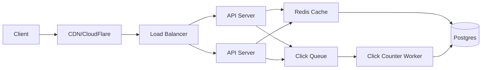

**Short code generation**: 6 base62 characters = 62^6 ≈ 56 billion combinations. Plenty.

**Algorithms**:
- Option 1: hash long URL (MD5/SHA), take first 6 chars. Collision possible — check and retry.
- Option 2: auto-incrementing ID encoded to base62. No collisions, but exposes order (predictable).
- Option 3: random 6-char string, check uniqueness on insert.

**Read path**: GET /abc123 → check cache → if miss, query DB by code → return 302 redirect to long URL → cache the result. Hot URLs stay in cache; cold ones cost one DB query.

**Click tracking**: don't increment a count in DB on every click (write contention). Queue the click event; a background worker batches updates.

**Discussion points to raise**:
- Stale cache: short URLs are immutable; cache forever (or until eviction)
- Custom codes: allow users to specify? Adds collision handling.
- Analytics: per-URL stats, top URLs, geographic data — separate analytics DB?
- Security: prevent shortening of malicious URLs

## 14.6 Worked example: Design a rate limiter

Goal: limit each user to 100 requests/minute.

### Algorithms

**Token bucket**: each user has a bucket holding up to N tokens. Each request consumes a token. Tokens refill at a fixed rate. Allows bursts (up to bucket size); long-run rate is bounded. Most popular.

**Leaky bucket**: requests queue and process at a fixed rate. Excess overflows (rejected). Smooths traffic.

**Fixed window**: count requests in 60-second windows. Simple but allows 2× burst at window boundary (99 reqs in last second of window A + 99 in first second of B = 198 in 2 seconds).

**Sliding window**: track exact timestamps of recent requests; count those within the last 60 seconds. More accurate, more memory.

### Distributed rate limiting

For a single instance: keep counts in memory. For multiple instances behind a load balancer: counts must be shared.

```
INCR ratelimit:{userId}:{minute}
EXPIRE ratelimit:{userId}:{minute} 60
if count > 100: reject
```

Redis atomic operations make this simple and fast.

### Considerations

- **What identifier?** User ID, IP address, API key — different granularity
- **What's the response on limit?** 429 Too Many Requests, with a `Retry-After` header
- **Local first?** A small in-process limit can absorb micro-bursts without hitting Redis on every request

## 14.7 Worked example: Design a payment service (your KMS project area)

Requirements: process payments, idempotent, ACID-strong, observable.

Key components:
- **API layer**: receives requests, validates, authorizes
- **Idempotency layer**: deduplicates retries via idempotency keys
- **Domain logic**: transaction state machine (PENDING → PROCESSING → SUCCESS/FAILED)
- **Persistence**: Postgres with strict transactions
- **Outbox table**: events written in the same transaction as the state change; relay to Kafka asynchronously
- **External payment gateway**: with retry, circuit breaker, timeout

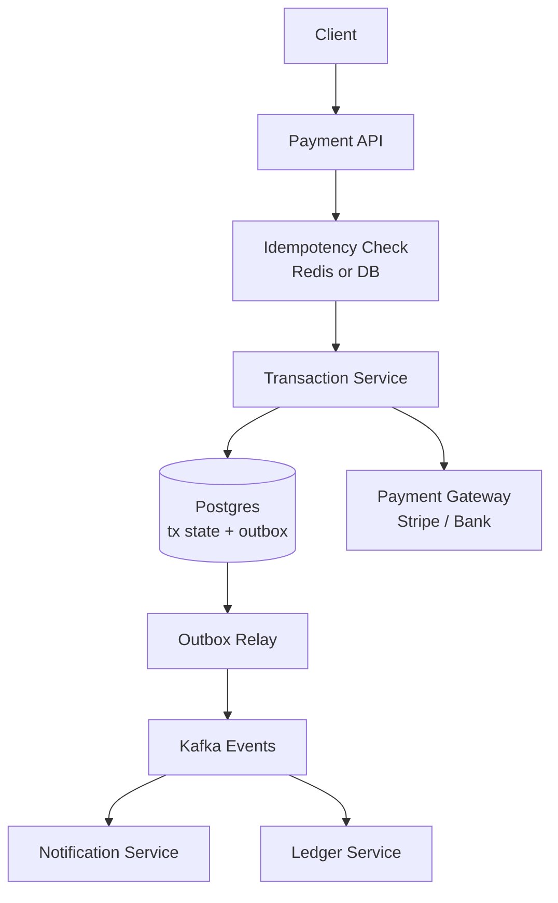

Discussion points:
- Idempotency keys + Redis SETNX or DB UNIQUE constraint
- Outbox pattern guarantees event publishing matches DB commits
- Circuit breakers around external calls (Resilience4j)
- Pessimistic locking on the transaction row for state transitions
- Audit log for every state change

## 14.8 Top system design interview questions

**Q: How would you design a URL shortener?**
(See §14.5 above for the full walk-through.)

**Q: How would you implement a rate limiter?**
Token bucket (allows bursts) or sliding window (precise). For distributed systems, shared counts in Redis with atomic INCR + EXPIRE. Identify by user/IP/key. Return 429 with Retry-After.

**Q: How do you scale a relational database?**
Order of escalation: vertical scaling → read replicas → caching → denormalization → sharding. Sharding is a last resort due to complexity (cross-shard queries, transactions, rebalancing).

**Q: When use a cache vs a CDN?**
Cache (Redis): application data (DB query results, computed values, sessions). CDN (Cloudflare): static assets and full HTTP responses, distributed globally near users. They serve different layers.

**Q: How do you ensure data consistency across microservices?**
Within a service: ACID transactions. Across services: sagas (sequence of local transactions with compensating actions on failure), outbox pattern (publish events from same transaction as state change), eventual consistency.

**Q: What's the difference between sync and async communication?**
Sync (HTTP, gRPC): caller blocks for response. Tight coupling, immediate feedback. Async (Kafka, queues): caller doesn't wait. Loose coupling, better for high-throughput or unreliable downstreams.

**Q: Design considerations for handling 10x traffic?**
Add load-balanced instances. Aggressive caching at edge (CDN) and application (Redis). Read replicas. Async processing for non-critical work. Auto-scaling. Plus capacity planning: provision for peak + buffer.

---

---

# PART IV — Production Stack

# 15. Docker

> What it is, how it works, what containers are NOT, and how your project uses Compose.

## 15.1 What Docker actually is

A **Docker container** is a Linux process (or set of processes) running with isolation:
- Its own filesystem view (chroot-like, via overlay filesystems)
- Its own network namespace
- Its own process namespace (PID 1 inside differs from host)
- cgroup-limited CPU / memory / I/O

This is **not** virtualization. There's no guest kernel, no hypervisor. Containers share the host's kernel.

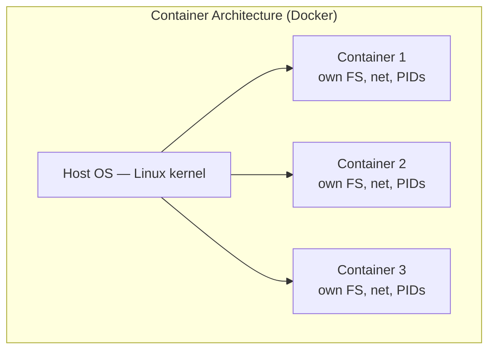

vs. VMs:

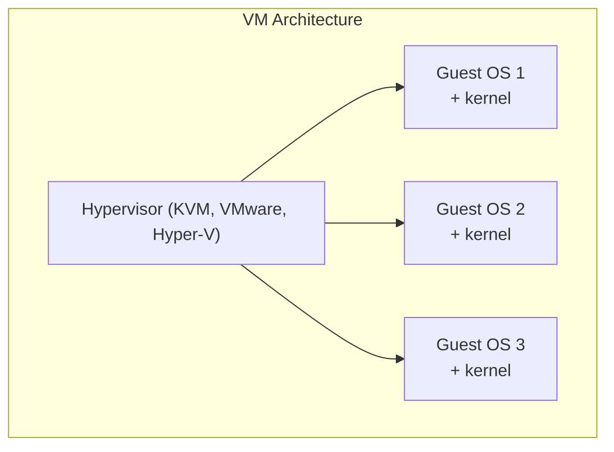

Containers are dramatically lighter: ms to start (vs. seconds-to-minutes for VMs), KB-MB overhead (vs. GBs), share the host kernel.

## 15.2 Images vs containers

- **Image** = read-only template (filesystem snapshot + metadata + default command). Versioned, immutable.
- **Container** = a running instance of an image (with a writable layer on top).

Analogy: image is a class, container is an instance.

## 15.3 Dockerfile

A Dockerfile is a recipe for building an image. Each instruction creates a new layer (cached for fast rebuilds).

### Basic example for a Spring Boot app

```dockerfile
FROM eclipse-temurin:17-jre-alpine
WORKDIR /app
COPY build/libs/payment-*.jar app.jar
EXPOSE 8080
ENTRYPOINT ["java", "-jar", "/app/app.jar"]
```

### Multi-stage builds — what production looks like

```dockerfile
# ── Build stage ─────────────────────────────────────
FROM gradle:8.5-jdk17 AS build
WORKDIR /src
COPY build.gradle settings.gradle ./
COPY src ./src
RUN gradle bootJar --no-daemon

# ── Runtime stage ──────────────────────────────────
FROM eclipse-temurin:17-jre-alpine
RUN addgroup -S app && adduser -S -G app app    # non-root user
WORKDIR /app
COPY --from=build /src/build/libs/*.jar app.jar
USER app
EXPOSE 8080
ENV JAVA_OPTS="-XX:+UseG1GC -XX:MaxRAMPercentage=75"
ENTRYPOINT ["sh", "-c", "java $JAVA_OPTS -jar app.jar"]
```

**Why multi-stage:** the final image doesn't include Gradle, source code, dev tools — only the JAR + JRE. Smaller images = faster pulls, less attack surface.

### Key instructions

| Instruction | Purpose |
|---|---|
| `FROM` | Base image |
| `WORKDIR` | Set working directory (creates if needed) |
| `COPY` / `ADD` | Copy files into image (`ADD` also extracts archives, fetches URLs — usually use `COPY`) |
| `RUN` | Execute a command at build time, commits result as a layer |
| `ENV` | Set env var for build and runtime |
| `ARG` | Build-time variable (not in final image unless re-set as ENV) |
| `EXPOSE` | Documents which port the container listens on (doesn't actually publish) |
| `VOLUME` | Mount point for persistent data |
| `ENTRYPOINT` | Main command (treated as the executable) |
| `CMD` | Default args to ENTRYPOINT, or default command |
| `USER` | Run as a specific user (don't use root!) |
| `HEALTHCHECK` | Container health probe |

### Layer caching

Each Dockerfile instruction creates a layer. Layers are cached and reused if their inputs haven't changed.

**Order matters:** put rarely-changing instructions first.

```dockerfile
# ❌ BAD: any source change invalidates dependency download
FROM gradle:8.5-jdk17
COPY . /src                                   # source changes constantly
RUN cd /src && gradle build                   # downloads deps every build

# ✅ GOOD: only re-download deps when build files change
FROM gradle:8.5-jdk17
COPY build.gradle settings.gradle /src/       # changes rarely
RUN cd /src && gradle dependencies --refresh-dependencies   # cached layer
COPY src /src/src                             # source layer changes often
RUN cd /src && gradle build
```

## 15.4 Common Docker commands

```bash
# Image lifecycle
docker build -t myapp:1.0 .             # build image from Dockerfile
docker pull nginx:alpine                # pull from registry
docker push myregistry/myapp:1.0        # push to registry
docker images                           # list local images
docker image prune                      # remove dangling images
docker rmi myapp:1.0                    # remove image

# Container lifecycle
docker run -d --name web -p 8080:80 nginx           # run, detached, port mapped
docker run --rm -it ubuntu bash                     # interactive, remove on exit
docker run -v /host/data:/app/data nginx            # mount host directory
docker run --env DB_PASSWORD=secret myapp           # env var
docker run --network mynet myapp                    # custom network
docker run --memory=512m --cpus=1.0 myapp           # resource limits

docker ps                               # running containers
docker ps -a                            # all containers (including stopped)
docker logs -f web                      # follow logs
docker exec -it web bash                # shell into running container
docker stop web                         # graceful stop (SIGTERM, then SIGKILL after 10s)
docker rm web                           # remove stopped container
docker container prune                  # remove all stopped containers

# Inspect
docker inspect web                      # detailed JSON about container
docker stats                            # live resource usage
docker top web                          # processes inside container
```

## 15.5 Networking

By default Docker creates three networks:
- **bridge** — default for containers without explicit network. Each gets an IP on `docker0` virtual bridge.
- **host** — share host's network namespace. No isolation but no overhead.
- **none** — no network.

For multi-container apps, **create a user-defined bridge network** — containers on the same network can resolve each other by service name (built-in DNS).

```bash
docker network create mynet
docker run -d --name db --network mynet postgres
docker run -d --name app --network mynet -p 8080:8080 myapp
# Inside app, "db" resolves to the postgres container
```

### Port mapping

`-p HOST_PORT:CONTAINER_PORT` exposes the container's port on the host.

```bash
docker run -p 8080:80 nginx            # host 8080 → container 80
docker run -p 127.0.0.1:8080:80 nginx  # only listen on localhost
docker run -p 8080:80/udp nginx        # UDP
```

## 15.6 Volumes — persisting data

Containers are ephemeral. Anything written inside the container's writable layer is lost when the container is removed. For persistence: **volumes**.

```bash
# Named volume (managed by Docker, lives in /var/lib/docker/volumes/)
docker volume create pgdata
docker run -v pgdata:/var/lib/postgresql/data postgres

# Bind mount (host directory)
docker run -v /host/path:/container/path myapp

# tmpfs (RAM, ephemeral but no disk I/O)
docker run --tmpfs /tmp myapp
```

Volumes are the right answer for databases, caches, anything stateful.

## 15.7 Docker Compose

For multi-container applications, declarative config in `docker-compose.yml`. **Your project uses this.**

```yaml
services:
  postgres:
    image: postgres:15-alpine
    environment:
      POSTGRES_DB: payments
      POSTGRES_USER: app
      POSTGRES_PASSWORD: ${DB_PASSWORD}
    volumes:
      - pgdata:/var/lib/postgresql/data
    healthcheck:
      test: ["CMD-SHELL", "pg_isready -U app -d payments"]
      interval: 5s
      timeout: 3s
      retries: 5

  redis:
    image: redis:7-alpine
    command: redis-server --requirepass ${REDIS_PASSWORD}
    healthcheck:
      test: ["CMD", "redis-cli", "ping"]
      interval: 5s

  kafka:
    image: confluentinc/cp-kafka:7.5.0
    environment:
      KAFKA_NODE_ID: 1
      KAFKA_PROCESS_ROLES: 'broker,controller'
      KAFKA_LISTENERS: PLAINTEXT://kafka:9092,CONTROLLER://kafka:9093
      # ... KRaft mode config
    healthcheck:
      test: ["CMD", "kafka-topics", "--bootstrap-server", "localhost:9092", "--list"]

  backend:
    build: ./backend
    depends_on:
      postgres:  { condition: service_healthy }
      redis:     { condition: service_healthy }
      kafka:     { condition: service_healthy }
    environment:
      SPRING_DATASOURCE_URL: jdbc:postgresql://postgres:5432/payments
      SPRING_REDIS_HOST: redis
      KAFKA_BOOTSTRAP_SERVERS: kafka:9092
    ports:
      - "8080:8080"

  prometheus:
    image: prom/prometheus:v2.48.0
    volumes:
      - ./monitoring/prometheus.yml:/etc/prometheus/prometheus.yml
    ports:
      - "9090:9090"

  grafana:
    image: grafana/grafana:10.2.0
    volumes:
      - ./monitoring/grafana/provisioning:/etc/grafana/provisioning
    environment:
      GF_SECURITY_ADMIN_PASSWORD: admin
    ports:
      - "3001:3000"

volumes:
  pgdata:
```

```bash
docker compose up -d                    # start all services in background
docker compose logs -f backend          # follow backend logs
docker compose ps                       # status
docker compose down                     # stop and remove containers
docker compose down -v                  # also remove volumes (data loss!)
docker compose restart backend          # restart one service
```

`depends_on` with `condition: service_healthy` is critical — without it, your app might start before Postgres is ready.

## 15.8 Docker production best practices

1. **Don't run as root** — `USER app` in Dockerfile. Limits blast radius of escapes.
2. **Pin base image versions** — `python:3.11-slim`, not `python:latest`. Reproducible builds.
3. **Use `.dockerignore`** — exclude `.git`, `node_modules`, `target`, etc. from build context (faster builds, smaller images).
4. **Multi-stage builds** — runtime image only contains what's needed at runtime.
5. **Minimal base images** — `alpine` (5MB) or `distroless` instead of full `ubuntu` (70MB).
6. **One process per container** — embrace the Unix philosophy. Use Compose for multi-process systems.
7. **Don't store secrets in images** — use env vars, mounted secrets, or Docker secrets / Vault.
8. **Set resource limits** — `--memory`, `--cpus`. Prevents one container from starving others.
9. **Health checks** — let orchestrators know when a container is broken.
10. **Tag immutably** — `myapp:1.2.3-abc123` (semver + git SHA), not just `:latest`.

## 15.9 Common pitfalls

### "Why is my container exiting immediately?"

The main process exited. Common causes:
- ENTRYPOINT/CMD ran successfully and returned (no long-running server)
- Process crashed — check `docker logs <name>`
- Wrong working directory or missing files

### Connection refused between containers

- They need to be on the same network
- Use service name (Compose) or container name as hostname, not `localhost`
- Inside a container, `localhost` refers to the container itself

### File ownership / permissions issues with bind mounts

If host UID ≠ container UID, the container process may not have permission to write to mounted host files. Fix: match UID/GID, or use named volumes.

### Image size keeps growing

- Multi-stage builds
- `apt-get install ... && apt-get clean && rm -rf /var/lib/apt/lists/*` in same `RUN` (so cleanup is in same layer)
- `.dockerignore` excluding build artifacts

## 15.10 Docker interview questions

**Q: Difference between a container and a VM?**
*(see §14.1)* Container shares host kernel; VM has its own kernel + hypervisor. Container = MB and ms to start; VM = GB and seconds. Container is lighter but less isolated.

**Q: What's the difference between an image and a container?**
Image: read-only template (filesystem + metadata). Container: running instance with a writable layer on top. Image is to container what class is to instance.

**Q: What is layer caching?**
Each Dockerfile instruction creates a layer. Layers are cached by content hash + previous layer hash. If neither changed, the layer is reused — making rebuilds fast. Order Dockerfile instructions from least-to-most-changing for maximum cache hits.

**Q: ENTRYPOINT vs CMD?**
ENTRYPOINT is the executable (rarely overridden); CMD is default args (overridable on `docker run`). Common pattern: `ENTRYPOINT ["java", "-jar", "/app.jar"]` + `CMD ["--spring.profiles.active=dev"]`. `docker run myapp --spring.profiles.active=prod` overrides the CMD.

**Q: What's a multi-stage build?**
Multiple `FROM` instructions in one Dockerfile. Each is a stage. You can `COPY --from=<stage>` artifacts forward. The final stage is your image — earlier stages aren't included. Lets you compile in a heavy build environment but ship a minimal runtime.

**Q: Volumes vs bind mounts?**
Volumes managed by Docker (in `/var/lib/docker/volumes`); bind mounts point to host paths. Volumes are portable, the standard for databases. Bind mounts are good for source code in dev (live-reload) and config files.

**Q: Why not run as root in containers?**
Container escapes (kernel bugs, capability misuse) become host root if the container runs as root. Running as a non-privileged user limits the blast radius.

**Q: How do containers communicate?**
On the same Docker network, containers can resolve each other by service name (Compose) or container name. Cross-network requires explicit network attach. Outside Docker → port mapping with `-p host:container`.

**Q: How do you handle persistent data in containers?**
Volumes for managed Docker storage; bind mounts for host paths; `tmpfs` for ephemeral RAM. Database data goes in named volumes — never inside the container's writable layer.

**Q: How does `docker compose up` know which order to start services?**
Looks at `depends_on`. With `condition: service_healthy`, waits for the dependency's healthcheck to pass. Without conditions, it just orders startup but doesn't actually wait for readiness.

**Q: What's a `.dockerignore` file?**
Like `.gitignore` but for Docker build context. Excludes files from being sent to the daemon, speeds up build, prevents leaking dev artifacts (target/, node_modules/, .git/, .env) into images.

---

# 16. Redis

> Single-threaded in-memory data store. Used in your project for cache, distributed locks, and rate limiting. Know the data structures and the operational model.

## 16.1 What Redis is

Redis is an in-memory data store with optional disk persistence. Sub-millisecond latency. Single-threaded core (one event loop) — simple concurrency model, no internal contention. Multi-threaded I/O for network in 6.0+.

Key features:
- Data structures: strings, hashes, lists, sets, sorted sets, streams, bitmaps, hyperloglog, geo
- Pub/sub messaging
- Transactions (MULTI/EXEC) — optimistic, no rollback
- Lua scripting for atomic operations
- Persistence: RDB snapshots + AOF append-only log
- Replication: primary-replica
- Sentinel for HA, Cluster for sharding

**Why single-threaded works**: most ops are O(1) or O(log n). The bottleneck is network I/O, not CPU. No thread switches, no locks. To use more cores: run multiple Redis processes (Cluster) or use Redis 6+ multi-threaded I/O.

## 16.2 Data structures

### Strings

The simplest type; values are binary-safe strings up to 512 MB.

```
SET user:42 "{'name':'Alice','age':30}"
GET user:42
SETEX session:abc 3600 "userid=42"           # expire in 1h
INCR counter                                  # atomic integer increment
INCRBY counter 5
APPEND log:current "new line\n"
```

Use cases: caching arbitrary objects (serialize JSON), counters, simple rate limiting.

### Hashes

Map from field → value. Like a small `HashMap<String, String>` per key.

```
HSET user:42 name "Alice" age 30 email "a@x.com"
HGET user:42 name
HGETALL user:42
HINCRBY user:42 age 1
HDEL user:42 email
```

Use cases: object representation (avoid serialize/deserialize round-trip).

### Lists

Linked list. O(1) push/pop on both ends. Indexed access O(n).

```
LPUSH queue "msg1" "msg2" "msg3"             # push to head
RPUSH queue "msg4"                            # push to tail
LPOP queue
RPOP queue
LRANGE queue 0 -1                             # all elements
BLPOP queue 5                                 # blocking pop with timeout
```

Use cases: simple message queue (LPUSH producer, BRPOP consumer), recent activity feeds.

### Sets

Unordered, unique members.

```
SADD tags "java" "spring" "redis"
SMEMBERS tags
SISMEMBER tags "java"
SREM tags "redis"
SINTER tags1 tags2                            # intersection
SUNION tags1 tags2
```

Use cases: tags, unique-visitors per day, membership checks.

### Sorted Sets (ZSets)

Sets where each member has a score. Sorted by score.

```
ZADD leaderboard 100 "alice" 200 "bob" 150 "carol"
ZRANGE leaderboard 0 -1 WITHSCORES            # ascending
ZRANGEBYSCORE leaderboard 100 200
ZINCRBY leaderboard 50 "alice"                # alice now has 150
ZREVRANGE leaderboard 0 9                     # top 10 descending
```

Use cases: leaderboards, time-ordered events, priority queues, secondary indexes.

### Streams (Redis 5+)

Append-only log with consumer groups, similar to Kafka's model on a smaller scale.

```
XADD events * type "login" user "alice"      # * = auto-id
XLEN events
XRANGE events - +
XREAD COUNT 10 STREAMS events 0
XGROUP CREATE events workers $
XREADGROUP GROUP workers worker-1 COUNT 1 STREAMS events >
XACK events workers 1234567-0
```

Use cases: event log, lightweight message queue, audit trail. Not a Kafka replacement at scale, but excellent for "Kafka-lite" needs.

### Bitmaps

Bits operated by offset. Storage-efficient for large boolean arrays.

```
SETBIT user:active:2024-05-08 42 1            # mark user 42 active today
GETBIT user:active:2024-05-08 42
BITCOUNT user:active:2024-05-08               # count active users today
```

### HyperLogLog

Probabilistic count of unique elements. ~12KB to count up to billions of distinct items with ~0.81% error.

```
PFADD page-visits user42 user99 user42        # idempotent
PFCOUNT page-visits                           # ≈ 2
PFMERGE total-visits day1 day2 day3
```

## 16.3 Use cases in your project

### Caching

Cache-aside pattern. Application layer manages cache.

```java
@Cacheable(value = "users", key = "#id")
public UserDto get(long id) { return repo.findById(id).orElseThrow(); }
```

With Spring Cache + Redis backend, `@Cacheable` translates to:
```
GET cache:users::42  →  miss → load from DB → SET cache:users::42 <data> EX 300
```

### Rate limiting

Atomic INCR with expiration:
```java
String key = "ratelimit:" + userId;
Long count = redis.opsForValue().increment(key);
if (count == 1) redis.expire(key, Duration.ofSeconds(60));
if (count > 10) throw new RateLimitExceeded();
```

For correctness under concurrent first-call (race between INCR and EXPIRE), use a Lua script that does both atomically.

### Distributed locks (Redisson)

```java
RLock lock = redisson.getLock("tx:" + txId);
if (lock.tryLock(0, 30, TimeUnit.SECONDS)) {
    try { /* protected work */ }
    finally { lock.unlock(); }
}
```

Under the hood: Redisson uses Lua scripts for atomic SET NX with automatic renewal ("watchdog") to extend the lease while the holder is still alive.

### Idempotency cache

Store (key → response) for replay on retries.

```
SET idempotency:7c8e2a1b... '{"id":"42","status":"PENDING"}' EX 86400 NX
```

`NX` makes it atomic-claim — only set if not exists.

## 16.4 Persistence: RDB vs AOF

### RDB (Redis Database) snapshots

Periodic point-in-time snapshots of the entire dataset to a binary file.

```
save 900 1                                    # snapshot if 1+ key changed in 900s
save 300 10                                   # 10+ in 300s
save 60 10000                                 # 10000+ in 60s
```

Pros: compact file, fast restart. Cons: data loss between snapshots.

### AOF (Append-Only File)

Logs every write command. On restart, replays the log to reconstruct state.

```
appendfsync everysec                          # fsync once per second (default, balanced)
appendfsync always                            # fsync every write — durable, slow
appendfsync no                                # let OS decide — fast, risky
```

Pros: minimal data loss (~1s with default `everysec`). Cons: bigger file, slower restart.

### Practical recommendation

Use **both** in production: RDB for periodic snapshots (fast restart, smaller backups) + AOF for durability between snapshots.

### Redis 7+ multi-part AOF

AOF is now split into a base RDB file + incremental AOF — combines the strengths.

## 16.5 Replication

### Primary-replica

```
Primary ─── async replication ───► Replica 1
                              └──► Replica 2
```

Replicas handle reads (offload primary), serve as failover candidates.

```
# On replica
REPLICAOF primary-host 6379                   # become a replica of primary
REPLICAOF NO ONE                              # promote to primary
```

Async replication → possible data loss on primary failure. Cannot be made fully sync without significant write latency penalty.

### Sentinel (HA)

A separate set of Redis Sentinel processes monitor primary + replicas. On primary failure: vote, elect a new primary, reconfigure replicas, notify clients.

```
                ┌─ Sentinel ─┐
Primary ◄────►  │ Sentinel   │ ◄───► Clients (ask Sentinel for current primary)
Replicas  ◄──►  └─ Sentinel ─┘
```

Use 3+ Sentinels for quorum.

### Redis Cluster (sharding + HA)

Data partitioned across multiple primary nodes, each with replicas.

- 16,384 hash slots distributed across primaries
- Key's slot = `CRC16(key) % 16384`
- Multi-key operations require all keys in the same slot — use **hash tags**: `{user:42}:profile` and `{user:42}:settings` go to the same slot
- Clients are slot-aware, redirect on MOVED/ASK errors

## 16.6 Cache patterns

### Cache-aside (lazy loading)

App reads cache; on miss, reads DB and populates cache.

```java
public User get(long id) {
    User cached = redis.get("user:" + id);
    if (cached != null) return cached;
    User u = repo.findById(id).orElseThrow();
    redis.setex("user:" + id, 300, u);
    return u;
}
```

Pros: only requested data is cached. Cons: cache miss penalty; stale data possible.

### Read-through

Application reads only from cache; cache loads from DB on miss transparently. Library-managed (Caffeine LoadingCache, JCache).

### Write-through

Every write goes to both cache and DB synchronously.
Pros: cache always consistent. Cons: slower writes.

### Write-behind (write-back)

Writes go to cache, async-flush to DB.
Pros: fast writes. Cons: data loss risk on cache crash.

### Refresh-ahead

Cache proactively refreshes hot keys before TTL expiry. Avoids cold-cache stampedes.

## 16.7 Eviction policies

When Redis hits `maxmemory`, it evicts according to policy:

| Policy | Behavior |
|---|---|
| `noeviction` | Return errors on write — default |
| `allkeys-lru` | Evict least-recently-used across all keys |
| `volatile-lru` | LRU among keys with TTL |
| `allkeys-lfu` | Least-frequently-used across all keys (Redis 4+) |
| `volatile-lfu` | LFU among keys with TTL |
| `allkeys-random` | Random eviction |
| `volatile-ttl` | Evict key closest to expiry |

**For caches**: `allkeys-lru` is the standard.
**For data stores**: `noeviction` and explicit TTL on keys you intend to expire.

## 16.8 Common pitfalls

### Big keys

A single 1GB list/set/hash blocks the event loop on operations. Symptoms: latency spikes. Detect: `redis-cli --bigkeys`. Mitigate: shard a big key into multiple smaller keys.

### Hot keys

A single key receiving millions of QPS becomes the bottleneck. Replicate the value across multiple keys with random suffix; client picks one randomly.

### Cache stampede

TTL expires → concurrent requests miss → all hit DB. Mitigate: single-flight (`@Cacheable(sync=true)`), probabilistic early refresh, distributed lock.

### Missing TTLs

Keys without expiry accumulate forever, eventually exhausting memory. Set TTL on every cache-pattern key.

### KEYS command

`KEYS pattern` is O(n) over the entire keyspace. **Never use in production** — blocks the event loop. Use `SCAN` (cursor-based, non-blocking).

```
SCAN 0 MATCH "user:*" COUNT 100              # returns cursor + batch
```

## 16.9 Pub/Sub

```
SUBSCRIBE channel1 channel2
PSUBSCRIBE news.*
PUBLISH channel1 "hello"
```

Fire-and-forget — no persistence. Subscribers must be online at publish time to receive. For persistent messaging use Streams (or Kafka).

## 16.10 Pipelining vs transactions

### Pipelining

Send multiple commands without waiting for replies; read all replies in batch. Reduces RTT cost dramatically.

```java
redis.executePipelined(connection -> {
    for (int i = 0; i < 1000; i++) connection.set(("k" + i).getBytes(), "v".getBytes());
    return null;
});
```

### Transactions (MULTI/EXEC)

Group commands to execute atomically (no other client interleaves between commands).

```
MULTI
INCR counter
LPUSH log "incremented"
EXEC                                          # both run atomically
```

**No rollback** — if a command fails (e.g., INCR on a non-integer), other commands still execute. Optimistic locking via `WATCH`:

```
WATCH balance
val = GET balance
MULTI
SET balance (val - 100)
EXEC                                          # fails (returns nil) if balance changed since WATCH
```

For complex atomic logic, **Lua scripts** are usually cleaner.

## 16.11 Lua scripting

```
EVAL "if redis.call('get', KEYS[1]) == ARGV[1] then return redis.call('del', KEYS[1]) else return 0 end" 1 mykey expectedvalue
```

Atomic from Redis's perspective — no other client runs commands during the script. The basis of Redisson's distributed lock and many rate-limiting implementations.

## 16.12 Redis interview questions

**Q: Why is Redis fast?**
In-memory, single-threaded core (no lock contention), efficient O(1)/O(log n) ops, optimized data structures, network I/O is the bottleneck and even that is multi-threaded in 6.0+.

**Q: Single-threaded — doesn't that limit throughput?**
On modern hardware Redis hits 100k+ ops/s on one core easily. To scale further: multiple Redis processes (Cluster), or 6.0+ multi-threaded I/O. But CPU is rarely the bottleneck — network and serialization usually are.

**Q: RDB vs AOF?**
RDB: periodic snapshots, fast restart, minimal disk overhead, but data loss between snapshots. AOF: append-only command log, max ~1 sec data loss with `everysec` fsync, larger file, slower restart. **Use both in production.**

**Q: How would you cache a user object in Redis?**
Hash for the object: `HSET user:42 name "Alice" age 30`. Read with HGET / HGETALL. Set TTL with `EXPIRE user:42 300`. Or store JSON as a string — simpler but requires full serialize/deserialize on every access.

**Q: How does Redis distributed locking work?**
`SET key value NX PX 30000` — atomically claim if not exists, with 30-second TTL. Holder unlocks by checking value matches its own UUID, then DEL (via Lua script for atomicity). Redisson's "watchdog" auto-renews while the holder is alive.

**Q: Redlock — is it safe?**
Controversial. Martin Kleppmann's blog argued Redlock is unsafe for correctness due to clock-drift assumptions. Antirez (Redis creator) responded. **Practical answer**: Redis locking is fine for performance (avoid duplicate work). For correctness (must absolutely not double-spend), back it with idempotency at the underlying storage (DB unique constraints, version checks). Your project does both.

**Q: Cache eviction policies?**
*(see §15.7)* `allkeys-lru` for caches; `noeviction` with explicit TTLs for data stores.

**Q: How would you implement rate limiting in Redis?**
Token bucket via Lua script. Or simpler: `INCR ratelimit:{user}` + `EXPIRE` to count requests in a fixed window. For sliding windows, use a sorted set of timestamps with `ZRANGEBYSCORE` to count recent requests.

**Q: When use Redis instead of a relational DB?**
Caching, rate limiting, distributed locks, pub/sub, ephemeral / sub-millisecond data, leaderboards (sorted sets). Not a replacement for a primary store of record — Redis is in-memory first.

**Q: What's a "hot key" problem?**
A single key receiving overwhelming traffic, becoming the bottleneck. Mitigations: replicate the value across multiple keys with random suffix and have clients pick randomly; cache locally in app servers; pre-aggregate hot data.

**Q: KEYS vs SCAN?**
KEYS is O(n) and blocks the event loop — never in production. SCAN uses a cursor, returns batches non-blockingly. Always SCAN.

**Q: Why might `MULTI`/`EXEC` not be enough for atomic increment-then-update?**
MULTI/EXEC is atomic but doesn't conditionally execute based on a value read **inside** the transaction (you can't see results of intermediate commands). Either use WATCH for optimistic locking, or Lua scripts for arbitrary atomic logic.

---

# 17. Kafka

> Distributed event streaming platform. Used in your project for transaction events and DLQ. Master partitions, consumer groups, delivery semantics.

## 17.1 What Kafka is

A distributed, durable, partitioned, replicated commit log. Producers append messages; consumers read from any offset. Messages persist for a configured retention (time or size), even after consumption.

**Key differentiators vs traditional message queues:**
- **Replayable** — consumers can re-read any offset
- **Multi-subscriber** — many consumer groups can independently read the same topic
- **High throughput** — sequential disk writes, zero-copy network sends
- **Durable** — replicated across brokers
- **Ordered within a partition** — but not across partitions

## 17.2 Core concepts

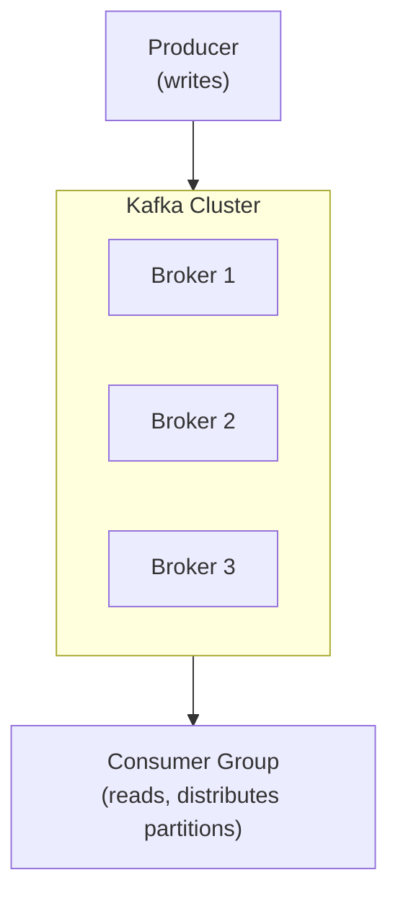

### Topics

A category of messages. Producers send to topics; consumers read from them.

### Partitions

Each topic is split into N partitions. Messages within a partition are strictly ordered. Across partitions, no order guarantee.

```
Topic: transaction.events (3 partitions)
  Partition 0: [m1] [m4] [m7] [m10]
  Partition 1: [m2] [m5] [m8]
  Partition 2: [m3] [m6] [m9] [m11]
```

Partitions are the unit of:
- **Parallelism** — one consumer per partition per consumer group
- **Ordering** — only within a partition
- **Replication** — each partition has N replicas

### Brokers

A broker is a Kafka server. A cluster has multiple. Each partition has one **leader** broker (handles reads/writes) and N-1 **follower** replicas.

### Producers

```java
@Bean
ProducerFactory<String, String> producerFactory() {
    Map<String, Object> cfg = new HashMap<>();
    cfg.put(BOOTSTRAP_SERVERS_CONFIG, "kafka:9092");
    cfg.put(KEY_SERIALIZER_CLASS_CONFIG, StringSerializer.class);
    cfg.put(VALUE_SERIALIZER_CLASS_CONFIG, StringSerializer.class);
    cfg.put(ACKS_CONFIG, "all");                  // wait for all in-sync replicas
    cfg.put(ENABLE_IDEMPOTENCE_CONFIG, true);     // exactly-once semantics per producer session
    cfg.put(RETRIES_CONFIG, Integer.MAX_VALUE);
    cfg.put(MAX_IN_FLIGHT_REQUESTS_PER_CONNECTION, 5);
    return new DefaultKafkaProducerFactory<>(cfg);
}

@Service
class EventPublisher {
    private final KafkaTemplate<String, String> kafka;
    public void publish(String key, String json) {
        kafka.send("transaction.events", key, json);
    }
}
```

### Partition assignment for messages

- If key is null: round-robin / sticky partitioner
- If key is set: `partition = hash(key) % numPartitions` — same key → same partition → ordered

For your project: use `txId` or `accountId` as the key to ensure all events for a single account go to the same partition (preserving causal order).

### Consumers and Consumer Groups

A consumer group is a set of consumers that cooperatively process a topic's partitions. Kafka assigns partitions to consumers in the group (one partition → one consumer at a time).

```
Topic: transaction.events (4 partitions)
Consumer Group "billing":
  Consumer A: partitions 0, 1
  Consumer B: partitions 2, 3
```

If a consumer dies, Kafka **rebalances** — reassigns its partitions to others.

```java
@KafkaListener(topics = "transaction.events", groupId = "billing")
public void onTransaction(ConsumerRecord<String, String> rec) {
    // rec.key(), rec.value(), rec.offset(), rec.partition(), rec.timestamp()
    process(rec);
}
```

### Offsets

Each consumer group tracks its position (offset) per partition. Kafka stores these in the special `__consumer_offsets` topic.

- **Auto-commit** (default): consumer commits offsets every N seconds. Risk: at-most-once if process dies between commit and processing.
- **Manual commit**: app commits after successful processing. At-least-once (duplicates possible if commit fails after processing).

```java
// Manual commit, more control
factory.getContainerProperties().setAckMode(ContainerProperties.AckMode.MANUAL);

@KafkaListener(...)
public void onMessage(ConsumerRecord<String, String> rec, Acknowledgment ack) {
    process(rec);
    ack.acknowledge();
}
```

## 17.3 Replication

Each partition has a **leader** + N-1 **followers**.

- **ISR (In-Sync Replicas)**: replicas that are up to date with the leader. Includes the leader.
- **min.insync.replicas**: minimum number of ISRs that must ack a write (with `acks=all`)

```
Topic: orders (replication factor = 3, min.insync.replicas = 2)
  Partition 0: leader = broker 1, followers = brokers 2, 3
```

If broker 1 fails, broker 2 or 3 is promoted to leader (assuming they're in ISR).

### Producer `acks`

| `acks` | Behavior | Durability |
|---|---|---|
| `0` | Don't wait for acknowledgment | Fire-and-forget; may lose data |
| `1` | Leader only acknowledges | Loses data if leader fails before replicating |
| `all` (`-1`) | Leader + all ISRs ack | Strongest durability |

For banking: **always `acks=all`** + `min.insync.replicas >= 2` + replication factor 3.

## 17.4 Delivery semantics

Three possibilities:

- **At-most-once**: messages may be lost. Auto-commit before processing.
- **At-least-once**: messages may be duplicated. Manual commit after processing — the most common in practice.
- **Exactly-once**: messages neither lost nor duplicated. Achievable via Kafka transactions OR app-level idempotency.

### Exactly-once semantics (EOS)

Kafka 0.11+ supports producer transactions:

```java
producer.initTransactions();
producer.beginTransaction();
producer.send(record1);
producer.send(record2);
producer.sendOffsetsToTransaction(...);   // for read-process-write patterns
producer.commitTransaction();
```

EOS within a Kafka system. If your consumer writes to an external DB, you still need application-level idempotency.

### Practical advice

For most apps:
- **Use at-least-once** + idempotent consumers
- Idempotency keys at the message layer
- Check for duplicates before applying side effects
- Your project does this — be ready to explain why this is more practical than EOS for cross-system transactions.

## 17.5 Common patterns

### Event-driven architecture

Services emit events; others react. No direct API calls.

```
Order Service ─ "OrderPlaced" → Kafka → Inventory Service (reserves stock)
                                      → Billing Service (charges customer)
                                      → Notification Service (sends email)
```

Loose coupling — adding a new consumer doesn't change the producer.

### Outbox pattern

DB write + Kafka publish need to be atomic, but you can't 2PC across them. Solution:

```
1. In a single DB transaction:
   - Write business data
   - Insert event into an "outbox" table
   - Commit
2. A separate poller reads outbox, publishes to Kafka, marks as published
```

Tools: **Debezium** (CDC from DB log), or a simple scheduled poller.

### Dead Letter Queue (DLQ)

Messages that fail processing repeatedly are sent to a DLQ for manual investigation/retry.

```java
@Bean
public DefaultErrorHandler errorHandler(KafkaTemplate<Object, Object> template) {
    var recoverer = new DeadLetterPublishingRecoverer(template,
        (rec, ex) -> new TopicPartition(rec.topic() + ".dlq", rec.partition()));
    return new DefaultErrorHandler(recoverer, new FixedBackOff(1000L, 3));
}
```

**Your project** uses a custom recoverer that writes to a Postgres `dead_letter_events` table FIRST (durable), then publishes to the DLQ topic best-effort. If Kafka is the problem, default Spring Kafka behavior (publish to DLQ topic) is useless. By persisting to DB first, no message is ever lost — and admins can inspect/retry from `/api/admin/dlq`.

### Retry topics

Tiered retry with delays: `topic.retry.5s`, `topic.retry.30s`, `topic.retry.5m`, `topic.dlq`. Each retry topic has its own consumer that waits the delay then retries; on failure, forwards to the next tier. Spring Kafka has `@RetryableTopic` for this.

## 17.6 Kafka vs traditional message queues (RabbitMQ, ActiveMQ)

| | Kafka | RabbitMQ |
|---|---|---|
| Model | Distributed log | Smart broker, stupid consumer |
| Routing | Topic + partition; hashing on key | Exchanges (direct, topic, fanout, headers) |
| Persistence | Append-only log; replay possible | Queue-based; consumed = gone |
| Throughput | Very high (millions/sec) | High but lower (10k-100k/sec) |
| Latency | ms | sub-ms possible |
| Multi-subscriber | First-class (consumer groups) | Need fanout exchange |
| Ordering | Per-partition | Per-queue |
| Use cases | Event streaming, log aggregation, CDC | Task queues, RPC, complex routing |

**Pick Kafka for**: event-driven systems, audit trails, replay, high throughput, multiple downstream consumers.
**Pick RabbitMQ for**: task queues, complex routing rules, lower-volume but lower-latency RPC-style messaging.

## 17.7 Operational concerns

### Partitioning strategy

How many partitions? Rules of thumb:
- More partitions = more parallelism, but more overhead per broker
- Start with `numConsumers × 2` to allow growth without repartitioning
- Repartitioning is expensive — get it close to right initially

### Choosing the message key

Key determines partition. Choose it to:
- Maintain ordering for related events (`accountId` → all events for one account go to one partition → ordered)
- Distribute evenly (avoid hot keys, where one key dominates traffic)

### Retention

```
log.retention.hours=168                       # default 7 days
log.retention.bytes=1073741824                # or by size
log.cleanup.policy=delete                     # or "compact"
```

**Compacted topics** keep only the latest value per key — perfect for state snapshots / change logs (think: latest customer profile, latest config).

### Schema evolution

JSON is convenient but error-prone. **Avro** or **Protobuf** with a schema registry (Confluent Schema Registry, Apicurio) gives:
- Compile-time type safety in producers/consumers
- Backward/forward compatibility checks
- Smaller, faster serialization

## 17.8 Common pitfalls

### Consumer lag

Consumer can't keep up with producer → lag grows → SLA misses. Solutions: increase partition count + consumers, optimize processing, batch operations.

### Rebalancing storms

When a consumer joins/leaves, the group rebalances — all consumers stop briefly. Frequent rebalances = bad. Causes: consumer timeouts (long processing > `max.poll.interval.ms`), slow heartbeats. Mitigate: tune `max.poll.records` smaller, increase `max.poll.interval.ms`, use cooperative rebalancing (`CooperativeStickyAssignor`).

### Poison messages

A message that always fails consumption blocks the partition. Without a DLQ, the consumer retries forever. Solution: bounded retries + DLQ.

### Hot partition

Skewed key distribution → one partition gets most traffic. Solution: better key, or composite key with random suffix for high-cardinality keys.

### Out-of-order delivery (across partitions)

Cross-partition order is NOT guaranteed. If you need ordering, the events must share a key.

## 17.9 KRaft vs ZooKeeper

Historically, Kafka used ZooKeeper for cluster coordination. Kafka 3.3+ supports **KRaft** (Kafka Raft) — replaces ZooKeeper with a built-in Raft consensus, simplifying ops. Kafka 4.0 (May 2025) made KRaft the only option.

## 17.10 Kafka interview questions

**Q: Difference between Kafka and a traditional message queue?**
*(see §16.6)* Kafka is a distributed append-only log with replay; traditional MQs are queue-based, message consumed = gone. Kafka excels at high-throughput event streaming with multiple subscribers.

**Q: What's a partition? Why do we need them?**
A topic is split into N partitions for parallelism. Each partition is an ordered, immutable sequence of records. Multiple consumers in a group share partitions — one partition is consumed by exactly one consumer in the group at a time. More partitions = more parallel throughput.

**Q: Why is ordering only guaranteed within a partition?**
Different partitions live on different brokers; messages flow through different network paths and disks. Cross-partition ordering would require a global ordering primitive (like a single leader for the whole topic), defeating the parallelism benefits.

**Q: How does the consumer know what to read next?**
Each consumer group tracks its **offset** per partition (the position of the next message to read). Stored in `__consumer_offsets` topic. Committed periodically (auto) or after processing (manual).

**Q: Auto-commit vs manual commit?**
Auto-commit (default 5s): convenient but at-most-once if process dies after commit, before processing complete. Manual commit (after processing): at-least-once (potential duplicates if commit fails). For correctness-sensitive apps, manual + idempotent consumer is the standard.

**Q: At-most-once / at-least-once / exactly-once?**
*(see §16.4)* Exactly-once is hard cross-system. Practical: at-least-once + idempotent consumer.

**Q: What's a consumer group?**
A set of consumers cooperating to process a topic. Each partition is consumed by exactly one consumer in the group at a time. Different groups consume independently.

**Q: What's a rebalance?**
When the set of consumers in a group changes (one leaves or joins), Kafka reassigns partitions. During rebalance, no messages are processed → SLO impact. Frequent rebalances are a smell — usually slow processing exceeding `max.poll.interval.ms`.

**Q: What's `acks=all` and why use it?**
The producer waits for the leader AND all in-sync replicas to acknowledge. Combined with `min.insync.replicas >= 2` and replication factor 3, you survive any single broker failure without data loss. Banking standard.

**Q: How does Kafka achieve durability?**
Replication factor N → message exists on N brokers. `acks=all` ensures producer doesn't return until message is on all in-sync replicas. Disk fsync (configurable) ensures persistence across broker restart.

**Q: What's a DLQ and why does your project use a custom one?**
DLQ = topic for messages that failed processing. Spring Kafka's default `DeadLetterPublishingRecoverer` writes to a Kafka topic — useless if Kafka itself is the problem. Your custom recoverer writes to Postgres first (durable), then forwards to Kafka best-effort. Admins inspect via API and replay through the regular publish path.

**Q: How would you guarantee that all events for a single user are processed in order?**
Use the user ID as the message key. Same key always hashes to the same partition → strict per-user ordering. Cross-user ordering is not guaranteed (and usually doesn't matter).

**Q: Compacted topic — when use?**
For "current state" topics — only the latest value per key matters. Examples: latest customer profile, latest config snapshot, change log. Compaction keeps storage bounded while preserving the latest state.


# 18. Observability: Prometheus, Grafana, k6

> Your project (payment-transaction-service) has the full observability stack — Micrometer → Prometheus → Grafana, plus k6 for load tests. Be ready to explain what each does and why.

## 18.1 The three pillars of observability

- **Metrics** — numerical time-series (request rate, latency p99, error count). Cheap to collect; great for dashboards and alerts. **Prometheus** is the de facto standard.
- **Logs** — discrete events with context. High-cardinality, expensive at scale. **ELK / Loki / Datadog** ingest these.
- **Traces** — end-to-end request flow across services with timing. Reveal bottlenecks. **Jaeger / Zipkin / OpenTelemetry / Tempo**.

Your project covers metrics fully (Prometheus + Grafana) and logs (Logback JSON + MDC); traces are an obvious extension if asked "what would you add?".

## 18.2 Metric types (Prometheus)

| Type | Description | Examples |
|---|---|---|
| **Counter** | Monotonically increasing | `transactions_created_total`, `http_requests_total` |
| **Gauge** | Goes up and down | `connection_pool_active`, `circuit_breaker_open` |
| **Histogram** | Distribution of values, bucketed | `http_request_duration_seconds`, `transactions_processing_duration_seconds` |
| **Summary** | Like histogram, but pre-computes quantiles client-side | Less common; Histogram is preferred |

**Counters never decrease** — even on restart, Prometheus knows because of resets handling. To get rate, use `rate(counter[5m])` in PromQL.

## 18.3 Micrometer in Spring Boot

`spring-boot-starter-actuator` + `micrometer-registry-prometheus` exposes metrics at `/actuator/prometheus`.

```java
@Service
public class TransactionMetrics implements TransactionMetricsPort {
    private final Counter created;
    private final Counter processed;
    private final Timer processingDuration;

    public TransactionMetrics(MeterRegistry registry) {
        this.created = Counter.builder("transactions.created")
            .description("Total transactions created")
            .register(registry);
        this.processed = Counter.builder("transactions.processed")
            .tag("status", "")        // tag will be set per emit
            .register(registry);
        this.processingDuration = Timer.builder("transactions.processing.duration")
            .publishPercentiles(0.5, 0.95, 0.99)        // p50, p95, p99
            .register(registry);
    }

    @Override
    public void recordCreated() { created.increment(); }
    @Override
    public void recordProcessed(String status) {
        Counter.builder("transactions.processed").tag("status", status).register(registry).increment();
    }
    @Override
    public Timer.Sample startTimer() { return Timer.start(registry); }
    @Override
    public void recordDuration(Timer.Sample sample) { sample.stop(processingDuration); }
}
```

**Key insight from your project:** `TransactionMetricsPort` is an outbound port in `application/`; the Micrometer-using class above lives in `infrastructure/`. The application layer never imports Micrometer. **Tests inject a fake.** Pure hexagonal.

### Auto-exposed metrics

Spring Boot Actuator + Micrometer expose dozens of metrics for free:

```
http_server_requests_seconds_count{method="POST",status="201",uri="/api/transactions"}
jvm_memory_used_bytes
jvm_threads_states_threads{state="runnable"}
hikaricp_connections_active
hikaricp_connections_max
process_cpu_usage
logback_events_total{level="error"}
resilience4j_circuitbreaker_calls_seconds_count{name="payment-gateway",kind="successful"}
resilience4j_circuitbreaker_state{name="payment-gateway",state="open"}
kafka_consumer_records_consumed_total
kafka_consumer_fetch_latency_avg
```

The `http_server_requests_seconds_*` family is the workhorse for HTTP metrics — it's what you'd use to compute request rate, error rate, and latency percentiles per endpoint.

## 18.4 PromQL essentials

Prometheus query language. Critical for dashboards and alerts.

### Basics

```promql
# Current value
http_server_requests_seconds_count

# Filter by labels
http_server_requests_seconds_count{method="POST",status="201"}

# Rate of increase per second over last 5 minutes
rate(http_server_requests_seconds_count[5m])

# Aggregations
sum(rate(http_server_requests_seconds_count[5m]))
sum by (status) (rate(http_server_requests_seconds_count[5m]))
sum by (uri) (rate(http_server_requests_seconds_count{status=~"5.."}[5m]))   # 5xx by uri
```

### RED method — for request-driven services

- **R**ate: `sum(rate(http_server_requests_seconds_count[1m]))`
- **E**rrors: `sum(rate(http_server_requests_seconds_count{status=~"5.."}[1m]))`
- **D**uration: `histogram_quantile(0.95, sum(rate(http_server_requests_seconds_bucket[5m])) by (le))`

```promql
# Error rate as percentage
sum(rate(http_server_requests_seconds_count{status=~"5.."}[1m]))
/
sum(rate(http_server_requests_seconds_count[1m])) * 100

# P99 latency for POST /api/transactions
histogram_quantile(0.99,
    sum(rate(http_server_requests_seconds_bucket{method="POST",uri="/api/transactions"}[5m]))
    by (le))
```

### USE method — for resources

- **U**tilization: % of capacity being used
- **S**aturation: queue length / wait time
- **E**rrors: hardware/IO error count

For HikariCP:
```promql
# Connection pool utilization
hikaricp_connections_active / hikaricp_connections_max
# Pool waiting threads
hikaricp_connections_pending
```

## 18.5 Prometheus operational model

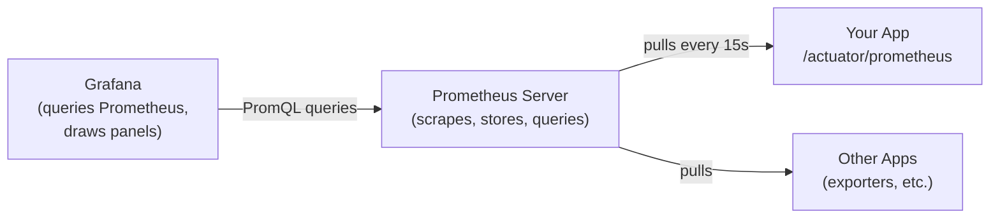

**Pull-based** (vs Datadog/StatsD push-based). Prometheus periodically scrapes targets. Targets are configured in `prometheus.yml`:

```yaml
scrape_configs:
  - job_name: 'payment-service'
    metrics_path: /actuator/prometheus
    scrape_interval: 15s
    static_configs:
      - targets: ['backend:8080']
  - job_name: 'kafka'
    static_configs:
      - targets: ['kafka:9090']
```

For dynamic environments (K8s, Docker Compose), use service discovery instead of static lists.

### Storage

Prometheus stores time-series in a custom on-disk format. Default retention 15 days. For long-term, ship to **Thanos** / **Cortex** / **Mimir** / **VictoriaMetrics** / **Grafana Cloud**.

### Cardinality — the hidden cost

Each unique combination of metric name + labels = one time series. **High cardinality kills Prometheus** (memory + disk).

```
http_requests_total{user_id="42"}      # ❌ user_id is unbounded — DON'T
http_requests_total{path="/api/users"}  # ✅ path is bounded — fine
```

Avoid labels with unbounded values (user IDs, transaction IDs, full URLs with query params). Use logs/traces for those.

## 18.6 Grafana

Visualization layer. Connects to Prometheus (and many others), draws dashboards, supports alerts.

### Dashboard structure

- **Panels** — individual visualizations (graph, gauge, stat, table, heatmap)
- **Variables** — dropdowns at the top to filter (`$service`, `$instance`)
- **Annotations** — overlay events on graphs (deploys, incidents)
- **Provisioning** — declarative dashboard config in `monitoring/grafana/provisioning/dashboards/*.json` (your project's pattern)

### Common panels for a backend service

1. **Request rate** by endpoint
2. **Error rate** (4xx vs 5xx separately)
3. **Latency p50/p95/p99** by endpoint
4. **JVM memory** (heap used, heap max, GC pause)
5. **Connection pool** (active, idle, pending)
6. **Circuit breaker state** (open/closed/half-open over time)
7. **Kafka consumer lag**
8. **Business metrics** — transactions created/processed/failed

### Alerts

```yaml
# Grafana alert rule
expression: |
  sum(rate(http_server_requests_seconds_count{status=~"5.."}[5m]))
  /
  sum(rate(http_server_requests_seconds_count[5m]))
  > 0.01

for: 5m
annotations:
  summary: "Error rate > 1% for 5 minutes on {{ $labels.app }}"
```

Avoid alert fatigue: alert only on user-impacting issues (error rate spikes, p99 latency over SLO, queue depth growing). Send to PagerDuty / Slack / email based on severity.

## 18.7 SLI / SLO / SLA — the language of reliability

- **SLI (Service Level Indicator)** — a metric of service health (e.g., success rate, p99 latency)
- **SLO (Service Level Objective)** — internal target (e.g., 99.9% success rate, p99 < 500ms)
- **SLA (Service Level Agreement)** — contract with customers (with consequences if breached)

Typical SLO: "99.9% of POST /api/transactions complete in < 1s, measured over a 30-day rolling window." 99.9% over 30 days = **43 minutes of error budget** per month.

When budget is being burned fast, slow down on risky deploys.

## 18.8 k6 — modern load testing

JavaScript-driven load testing tool from Grafana Labs. Your project uses it.

### Anatomy of a k6 script

```js
import http from 'k6/http';
import { check, sleep } from 'k6';

export const options = {
    scenarios: {
        constant_load: {
            executor: 'constant-vus',
            vus: 100,                          // virtual users (concurrent)
            duration: '5m',
        },
    },
    thresholds: {
        http_req_failed:   ['rate<0.01'],       // less than 1% failures
        http_req_duration: ['p(95)<500', 'p(99)<2000'],   // p95 < 500ms, p99 < 2s
    },
};

const BASE_URL = __ENV.BASE_URL || 'http://localhost:8080';

export default function () {
    const headers = {
        'Authorization': `Bearer ${__ENV.JWT}`,
        'Idempotency-Key': crypto.randomUUID(),
        'Content-Type': 'application/json',
    };
    const body = JSON.stringify({
        toAccountId: __ENV.TO_ACCOUNT_ID,
        amount: 100,
        description: 'load test',
    });
    
    const res = http.post(`${BASE_URL}/api/transactions`, body, { headers });
    
    check(res, {
        'status is 201 or 422 or 429': r => [201, 422, 429].includes(r.status),
        'response has id': r => r.json('id') !== undefined,
    });
    
    sleep(1);                                  // pace the user
}
```

### Executors (load shapes)

| Executor | Use |
|---|---|
| `constant-vus` | Fixed concurrency for a duration |
| `ramping-vus` | Ramp up/down — like a real launch curve |
| `constant-arrival-rate` | Fixed RPS (requests per second), regardless of latency |
| `ramping-arrival-rate` | Ramp RPS over time |
| `per-vu-iterations` | Each VU runs N iterations |

`constant-arrival-rate` is what you want for SLA testing — it forces the target throughput regardless of how slow your system is, exposing the breakpoint.

### Thresholds — gating CI

```js
thresholds: {
    http_req_failed:    ['rate<0.01'],
    http_req_duration:  ['p(99)<2000'],
}
```

Non-zero exit on failure → CI breaks the build. **Your project does this.**

### Key built-in metrics

- `http_reqs` — total requests
- `http_req_duration` — request latency
- `http_req_failed` — failure rate (non-2xx by default)
- `http_req_blocked` / `connecting` / `tls_handshaking` / `sending` / `waiting` / `receiving` — broken down phases
- `vus` — current virtual users
- `iterations` — total VU iterations completed

### Custom metrics

```js
import { Counter, Trend } from 'k6/metrics';

const rateLimits = new Counter('rate_limit_responses');
const businessTime = new Trend('business_processing_time');

export default function () {
    const res = http.post(...);
    if (res.status === 429) rateLimits.add(1);
    businessTime.add(parseInt(res.headers['X-Processing-Time']));
}
```

### Output to Prometheus / InfluxDB

```bash
k6 run --out experimental-prometheus-rw=http://prometheus:9090/api/v1/write script.js
```

Lets you see live load-test metrics in your Grafana dashboards alongside service metrics. Powerful for spotting where the system breaks under load.

### Realistic load patterns

```js
scenarios: {
    morning_ramp: {
        executor: 'ramping-vus',
        stages: [
            { duration: '2m', target: 10 },     // warm-up
            { duration: '5m', target: 100 },    // peak
            { duration: '2m', target: 100 },    // sustain
            { duration: '1m', target: 0 },      // cool-down
        ],
    },
}
```

## 18.9 Observability interview questions

**Q: Difference between metrics, logs, traces?**
*(see §17.1)* Metrics: numeric time-series, cheap, dashboards/alerts. Logs: discrete events, expensive at scale, debugging. Traces: end-to-end request timing across services, find bottlenecks.

**Q: Counter vs Gauge vs Histogram?**
Counter: monotonic increasing (request count). Gauge: up/down (memory used, queue length). Histogram: distribution in pre-defined buckets, allows percentile queries.

**Q: Why does Prometheus pull, not push?**
Pros: target's health is implicit in scrape success. Easy service discovery in dynamic environments. No fan-out to many push endpoints; Prometheus is the one fan-in. Cons: harder for short-lived jobs (use the Pushgateway).

**Q: What's cardinality? Why does it matter?**
Each unique label combination = one time series. High cardinality (e.g., labeling by user ID) explodes memory/disk use. Keep labels bounded.

**Q: What are the RED metrics?**
**R**ate, **E**rrors, **D**uration. The minimum set for any request-driven service.

**Q: USE method?**
**U**tilization, **S**aturation, **E**rrors — for resources (CPU, memory, disk, queue, connection pool).

**Q: Difference between p99 and average latency?**
Average hides outliers; p99 (99th percentile) is the slowest 1% of requests. P99 is the user experience for a meaningful slice of users; average is misleading. Always alert on p99, not average.

**Q: SLI vs SLO vs SLA?**
SLI: the indicator (metric). SLO: internal target on the SLI (e.g., 99.9%). SLA: customer-facing contract with consequences. SLO is usually stricter than SLA.

**Q: How would you measure your app's availability?**
Uptime as % of successful health checks, or `1 - error_rate` over a rolling window. Define what "success" means precisely (which endpoints? what status codes?). 99.9% SLO = ~8.7 hours downtime per year, ~43 min per month.

**Q: How do you debug a latency spike?**
1. Check Grafana — which endpoint? which percentile? sustained or burst?
2. Correlate with deploys, traffic spikes, dependency health.
3. Check downstream: DB queries, Redis, Kafka, external APIs. Check connection pools (saturation).
4. Logs / traces for that endpoint at the time window.
5. CPU / memory / GC pauses on the app.

**Q: What's k6 and how does it differ from JMeter / Locust?**
k6 is JS-scripted, designed for developers (in-CI testing), focused on HTTP / WebSocket / gRPC load testing. JMeter is GUI-driven, Java, heavyweight. Locust is Python-based, distributed by design. k6 wins for "tests-as-code" workflows.

**Q: What thresholds would you set on a payment service load test?**
Error rate < 0.5%, p95 < 500ms, p99 < 2s for the synchronous path. Also check business outcomes: transaction success rate, no double-debit (post-test integrity check).

**Q: What's the difference between ramping-VUs and constant-arrival-rate executors?**
Ramping-VUs scales concurrency over time. Constant-arrival-rate forces a fixed RPS — if the system slows, k6 spawns more VUs to keep RPS — which exposes overload behavior more accurately.

**Q: How does your project use Micrometer in a hexagonal-clean way?**
`TransactionMetricsPort` lives in `application/` (no Micrometer import). The Micrometer adapter implements it from `infrastructure/`. Tests inject a recording fake instead of Micrometer. The application layer never depends on the metrics framework.


# 19. Distributed Systems Patterns

> Distributed systems are systems where failure of any single component must not bring everything down. This section covers the essential patterns — timeouts, retries, circuit breakers, idempotency, distributed locks, and sagas. Kept compact: the theme is *learn the patterns, understand when each applies*.

## 19.1 Why distributed systems are hard

The defining property of a distributed system: **the network is unreliable**. Messages can be:
- Lost (never arrive)
- Delayed (arrive late)
- Duplicated (arrive multiple times)
- Reordered (arrive out of order)

On top of that, processes can crash, restart, or run slow. Clocks drift. Storage can be inconsistent across replicas. Everything that can go wrong, eventually does.

The two most important properties to internalize:

**Network failures are normal**, not exceptional. Code defensively. Every remote call can fail; every response can be delayed or never arrive.

**Distributed systems trade consistency for availability**. CAP theorem (§11.11) says you can't have all three of Consistency, Availability, Partition tolerance simultaneously. Real-world systems are mostly AP (eventual consistency) or CP (sacrifice availability on partition).

## 19.2 Timeouts

Every network call must have a timeout. Without one, a slow downstream can exhaust your thread pool, hang your service, cascade the failure upstream.

```java
RestClient.builder()
    .baseUrl(url)
    .requestFactory(new SimpleClientHttpRequestFactory() {{
        setConnectTimeout(2_000);   // ms
        setReadTimeout(5_000);
    }})
    .build();
```

**Rule of thumb**: timeout should be a small multiple of expected latency (e.g., expected 100ms → timeout 1000ms). Too short and you'll abort valid responses; too long and slow downstreams paralyze you.

## 19.3 Retries

Network calls sometimes fail transiently. Retrying often succeeds. But retrying mindlessly is dangerous.

**Retry only idempotent operations**. GET, PUT, DELETE are naturally idempotent. POST usually isn't — retrying could double-charge a payment. Add idempotency keys (§19.5) to make POSTs safely retryable.

**Use exponential backoff with jitter**. If every client retries instantly after a transient failure, they all hit the recovering service simultaneously — synchronized retry storm. Backoff (2x delay per retry) spaces them out; jitter (random component) breaks the synchronization.

```java
@Retryable(
    retryFor = TransientException.class,
    maxAttempts = 3,
    backoff = @Backoff(delay = 100, multiplier = 2, random = true))
public Result call() { ... }
```

**Bound retries**. After N attempts (typically 3-5), give up and propagate the error. Endless retries amplify problems.

## 19.4 Circuit breaker

When a downstream service is failing, retrying doesn't help — it adds load to a struggling system. The **circuit breaker** pattern: track failures, "open" the circuit when failure rate exceeds a threshold, fast-fail subsequent calls without making the network round trip. After a cooldown, "half-open" and try a few calls; if they succeed, close the circuit; otherwise re-open.

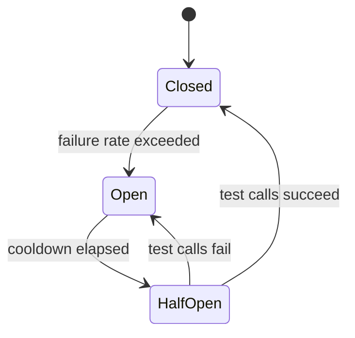

**Resilience4j** in Java:

```java
CircuitBreakerConfig config = CircuitBreakerConfig.custom()
    .failureRateThreshold(50)               // % failures to open
    .waitDurationInOpenState(Duration.ofSeconds(30))
    .slidingWindowSize(20)
    .build();

CircuitBreaker cb = CircuitBreaker.of("payment-gateway", config);
return cb.executeSupplier(() -> gateway.charge(payment));
```

Combined with retry + timeout, this gives you a robust outbound call.

## 19.5 Idempotency

An operation is **idempotent** if calling it multiple times has the same effect as calling it once. For POST requests that aren't naturally idempotent, accept an **idempotency key** from the client; store the result keyed by it; on a duplicate request, return the stored result.

```sql
CREATE TABLE idempotency_keys (
    key VARCHAR(255) PRIMARY KEY,
    request_hash VARCHAR(64),
    response JSONB,
    created_at TIMESTAMPTZ DEFAULT NOW()
);
```

Flow:
1. Client sends `Idempotency-Key: <uuid>` header
2. Server checks: does this key exist?
   - YES → return the stored response (verify request hash matches to detect re-use of key with different payload)
   - NO → process the request, store response with the key, return
3. Background job purges old keys after retention period (e.g., 24 hours)

Critical for retryable operations like payments, account creation, anywhere the cost of duplicate execution is high.

## 19.6 Distributed locks

Sometimes only one process should do something at a time across a cluster — process a queue item, refresh a cache, run a scheduled job. **Redis-based locks** are the common solution.

```java
// Simplified — production code uses Redisson library
boolean acquired = redis.set("lock:job-x", clientId, "NX", "EX", 60);
if (!acquired) return;     // someone else has it
try {
    runJob();
} finally {
    // Lua script: delete only if we still own it (clientId matches)
    redis.eval("if redis.call('get', KEYS[1]) == ARGV[1] then return redis.call('del', KEYS[1]) end",
        Collections.singletonList("lock:job-x"), Collections.singletonList(clientId));
}
```

**Always set a TTL** — if the holder crashes, the lock auto-releases. **Always verify ownership on release** — without this, you might delete a lock another instance acquired after yours expired.

**Redisson** wraps these details: `RLock lock = redisson.getLock("lock:x"); lock.tryLock(0, 30, TimeUnit.SECONDS); ... lock.unlock();`

For stronger guarantees, **Redlock** uses multiple Redis nodes (consensus over a majority). Most apps don't need it.

## 19.7 The Saga pattern

A **saga** is a sequence of local transactions across services, where each step has a **compensating action** for rollback. Used when a logical "transaction" spans services that can't share a database transaction.

**Choreography** (event-driven): each service listens for events and triggers the next step. Loose coupling but no centralized view.

**Orchestration**: a coordinator service calls each step explicitly. Easier to understand; coordinator is a single point of attention.

Example: Order placement spans OrderService, InventoryService, PaymentService:

```
1. OrderService.create        → on failure: nothing to undo
2. InventoryService.reserve   → on failure: cancel order
3. PaymentService.charge      → on failure: release inventory + cancel order
4. OrderService.markPaid      → on failure: refund + release inventory + cancel order
```

Each compensating action must itself be idempotent (it can be retried). Sagas don't give you atomicity in the ACID sense — there are intermediate states observable to clients — but they let you maintain eventual consistency.

## 19.8 Outbox pattern

Problem: you need to update the database **and** publish an event to Kafka, atomically. If you do them as separate operations, one might fail (DB succeeded, Kafka publish failed → event lost; or vice versa).

Solution: write the event to a database table (the **outbox**) in the same transaction as the state change. A separate process polls the outbox and publishes to Kafka, marking events as published.

```sql
CREATE TABLE outbox (
    id BIGSERIAL PRIMARY KEY,
    aggregate_type TEXT,
    aggregate_id TEXT,
    event_type TEXT,
    payload JSONB,
    created_at TIMESTAMPTZ DEFAULT NOW(),
    published_at TIMESTAMPTZ
);
```

```java
@Transactional
void placeOrder(Order o) {
    orderRepo.save(o);
    outboxRepo.save(new OutboxEvent("OrderPlaced", o.toJson()));
}
```

The relay process is at-least-once: events are published until marked complete. Consumers handle duplicates via idempotency.

## 19.9 Consistency models

In distributed systems, "consistency" has shades:

- **Strong consistency**: every read sees the most recent write. Like a single database. Hard to achieve at scale.
- **Eventual consistency**: replicas eventually converge to the same state, given no new writes. Reads may be stale.
- **Read-your-writes**: a client always sees its own writes (but maybe not others' yet).
- **Monotonic reads**: a client never goes back in time on subsequent reads.
- **Causal consistency**: causally-related writes are seen in order; concurrent writes can be reordered.

Different operations may need different consistency. A bank balance display needs strong; a "users who liked this post" count is fine eventually consistent.

## 19.10 Top distributed systems interview questions

**Q: Why do you need timeouts on every remote call?**
Without timeouts, a slow downstream can hang your service indefinitely, exhausting threads and cascading failure upward. Timeouts limit your blast radius from downstream slowness.

**Q: When is it safe to retry?**
For idempotent operations. GET, PUT, DELETE are naturally idempotent. POST is not — retrying could double the effect. Add idempotency keys to make POSTs safely retryable. Always use exponential backoff + jitter to avoid retry storms.

**Q: What does a circuit breaker do?**
Tracks failures to a downstream and "opens" when failures exceed a threshold, fast-failing subsequent calls without making the round trip. After a cooldown, half-opens to test recovery. Saves the struggling downstream from added load and saves you from waiting on hopeless requests.

**Q: What's an idempotency key?**
A unique identifier the client sends with a request, allowing the server to deduplicate retries. If two requests arrive with the same key, the server returns the result of the first instead of re-executing. Standard for payments and other non-idempotent operations.

**Q: How does a Redis-based distributed lock work?**
`SET key value NX EX 60` — atomically sets the key only if it doesn't exist, with a TTL. The TTL ensures auto-release on holder crash. On release, verify the value matches yours before deleting (avoid releasing someone else's lock).

**Q: What's the Saga pattern?**
A sequence of local transactions across services with compensating actions for rollback. Used when a logical transaction spans services. Choreography (event-driven, loose) vs orchestration (coordinator service, explicit). No ACID atomicity — intermediate states observable — but eventual consistency.

**Q: What's the outbox pattern?**
Write events to a database table in the same transaction as the state change. A relay polls the outbox and publishes to Kafka. Solves the dual-write problem (atomically updating DB and publishing event). Consumers handle duplicates via idempotency.

**Q: What's CAP theorem?**
Consistency, Availability, Partition tolerance — pick any two. Since partitions are unavoidable in real distributed systems, the practical choice is CP (sacrifice availability during partitions) or AP (keep serving, possibly stale data).

**Q: At-least-once vs exactly-once delivery?**
At-least-once: messages may be delivered multiple times — consumers must be idempotent. Exactly-once: each message processed once — much harder, typically requires transactional coordination between consumer and downstream effects. Most systems are at-least-once + idempotent consumers.

**Q: What's eventual consistency?**
Replicas of data converge to the same state eventually, given no new writes. Reads in between may be stale. Common in NoSQL databases (Cassandra, DynamoDB) trading consistency for availability and scale.

---

---

# PART V — Interview Prep

# 20. Your Projects: Defending Every Decision

> 60% of your technical interview will be about *your projects*. The interviewer reads your CV, picks a project, and drills into "why did you do this?" / "what would you change at 10× scale?" Be ready with crisp, opinionated answers.

You have THREE projects to discuss. NAB will gravitate toward the JavaScript ones (since that's what you submitted to NAB), but be ready for any of them.

## 20.1 artisan-connect-server (NAB CV — primary focus)

> Express + TypeScript + Prisma + PostgreSQL + Socket.io. Social commerce platform for Vietnamese artisans. JWT (access + refresh in httpOnly cookies), 3-layer modular architecture, real-time messaging, multi-seller cart with price negotiation.

### One-paragraph elevator pitch

> "It's an end-to-end social commerce backend I built to learn production-grade Node patterns. Express 4 + TypeScript serves a REST API; Socket.io handles real-time chat and notifications; Prisma + PostgreSQL is the data layer. The architecture is strictly three-layer per feature module — Controller → Service → Repository — so HTTP concerns stay out of business logic and Prisma stays out of services. Auth is JWT with short-lived access tokens and httpOnly refresh tokens to defuse XSS. The interesting domain logic is the price-negotiation flow and the multi-seller cart that produces multiple orders from a single checkout."

### Architectural decisions you'll defend

**Q: Why Express, not NestJS or Fastify?**
Express is the lingua franca of Node web servers — clear, minimal, no magic. NestJS would have given me decorators and DI but obscure the underlying mechanics; that's a worse fit for learning. Fastify is faster but less battle-tested patterns and ecosystem.

**Q: Why TypeScript?**
Type safety on `req.body`, `req.params`, the Prisma client. Catches bugs that would have been runtime crashes. Self-documenting interfaces between modules. The end-to-end type chain (Prisma schema → repository → service → controller → DTO) means a column rename causes a compile error, not a 4am page.

**Q: Why Prisma over Sequelize / TypeORM?**
Schema-first with auto-generated client gives the strongest type safety. The query API is more readable than Sequelize. Migrations are first-class. The downside is less control for complex SQL — for that I'd drop to `prisma.$queryRaw`.

**Q: Why is the architecture 3-layer per module?**
Each module has its own controllers/services/repositories/DTOs. The boundaries enforce: HTTP concerns in controllers, business logic in services, DB access in repositories. Cross-cutting concerns (auth, error handling, validation) live in `shared/`. This is essentially Spring's layered architecture in TypeScript form. Trade-off: more boilerplate than a flat structure, but pays off as the codebase grows.

**Q: Why JWT with refresh tokens in httpOnly cookies?**
Access token (15-min) goes in `Authorization: Bearer ...` header — short-lived, so leak blast radius is small. Refresh token (7-day) goes in an httpOnly cookie — JavaScript can't read it, so XSS can't exfiltrate. On 401, client hits `/auth/refresh` to get a new access token via the cookie. Logout invalidates the refresh server-side.

**Q: How does Socket.io scale across multiple Node instances?**
By default it doesn't — an emit on instance A wouldn't reach a socket on instance B. The fix is the Redis adapter (`@socket.io/redis-adapter`): all instances share a Redis pub/sub bus. I haven't deployed multi-instance, but I'd need that adapter before scaling out.

**Q: How do you handle concurrent edits to the same cart?**
Currently optimistic — last write wins on cart line items. For shared carts (which I don't implement), I'd need optimistic locking with a `version` column on `cart_item` or a more sophisticated CRDT-style approach.

**Q: How would you scale this to 10× users?**
1. Cache hot reads (product listings, artisan profiles) in Redis — cache-aside, 5-minute TTL with invalidation on writes
2. Add CDN for product images (Cloudinary helps already; could front with CloudFront)
3. Index review: every query in `repositories/` should be EXPLAINed; add covering indexes
4. Multi-instance behind LB; Redis adapter for Socket.io; sticky sessions optional with bearer tokens
5. Read replicas for Postgres if read-heavy
6. Long-term: split into bounded contexts (commerce, social, messaging) as services, but only when one team can't ship without another

**Q: What would you change if doing it again?**
- **Add Zod for validation** — currently I use `class-validator`; Zod with TS-inferred types is cleaner
- **Add request tracing** — propagate a correlation ID through MDC-style logging
- **Add observability** — Prometheus metrics + Grafana, like my Java project
- **Add automated test coverage** — currently mostly manual testing
- **Add a queue** for the email + notification side-effects so they don't slow down the response path

### Risk areas the interviewer might probe

- N+1 queries in Prisma — show you know `include` and verified absence with logs
- Race conditions in price negotiations — what if both buyer and seller respond simultaneously? (Optimistic version on the negotiation row)
- Session security — explain `Secure`, `HttpOnly`, `SameSite=Strict` flags on cookies
- Authorization gaps — every controller validates that the JWT user owns the resource being accessed (not just authenticated)

## 20.2 roboflow-clone-server (NAB CV — secondary)

> Express + TypeScript + Sequelize + MySQL. Image annotation backend (clone of roboflow.com): projects, classes, images, annotations, dataset versioning with train/valid/test splits.

### Pitch

> "A backend for an image annotation platform. Express + TypeScript with Sequelize ORM for MySQL. The interesting parts are the dataset versioning (snapshot a project's images + annotations into immutable train/valid/test splits) and the dataset export to multiple formats (COCO, YOLO, Pascal VOC). Files go to either local disk or S3 depending on config — pluggable storage adapter."

### Defending decisions

**Q: Why MySQL instead of PostgreSQL?**
MySQL was the requirement of the project. In hindsight, Postgres would have been a better fit — JSON columns are more powerful (the `annotation_data` field is JSON), and Postgres's full-text search is stronger. MySQL works fine for this scale.

**Q: Why Sequelize instead of Prisma?**
Started this project before settling on Prisma. Sequelize's model-first style felt more familiar coming from Active Record patterns, and there's good ecosystem (associations, scopes, hooks). For a new TypeScript project today, I'd pick Prisma for the type safety.

**Q: How does the dataset export work?**
Datasets are immutable snapshots: when you "generate" a dataset, the system creates a `Datasets` row, creates `Dataset_Images` rows binding each image to a split (train/valid/test), and stores preprocessing/augmentation settings as JSON. Export reads this snapshot + annotations and serializes into the requested format (COCO is JSON, YOLO is text-per-image, Pascal VOC is XML-per-image).

**Q: How do you handle large image uploads?**
Multer middleware streams uploads to disk (or directly to S3 in cloud mode). The image is then registered in the DB with metadata (dimensions, batch_name). I don't process the images server-side — annotations are coordinates, not pixel-level.

**Q: How do you ensure dataset reproducibility?**
The dataset row stores the snapshot point. Once generated, the Dataset_Images table is immutable. Adding new images to the project doesn't affect existing datasets — they're versioned snapshots. This is critical for ML reproducibility.

**Q: Where would you improve?**
- **Async dataset generation** — currently I think this happens synchronously; for large projects this should be a background job (Bull queue + worker)
- **Image deduplication** — store a hash and skip duplicate uploads
- **Thumbnail generation** — pre-generate and serve via CDN
- **Pagination on `findAndCountAll`** — confirm I'm using it everywhere, not loading thousands of rows into memory

### What to be ready for

- **Sequelize associations questions** — `hasMany`, `belongsTo`, `belongsToMany`. When does Sequelize generate JOINs vs separate queries?
- **Eager vs lazy loading** — `include` for eager
- **Migrations** — Sequelize CLI vs `sequelize-cli`; how to write reversible migrations
- **Transactions** — `sequelize.transaction(async t => {...})`; passing `{ transaction: t }` to each model call

## 20.3 payment-transaction-service (KMS Technology CV — Java)

> Spring Boot 3 + Java 17 + PostgreSQL + Redis + Kafka. P2P payment service with hexagonal architecture, idempotency, distributed locking, circuit breaker, Kafka DLQ, Prometheus/Grafana, k6 load test. The most complex of your three projects.

### One-line pitch

> "A production-grade payments backend in Java/Spring Boot. The payment gateway is mocked, but the platform around it — idempotency, distributed locking, circuit-breaker-with-retry, observable metrics, k6-load-tested SLAs — is real. Built end-to-end as a portfolio piece to demonstrate I can ship banking-grade code, not just CRUD APIs."

### Walk through the architecture

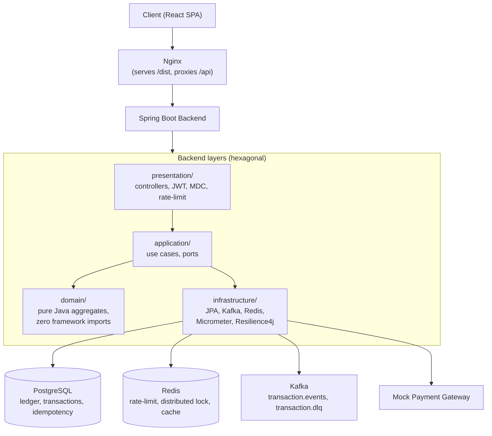

### Defending each decision

**Q: Why hexagonal architecture, not classic 3-layer Spring?**
Two reasons. First, business invariants belong in pure Java domain code — making them testable without Spring lets the test suite stay sub-second. Second, swapping any adapter (Postgres → another DB, JJWT → Keycloak, mock gateway → Stripe) shouldn't require touching the domain. Domain depends on ports (interfaces); adapters in `infrastructure/` implement them. Dependency arrows always point inward.

**Q: Walk me through the transaction lifecycle.**

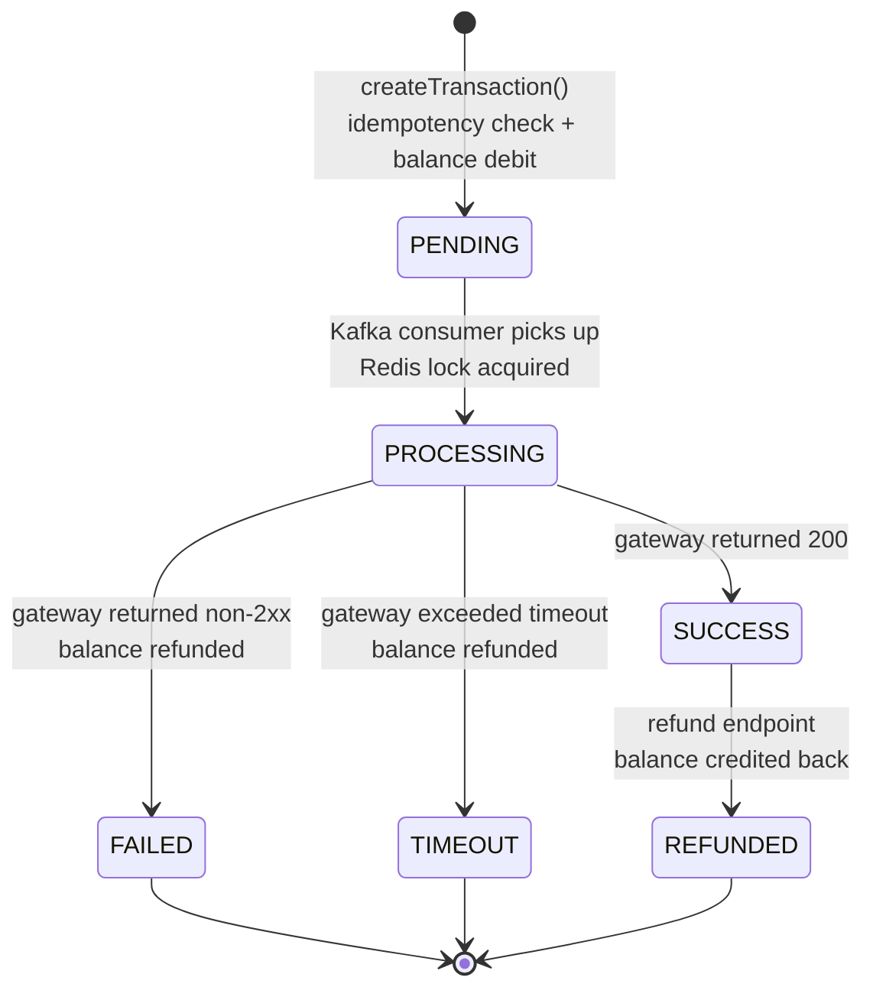

States: PENDING → PROCESSING → SUCCESS|FAILED|TIMEOUT → REFUNDED.

API call: validate idempotency key → atomic claim → debit sender's balance → INSERT transaction PENDING → publish Kafka event → return 201.

Consumer: receive event → acquire Redis lock on tx_id → transition PENDING → PROCESSING (DB tx 2) → call gateway *outside any DB tx* → transition to SUCCESS or FAILED (DB tx 3) → release lock.

Refund: API call → load transaction → check terminal-state precondition → SELECT FOR UPDATE on sender row → INSERT new refund transaction + UPDATE original to REFUNDED + UPDATE balance — all in one DB tx.

**Q: Why two-phase processing instead of one big transaction?**
A naive one-tx flow holds a Hikari connection for hundreds of ms while the gateway responds. Under load, the pool exhausts → cascading 503s. Splitting into three short transactions with the network call between them keeps connections free. The Redis lock + version checks ensure correctness across instances.

**Q: Why pessimistic lock on the sender row + optimistic version on the transaction?**
Pessimistic on the sender's account because that's the high-contention row — multiple concurrent transfers from the same account need strict serialization (else double-spend). Optimistic on the transaction because contention there is low — only when the API and the consumer both touch the same row simultaneously (refund vs gateway response). Wrong locking choice on either would either cause deadlocks (pessimistic on tx) or double-spends (optimistic on account).

**Q: Show me your circuit breaker order.**
`CircuitBreaker { Retry { gateway.charge() } }`. Outer breaker, inner retry. So when breaker is open, retry is short-circuited — no burning retry budget on a known-bad downstream. Resilience4j applies decorators outside-in based on annotation order — `@CircuitBreaker` before `@Retry` on the method.

**Q: Why does the DLQ persist to Postgres before publishing to Kafka?**
Spring Kafka's default `DeadLetterPublishingRecoverer` writes to a Kafka topic. If Kafka itself is the problem, that's useless. My `PersistingDlqRecoverer` writes to `dead_letter_events` first (durable), then forwards to the DLQ topic best-effort, catching publish failures so the consumer offset can commit and we don't infinite-loop. Admins inspect via `GET /api/admin/dlq` and replay via `POST /api/admin/dlq/{id}/retry`, which uses the same `EventPublisher` as production — no shadow code paths.

**Q: How is observability wired in?**
Micrometer registry with Prometheus exporter. Custom metrics (counters and histograms) for transactions created/processed, latency. Auto-exposed: HTTP requests, JVM, Hikari, Kafka consumer, Resilience4j circuit breaker state. Prometheus scrapes `/actuator/prometheus` every 15s. Grafana dashboards provisioned from JSON in `monitoring/grafana/provisioning/`. Logback JSON output with MDC stamping requestId on every line.

**Q: How is the metrics adapter clean from a hexagonal perspective?**
`TransactionMetricsPort` is an outbound port in `application/`. Domain code calls `metricsPort.recordCreated()`. The Micrometer-using adapter lives in `infrastructure/metrics/` and implements that port. Tests inject a recording fake. Application layer never imports Micrometer.

**Q: What does your k6 test prove?**
100 VUs × 5 min, sustained. Thresholds: error rate < 1% (excluding business 422/429 which are correct outcomes, not server errors), p95 < 500ms, p99 < 2s. CI fails on threshold breach. Recent run: P99 ~100ms, error rate ~0.3%. Throughput ~745 req/s.

**Q: What would change at 10× scale?**
1. **Sharding by account** — partition transactions by sender account. Single-DB Postgres handles ~5-10K TPS comfortably; for more, shard.
2. **Read replicas** — point read endpoints (transaction history) at replicas
3. **Outbox pattern** — currently I publish Kafka inside the API transaction. At higher scale, switch to an outbox table + Debezium CDC for guaranteed at-least-once without slowing the API path.
4. **Multi-region with active-passive** — for DR; geo-routing for latency
5. **Hot-reload feature flags** — currently all behavior is code-controlled; need to flip features without deploys

**Q: What's the weakest part of this architecture?**
The mock gateway hides real-world ugly: actual gateways have idempotency contracts, async webhooks, retries-on-our-side. A real integration would need: webhook handler with replay protection; reconciliation job that compares our state vs gateway statement nightly; manual exception handling workflow for stuck transactions.

### Be ready to demo

- Pull up the README, walk through the architecture diagram + state machine
- Show one of the controller→service→domain code paths
- Point to the `domain/` package — show it has zero `org.springframework.*` imports
- Explain `IdempotencyService.execute(key, hashFn, action)`
- Show `PersistingDlqRecoverer` — the 30 lines that make DLQ durable

## 20.4 Cross-project comparisons (be ready)

| | artisan-connect | roboflow-clone | payment-transaction |
|---|---|---|---|
| Language | TypeScript | TypeScript | Java |
| Framework | Express 4 | Express + TS | Spring Boot 3 |
| ORM | Prisma | Sequelize | JPA/Hibernate |
| DB | PostgreSQL | MySQL | PostgreSQL |
| Real-time | Socket.io | n/a | Kafka events |
| Cache/lock | n/a | n/a | Redis + Redisson |
| Resilience | n/a | n/a | Resilience4j (CB + Retry) |
| Observability | basic logs | basic logs | Micrometer + Prometheus + Grafana |
| Load test | n/a | n/a | k6 with thresholds |
| Architecture | 3-layer modules | 3-layer | Hexagonal + DDD |

**The arc to tell**: "I started with two TypeScript projects to get production Node patterns down, then built the Java payment service to dive into rigorous distributed-systems patterns — idempotency, locking, circuit breaking, observability. Each project taught the next; the payment service is the most production-ready by far, but the two TS projects have richer business domains."

---

# 21. Behavioral & Closing Questions

> The "soft" part of the interview. Practice 3-4 STAR-format stories that you can adapt to many questions. Keep them concrete, action-focused, and outcome-driven.

## 21.1 The STAR framework

Every behavioral answer should hit:
- **S**ituation — the context (1 sentence)
- **T**ask — what you needed to do (1 sentence)
- **A**ction — what *you* did (most of the answer; emphasize "I", not "we")
- **R**esult — the outcome (concrete numbers if possible)

**Don't ramble.** 90 seconds per answer is the sweet spot.

## 21.2 Stories you should have ready

Spend a day writing out 4-5 stories in advance. Adapt at runtime.

### Story 1: A technical challenge you overcame
A specific bug or design problem; what made it hard; how you debugged or designed; what you learned.

**Example seed:** "When building the payment service, my initial design wrapped the entire transfer flow — including the gateway call — in a single DB transaction. Under load test, I saw connection pool exhaustion at modest QPS. I traced this to connections being held during the network round-trip. I redesigned to two-phase: phase 1 commits PENDING + balance debit and publishes a Kafka event; phase 2 in the consumer transitions to PROCESSING, calls the gateway outside any DB transaction, then commits final state. P99 dropped from 2s+ to ~100ms under the same load."

### Story 2: A time you disagreed / pushed back
Show technical conviction without being uncollaborative. Frame as: "I had concerns, raised them with data, we discussed, settled on X."

**Example seed:** "Early in artisan-connect, I considered storing JWT in localStorage. I'd seen this pattern in tutorials. Reading the OWASP guidance more carefully, I realized localStorage is exposed to any XSS attack — a single compromised dependency could exfiltrate all tokens. I switched to httpOnly + Secure + SameSite=Strict cookies for the refresh token, with the access token in memory only. The trade-off is more careful CSRF handling, which I addressed with SameSite=Strict and explicit origin checks. The decision was driven by the threat model, not the convenience."

### Story 3: A time you led / mentored / collaborated
Even if you're a solo student, you've collaborated on group projects, helped classmates, contributed to forums.

**Example seed:** "In my final-year team project, two teammates and I were stuck on a recursion depth issue. Our DFS was crashing on large inputs. I spent an evening tracing the call patterns, realized we were redundantly visiting nodes due to a missing visited-set, and pair-debugged the fix. I also wrote a quick benchmark script so we could see throughput improvements. The lesson I took: when stuck, build the smallest reproduction first — often the bug becomes obvious."

### Story 4: A time you failed / learned from a mistake
Critical question. Show self-awareness without being cripplingly negative. Pick something genuine but not catastrophic.

**Example seed:** "On the roboflow-clone-server, I shipped image upload without proper type/size validation. A teammate uploaded a corrupted file during testing and it killed the Node process — multer was throwing an error in a path that wasn't caught. The fix was minor (add an `error` handler middleware), but the lesson was deeper: I had assumed `req.file` would always be valid because the happy path worked. I now reflexively code error paths first, especially around uploads, parsing, and external calls. I also added a Zod schema validation layer to catch malformed bodies before the handler."

### Story 5: A time you took initiative
Self-driven learning, fixing something that wasn't your job, etc.

**Example seed:** "I noticed the artisan-connect codebase lacked structured logging — debug was via `console.log`. For my own learning project this was fine, but I knew banking codebases need correlation IDs to trace requests across logs. I integrated `pino` and added a request-context middleware that stamps every log line with a request ID via async_local_storage. Took half a day. Wasn't strictly required for the project, but it's a habit I'd want from day one in any team."

## 21.3 Common questions — direct answers

**Q: Why software engineering?**
*(2 sentences max, sincere)*
"I like the mix of constraint and creativity — there's always a 'right' answer in some sense, but the path there involves real tradeoffs. And I like that the work compounds: every system I build leaves something running and useful."

**Q: Why NAB?**
"Banking is one of the few domains where engineering correctness matters in a regulatory, customer-trust sense — not just product velocity. The problems you face — distributed systems, idempotency, settlement, ledgers — are the same patterns I built into my payment-transaction-service. NAB Starcamp is exactly the place to apply that interest with mentorship and a real production environment."

**Q: Why Starcamp specifically?**
"Graduate / early-career programs that pair you with senior engineers and rotate you across teams build skills faster than going straight into one team. Starcamp's structure — capstone project, mentorship, multiple team exposures — fits how I learn best."

**Q: Where do you see yourself in 5 years?**
"Senior engineer at a place where the work is technically interesting, with at least one project I'd be proud to put on my CV. Whether that's NAB, depends on whether I'm growing and the work is meaningful."

Don't be too specific (manager? founder?). Show ambition + grounded thinking.

**Q: What's your greatest weakness?**
**Avoid the cliché "perfectionism" answer.** Pick something genuine that you've actively worked on:
"Earlier I was reluctant to ask questions when I felt I should already know the answer. I'd waste time spinning. I've consciously practiced asking sooner — the cost of looking 'less senior' for 30 seconds is much smaller than the cost of an hour of unnecessary spinning. I still notice the impulse, but I push through it."

**Q: Tell me about a time you handled conflict.**
*(Story 2 fits)*

**Q: Greatest strength?**
"I take ownership end-to-end. With my payment-transaction-service, I didn't stop at 'works on my machine' — I added load tests, wired observability, set up CI, and wrote a README that explains the design choices. I treat any project I start as something someone else might need to run, and that mindset travels well into team contexts."

**Q: Why should we hire you?**
*(Risk: don't sound arrogant or generic)*
"My CV shows three full-stack-or-backend projects, each with progressively more rigorous engineering — TypeScript modular architecture, then a Java service with proper distributed-system patterns. I learn fast and ship complete things, not just demos. Practically, that means by month two I'd be productive on a NAB team; by month six, owning something."

**Q: Walk me through your CV / resume.**
2-minute structured tour: education one sentence, then projects in order, ending with what you're learning now or what excites you about NAB. **Don't read off the page.**

**Q: Do you have any questions for us?**
**Always have 3-4 questions ready.** Asking nothing signals disinterest. Good ones:

- "What does the first 6 months on a Starcamp track typically look like?"
- "What's a recent technical challenge your team has solved that you're proud of?"
- "How do you balance shipping product features against paying down technical debt? Are there explicit budgets for each?"
- "What's your team's deployment cadence? Continuous? Weekly? With change windows?"
- "What would success look like for me at the end of the program?"
- "What's the biggest technical bet NAB is making right now?"

**Avoid**: salary, vacation, working hours, things you should have learned from the website.

## 21.4 Vietnamese-specific framing tips

For Vietnamese candidates interviewing at NAB Australia:

- **English fluency**: speak slower than feels natural. Pause between thoughts. Don't fear silence.
- **Cultural calibration**: Australian workplace tends to value directness, ownership, and "having a go." Saying "I think we should do X because Y" rather than implying or hedging is appreciated. Don't be afraid to disagree (politely) with the interviewer.
- **Timezone reality**: Vietnam → AEDT means 4-5 hours ahead. Most of NAB's collaboration would be in AEDT business hours.
- **Visa / relocation**: if asked about working from Vietnam vs relocating, be clear about your preference and constraints. Vague answers worry employers.

## 21.5 Last 24 hours — checklist

- Re-read each project's README; refresh your mental cache on the architectural decisions
- Run `docker compose up` on at least one project — if you screenshare, you want it ready
- Sleep 8 hours. Tired beats prepared.
- Have water, a notepad, and your CV in front of you
- Test your microphone, camera, internet 30 minutes before
- Quiet space; close all notifications
- Smile when you join — first impression sets the tone

## 21.6 During the interview

- **Repeat the question** in your own words before answering — buys thinking time, confirms understanding
- **Think out loud** on technical / system design — interviewers want to see *how* you reason
- **Use the whiteboard / notepad** for system design — boxes and arrows are clearer than narration
- **When stuck, narrate**: "I'm not sure between approach A and B. Let me think about the trade-off..."
- **Don't pretend** to know what you don't. "I haven't worked with that specifically, but here's how I'd approach learning it..." is fine.
- **Ask clarifying questions** before diving into a code or design problem — "What's the expected scale? Read-heavy or write-heavy?"

## 21.7 After the interview

- Send a thank-you email within 24h. 3-4 sentences. Reference one specific thing discussed.
- If it goes badly, don't dwell. Each interview is rep practice — the next one is better.
- Note what you wished you'd said. Add to your story bank.

## 21.8 You've got this

The strongest signal you can send is being specific, opinionated, and honest. Generic answers signal generic candidates. The fact that you've built three real projects with progressively rigorous engineering puts you ahead of most graduates. Your job in the interview is to make that obvious without overselling.

**Speak about your projects like a co-author would — not a tour guide.** That's the level NAB is hiring for.

Good luck. Tôi tin bạn sẽ làm tốt. 💪

